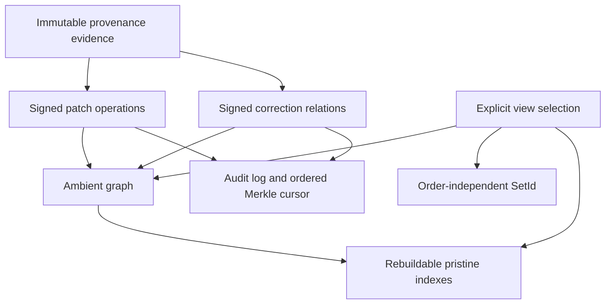
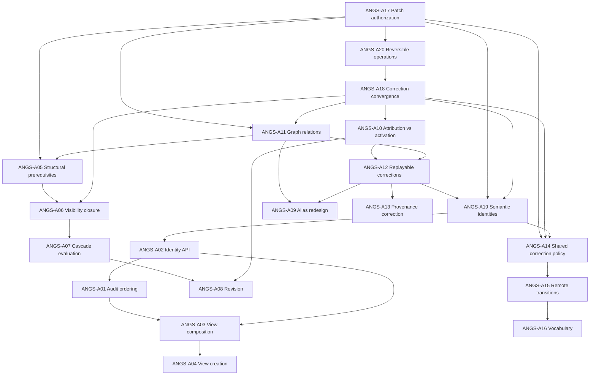
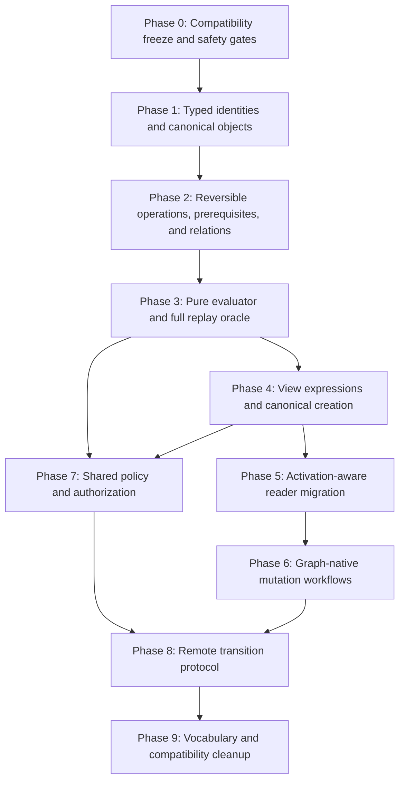

# RFC: Atomic-Native Graph Semantics

> **Status:** Architecture reviews complete — implementation planning required
>
> **Scope:** Audit and unwind Git-shaped assumptions in views, causality,
> state identity, history, repair, and provenance.
>
> **Origin:** The `performance-test` repository exposed a 98 MB change that
> accidentally captured thousands of benchmark checkout files. Attempts to
> isolate that patch showed that several current APIs interpret temporal order,
> view ancestry, and conservative dependency metadata as semantic causality.

## 1. Summary

Atomic is a patch-theoretic system over an ambient graph. Independent patches
commute; views select graph state; causal relationships arise from graph
references; provenance explains operations independently of presentation order.

Several current structures behave as if Atomic were a commit DAG:

- ordered `VIEW_CHANGES` is frequently treated as semantic history;
- `ViewState.parent` is used as persistent branch ancestry;
- `Merkle::next` is used as view identity despite order sensitivity;
- dependency collection can encode everything visible while recording;
- reverse dependency closure is treated as a descendant chain;
- revision workflows remove and replay linear suffixes;
- patch replacement was initially modeled as old-commit → new-commit lineage.

This RFC separates audit order from semantic truth and defines a review process
for deciding which structures to retain, generalize, migrate, or remove.

## 2. Non-negotiable model

### 2.1 Ambient graph

There is one canonical graph of vertices and edges. A patch contributes graph
operations; it is not a snapshot and does not own a private branch graph.

### 2.2 Structural causality

Patch `B` causally requires patch `A` only when an operation in `B` requires a
graph or semantic entity introduced by `A`.

```text
visible while recording ≠ causal dependency
recorded earlier         ≠ causal dependency
same view                ≠ causal dependency
```

### 2.3 Every operation has a do path and an undo path

Patch theory requires algebraic reversibility. Every primitive graph or semantic
operation must define both:

- a **do path** that applies its forward effect; and
- an **undo path** that deterministically applies its inverse against the state
  in which that operation is valid.

The inverse may be stored explicitly or derived from immutable operation data,
but it must be content-addressable, portable, replayable, and independently
testable. Applying an operation followed by its inverse must restore the prior
semantic graph modulo canonical representation, while preserving unrelated
commuting operations. Deletion is therefore a reversible graph operation, not
destruction of evidence.

A dependency or parent relation is not an undo path. Dependencies answer which
entities an operation requires; an inverse answers how to remove that operation's
effect. Reversing a patch must traverse inverse operations in a causally valid
order, not walk a Git-shaped hierarchy or remove every later audit-log entry.

Current code contains parts of this model—edge updates retain `previous` and
`flag`, `NewEdge::reverse` swaps them, and conflict-resolution variants carry
explicit undo operations—but the invariant is not uniformly specified or proven
for every `GraphOp`, semantic operation, correction, and composition. A20 audits
that gap before correction convergence is finalized.

### 2.4 Views select an undecided membership unit

A view currently selects whole changes through `VIEW_CHANGES` and filters edges
through `introduced_by`. Isolation exposed a question this RFC must decide,
not assume: is a signed patch an indivisible activation unit, or can signed
operations inside it be independently activated by authorized correction
relations?

Until A17 is accepted, the current whole-change selection remains normative.
A parent is deliberate live filter composition today; A3 must decide whether
that remains live composition, becomes a frozen base, or is replaced by an
explicit expression. The RFC does not presume the answer.

### 2.5 Identity domains must be explicit

`SetId` already provides order-independent identity for a multiset of change
hashes: permutation invariance, invertible remove/add, combination, and a
canonical empty value. It does **not** yet identify an activated graph. Once
correction relations exist, equal patch sets may materialize differently and
different patch sets may be graph-equivalent.

This RFC therefore distinguishes `PatchSetId` (the existing `SetId` domain),
a future correction/selection identity, and a canonical materialized-graph
identity. A2 and A19 must decide which identity each API requires. Ordered
Merkle state may remain an audit or transport cursor but is not automatically
semantic equality.

### 2.6 Provenance is independent evidence

Provenance records who or what produced an operation and why. It is not a
commit-parent relation and must survive graph equivalence, correction, removal,
and view selection without changing the original evidence.

## 3. Terminology

| Avoid as semantic vocabulary | Use instead |
|---|---|
| ancestor/descendant patch | causal prerequisite/dependent operation |
| branch history | view selection / audit log |
| rebase | commute / context resolution |
| squash | compose patches |
| rewrite history | change graph selection / publish correction |
| replacement commit | graph equivalence/removal relation |
| LSN as causality | audit sequence / transport cursor |

The avoided terms may still appear in Git interoperability code when they
refer to actual Git concepts.

## 4. Review protocol

Each item in §5 is reviewed independently. A review records exactly one outcome:

- **Retain:** Current representation and semantics are Atomic-native.
- **Retain as audit-only:** Keep storage for chronology/debugging, remove it
  from semantic decisions.
- **Generalize:** Keep the mechanism but make it graph/set based.
- **Migrate:** Introduce an Atomic-native replacement and migrate readers and
  writers before deleting the old form.
- **Remove:** Delete the structure or behavior.

Every review must answer:

1. What invariant does the structure currently enforce?
2. Is that invariant mathematical, operational, UX-only, or accidental?
3. Which code paths treat it as semantic truth?
4. What observable behavior breaks if it is removed?
5. What is the Atomic-native replacement?
6. Can old repositories be interpreted without rewriting immutable patches?
7. Which property and end-to-end tests prove the outcome?

A decision is not accepted without code references, migration impact, and tests.

## 5. Review items

### A1. Ordered `VIEW_CHANGES(view, sequence)`

**Current use:** Stores a patch log, drives display ordering, Merkle state,
revision suffix operations, and some synchronization decisions.

**Concern:** Sequence is frequently treated as semantic causality. Independent
patch permutations then appear as different semantic states.

**Recommended outcome:** **Retain as audit-only.** Introduce an explicit
order-independent effective selection as semantic truth. Audit sequence remains
useful for UI, provenance chronology, and deterministic presentation.

**Review questions:**

- Which operations genuinely require chronology?
- Can insertion and deletion update `SetId` without resequencing?
- Which APIs return “sequence” but mean “membership count”?

**Acceptance evidence:** Permuting independent patches leaves semantic view
identity and materialized graph unchanged.

---

### A2. Incremental ordered Merkle view state

**Current use:** `state[n+1] = Hash(state[n] || patch)` identifies a sequence.

**Concern:** It identifies an ordered log, not an order-independent patch set.

**Recommended outcome:** **Retain as audit/transport cursor; migrate semantic
identity to `SetId`.** Name both identities explicitly in APIs and output.

**Acceptance evidence:** Two views with the same effective patch set but
independent insertion order share `SetId` while retaining distinct audit roots.

---

### A3. `ViewState.parent`

**Current use:** Filter inheritance, view creation, deletion restrictions, UX,
and effective-history traversal.

**Concern:** Parent chains are becoming branch ancestry. Promotion changes a
parent’s membership and has already caused child log records to disappear when
inheritance was inferred dynamically.

**Recommended outcome:** **Review required.** Parent chains are deliberate live
composition in the current architecture. The review must choose live
composition, frozen creation base, or an explicit expression and specify what
a child should observe when a parent adds or removes changes. Regardless of
the choice, parent mutation must not retroactively rewrite the child’s own
audit records or patch identity.

**Acceptance evidence:** The chosen parent-update behavior is explicit and
property-tested; audit records remain stable.

---

### A4. Copying source logs during view creation

**Current use:** `create_view_from` copies source `VIEW_CHANGES` while also
assigning a parent; other creation paths rely only on parent filters.

**Concern:** Two incompatible inheritance representations exist. Copied logs
duplicate membership and make own/inherited classification unstable.

**Recommended outcome:** **Remove after migration.** New views should record an
explicit base selection or compose an immutable view expression, not copy a
linear log and also inherit it.

**Acceptance evidence:** Every view-creation path yields the same effective
selection and own-change accounting for the same inputs.

---

### A5. `CHANGE_DEPS` generation

**Current use:** Dependency closure, insertion ordering, push closure, split,
unrecord safety, and graph filtering.

**Concern:** Dependencies may include patches merely visible during recording.
In the `BEDHC4` case, declared closure reported 26 dependent patches while only
three directly referenced the target; later structural chaining widened the
candidate set further.

**Recommended outcome:** **Migrate to structural prerequisites.** Derive direct
requirements from graph positions, inode roots, edge ownership, and semantic
IDs. Store chronology/known context separately.

**Acceptance evidence:** Recording an independent patch while an unrelated
large patch is visible does not create a dependency.

---

### A6. Dependency closure as view visibility

**Current use:** A selected patch automatically makes every declared dependency
visible.

**Concern:** Conservative metadata can force excluded content back into a view.
It prevents selective removal even when graph operations commute.

**Recommended outcome:** **Generalize.** Closure expansion should use proven
structural prerequisites and accepted graph correction relations. Exclusion
requires a complete proof of validity; an indeterminate analysis fails closed
and cannot authorize exclusion.

**Acceptance evidence:** Excluding a non-required patch does not reintroduce it;
excluding a required graph entity fails with exact reference evidence.

---

### A7. Reverse dependency cascade

**Current use:** `view split --cascade`, unrecord checks, and repair planning.

**Concern:** It treats metadata reachability as a commit-descendant chain and
can move independent patches unnecessarily.

**Recommended outcome:** **Generalize.** Use a two-stage process: conservative
candidate discovery followed by counterfactual graph evaluation. Report direct,
transitive, context-only, indeterminate, and confirmed blockers separately.

**Acceptance evidence:** The system never labels candidate closure as proven
blockers and never mutates based solely on conservative reachability.

---

### A8. Linear suffix revision

**Current use:** `revise` unrecords every later sequence entry, creates a new
patch, then reinserts the suffix.

**Concern:** This is commit-stack behavior. It exposes partial states on crash
and needlessly touches commuting patches.

**Recommended outcome:** **Blocked on A10–A12, A17, and A18.** Revision may
operate on a structurally connected subgraph only after correction relations,
activation, replay, and convergence semantics are accepted. Unrelated patches
should remain untouched, but the RFC does not assume immutable dependent
references can survive without those mechanisms.

**Acceptance evidence:** Revising a middle patch leaves proven-independent later
patch hashes, provenance, and membership unchanged; dependent handling follows
the accepted correction model.

---

### A9. Patch-level old→new replacement lineage

**Current use:** Experimental `PatchRelink`, `PATCH_ALIASES`, and
`REV_PATCH_ALIASES` model a whole-patch replacement.

**Concern:** Whole-patch lineage is too coarse when one patch contains both
valid and unwanted graph operations. Broad reverse visibility can reactivate
removed content.

**Recommended outcome:** **Generalize before use.** The durable artifact should
describe graph equivalence, removal, and bridge relations. Patch hashes provide
attribution and packaging, not the semantic unit of alias activation.

**Immediate safety decision:** No isolation publication may install broad
replacement visibility until this review is accepted. Existing experimental
tables contain no production relinks and remain additive/unused.

**Acceptance evidence:** Activating retained mapped entities never activates
removed entities from the same original patch.

---

### A10. `introduced_by` as both provenance and visibility owner

**Current use:** Edge attribution and view filtering both depend on one field.

**Concern:** A repaired edge may retain historical attribution while becoming
active through a correction. One identifier cannot represent both facts
without reactivating unwanted old edges or falsifying provenance.

**Recommended outcome:** **Migrate after A18 defines convergence.** Separate
immutable attribution from current activation, either with an activation
relation/index or a schema field. The activation model must define concurrent
and contradictory corrections, authorization, supersession, re-addition, and
correction-of-correction before it controls materialization. Do not rewrite
historical provenance to solve visibility.

**Acceptance evidence:** A correction can activate a retained edge while its
historical introducer remains excluded, and removed sibling edges stay hidden.

---

### A11. Position aliases and graph equivalence

**Current use:** Experimental exact one-to-one old-node→new-node aliases.

**Concern:** Exact patch-owned nodes do not cover interior positions, splits,
coalescing, removals, or bridge topology. Treating aliases as patch lineage
would encode the wrong abstraction.

**Recommended outcome:** **Generalize.** Define role-aware graph-entity
relations:

```text
Equivalent(old entity, new entity)
Removed(old entity, correction)
Bridge(predecessor set, successor set, correction)
```

Resolution must distinguish predecessor-end, successor-start, inode root, and
exact-node roles and reject ambiguous mappings.

**Acceptance evidence:** Replay, materialization, status, record, and clone
resolve the same corrected graph deterministically.

---

### A12. In-place graph mutation versus replayable operations

**Current use:** Proposed isolation finish considered rewriting pristine rows.

**Concern:** A local database mutation not represented as a replicated graph
operation disappears on clone or pristine rebuild.

**Recommended outcome:** **Retain mutation only as derived indexing.** Every
semantic correction must be represented by signed, content-addressed,
replicated operations. Pristine tables are rebuildable indexes of those facts.

**Acceptance evidence:** Rebuilding an empty pristine from patch and correction
objects produces the same graph and view `SetId`.

---

### A13. Provenance relinking

**Current use:** Experimental signed `ProvenanceRelink` associates original
change/provenance with a replacement change.

**Concern:** “Replacement lineage” can imply rewritten authorship. Provenance
must preserve the original evidence and describe the correction truthfully.

**Recommended outcome:** **Retain and generalize vocabulary.** Original graphs
remain immutable. New signed assertions use explicit relations such as
`wasCorrectedBy` and identify the repair operation and retained/dropped graph
entities.

**Acceptance evidence:** Auditors can recover original evidence, correction
evidence, signer, and exact graph mapping without claiming the original agent
produced new bytes.

---

### A14. Shared views as permanent append-only history

**Current use:** Shared views cannot be deleted and ordinary remote updates are
fast-forward-like.

**Concern:** Permanent append-only membership prevents correction/removal of a
bad graph contribution and resembles protected branch history.

**Recommended outcome:** **Review required; no default recommendation.** Shared
collaboration needs strong authorization and auditability, but graph correction
must be possible. Consider signed correction operations rather than mutable
history or unrestricted deletion.

**Acceptance evidence:** An authorized correction removes unwanted graph state
without erasing audit evidence and converges across replicas.

---

### A15. Remote CAS and fast-forward assumptions

**Current use:** Remote refs compare expected old snapshot and require ancestry/
fast-forward behavior.

**Concern:** Set-equivalent or corrective graph selections may be rejected as
non-fast-forward despite valid patch-theoretic convergence.

**Recommended outcome:** **Generalize after defining observed-remove/correction
semantics.** CAS remains useful for concurrency, but acceptance should validate
authorized graph transitions rather than commit ancestry. The review must
specify concurrent add/remove, stale removal, re-addition, correction
supersession, and correction-of-correction.

**Acceptance evidence:** Concurrent independent additions commute; signed
corrections can remove graph entities; stale writers receive actionable set
conflicts rather than branch-divergence errors.

---

### A16. History and CLI vocabulary

**Current use:** Terms such as cherry-pick, reapply, ancestor, descendant,
fast-forward, stack, and branch remain in comments, errors, or workflows.

**Concern:** Vocabulary drives implementation assumptions and user expectations.

**Recommended outcome:** **Migrate.** Reserve Git terms for the Git bridge.
Use insert, commute, selection, causal prerequisite, correction, and graph
conflict in native commands.

**Acceptance evidence:** Native CLI help can explain all workflows without
commit/branch metaphors.

### A17. Patch atomicity and authorization unit

**Current use:** A signed, content-addressed patch is the view membership and
visibility unit.

**Concern:** Partial activation could repair a mixed good/bad patch, but it also
changes what a patch signature authorizes. Treating operations as independently
selectable without an explicit trust model is unsafe.

**Recommended outcome:** **Review first.** Decide whether patch atomicity is
absolute, whether a signed correction may deactivate a subset while preserving
the original evidence, and whose authorization is required.

**Acceptance evidence:** Verification can state exactly which bytes/operations
were authored originally, which are currently active, and who authorized every
correction.

---

### A18. Correction convergence and conflict semantics

**Current use:** No accepted replicated correction algebra exists.

**Concern:** Equivalence, removal, bridge, activation, and supersession
assertions can conflict concurrently. Without deterministic semantics, replicas
can materialize different graphs from the same object set.

**Recommended outcome:** **Define before mutation.** Specify authorization,
monotonicity, observed-remove behavior, stale correction handling, concurrent
corrections, cycles, re-addition, and correction-of-correction. Every evaluator
returns `valid`, `invalid`, or `indeterminate`; indeterminate fails closed.

**Acceptance evidence:** Property tests show permutation-independent convergence
for the same correction-object set and explicit conflict output for incompatible
assertions.

---

### A19. Semantic graph identity

**Current use:** Ordered Merkle identifies a log; `SetId` identifies change-hash
membership.

**Concern:** Neither necessarily identifies the activated graph once correction
relations or partial activation exist.

**Recommended outcome:** **Define after A17/A20/A18.** Specify canonical identity for
patch membership, accepted correction set, activated graph entities, and
materialized semantic state. Do not overload one hash across these domains.

**Acceptance evidence:** Equal identities imply the documented equivalence;
replay from portable objects reproduces all identities deterministically.

---

### A20. Reversible operation paths

**Current use:** Edge mutations retain prior/new flags and can construct reverse
edge modifications; some conflict-resolution operations carry explicit undo
operations. Higher-level unrecord and revision still rely substantially on view
sequence and dependency closure rather than a uniformly defined inverse algebra.

**Concern:** The model does not yet prove that every primitive graph operation,
semantic operation, correction, and composition has a deterministic inverse.
A dependency hierarchy records prerequisites, not the operation needed to undo a
node's effect, and using it as reversal can suppress unrelated commuting work.

**Recommended outcome:** **Review before A18.** Inventory every operation variant
and define its do/undo pair, preconditions, identity, composition order, and
failure result. An inverse must be replayable from immutable objects; derived
indexes may accelerate it but cannot be the sole representation. Corrections
must themselves define reversal or an explicit monotonic supersession operation
consistent with the convergence algebra.

**Acceptance evidence:** For every operation class, property tests establish the
applicable-state law `undo(do(G, p), inverse(p)) ≡ G`, preservation of independent
commuting operations, deterministic replay under valid permutations, and exact
`invalid` or `indeterminate` evidence when inverse preconditions do not hold.

---

## 6. Proposed architecture boundary



Semantic correctness flows through patches, correction relations, the ambient
graph, and explicit view selection. Audit sequence and pristine tables are
derived/supporting structures.

## 7. Migration principles

1. **No destructive migration first.** Add parallel identities/indexes and
   compare results before changing behavior.
2. **Immutable patches remain immutable.** The accepted A17 review permits
   sub-patch activation changes only through separately authorized correction
   objects; A20 and A18 must define their inverse and convergence semantics.
3. **Pristine remains rebuildable.** Any new table must derive from portable,
   content-addressed objects.
4. **Fail closed on ambiguity.** Never guess position mappings or silently drop
   graph edges.
5. **Property tests before CLI mutation.** Commutation, SetId convergence,
   replay equivalence, and correction idempotence are gates.
6. **Real-repository fixtures.** Preserve a minimized fixture derived from the
   `BEDHC4` contamination pattern.
7. **Separate review from implementation.** Each A-item gets an accepted
   outcome before code migration begins.

## 8. Review order

Review in dependency order:

1. A17 patch atomicity and authorization unit
2. A20 reversible operation paths
3. A18 correction convergence and conflict semantics
4. A10 attribution versus activation
5. A11 graph relations and position resolution
6. A12 replayable correction operations
7. A19 semantic graph identity
8. A1 ordered view log
9. A2 patch-set, correction-set, graph, and audit identities
10. A5 structural dependency generation
11. A6 visibility closure
12. A3/A4 view composition and creation
13. A7/A8 split, unrecord, and revision
14. A13 provenance correction assertions
15. A14/A15 shared and remote correction policy
16. A16 vocabulary migration

A9 (`PatchRelink`) is blocked on A10–A12 and must not be promoted to production
semantics before those reviews conclude.

## 9. Review record template

Copy this section for each accepted review:

```markdown
### Review A<n>: <title>

- Date:
- Reviewers:
- Outcome: Retain | Retain as audit-only | Generalize | Migrate | Remove
- Current invariant:
- Accepted invariant:
- Rejected alternatives:
- Compatibility impact:
- Data migration:
- Code migration:
- Test evidence:
- Follow-up intents:
```

## 10. Immediate actions pending review

- Keep `atomic isolate --finish` disabled.
- Treat `PatchRelink`, `PATCH_ALIASES`, and `REV_PATCH_ALIASES` as experimental.
- Do not install relinks into production repositories.
- Preserve the existing `performance-test` isolation plan as diagnostic evidence
  only; it has not mutated `dev`.
- Begin with A17 and A18 to establish patch authorization and deterministic
  correction semantics before choosing identity domains or building repair machinery.

## 11. Audit-only operating rule

This RFC phase is evidence gathering and decision making only. Reviewing an
`ANGS` item must not modify production types, tables, graph semantics, command
behavior, migration code, or repository data. An audit may add documentation,
tests that characterize existing behavior, minimized fixtures, and read-only
diagnostics. Implementation begins only after a separate accepted review
outcome is mapped to a new intent.

Experimental work created before this rule (`PatchRelink`, patch alias tables,
`isolate` planning/evaluation) is evidence to review, not an accepted design.
It must remain publication-gated and may be retained, generalized, or removed
by the relevant review outcomes.

## 12. Reusable assumption audit ledger

Stable TODO IDs use `ANGS-A##`. They identify decisions, not implementations.
Future review intents should use `<ID>-R`; accepted implementation slices use
`<ID>-I1`, `<ID>-I2`, and test/migration work uses `<ID>-T`/`<ID>-M`.

| TODO | Assumption under audit | Current validity | Git model | Atomic-native question | Why review is necessary | Blast radius |
|---|---|---|---|---|---|---|
| `ANGS-A01` | Ordered view sequence is semantic state | Valid current behavior; target disputed | Commit/parent order defines history | Is sequence audit-only while membership/activation is order-independent? | Commuting insertion order currently changes state and suffix operations | `ViewState`, `VIEW_CHANGES`, `REV_VIEW_CHANGES`, `STATES`, `MERKLE_CHAIN`, history, split, unrecord, revise, snapshots, push/pull |
| `ANGS-A02` | Ordered Merkle is “the” view identity | Valid for ordered log only | Commit hash identifies ordered snapshot/history | Which APIs need patch-set, correction-set, graph, semantic, or audit identity? | One ambiguous state hash causes invalid equality and sync decisions | `Merkle`, `SetId`, `ViewState`, snapshots, cache keys, CLI state output, convergence checks, wire compatibility |
| `ANGS-A03` | Parent is permanent live view composition | Valid and deliberate today; future unresolved | Branch starts from a fixed commit, not a live parent | Should parent remain live, become frozen creation metadata, or become an explicit expression? | Parent mutation changes child visibility without child mutation | `ViewState.parent`, `VIEWS`, filter/content/status/materialize/history, nested drafts, snapshots, session views |
| `ANGS-A04` | View creation may both copy membership and assign a parent | Valid inconsistency | Branch stores one pointer | Use exactly one explicit composition/base representation | Own/inherited counts and behavior depend on creation path | `create_view_from`, view CLI, `VIEW_CHANGES`, effective history, split, sandbox, manifests, clone |
| `ANGS-A05` | Dependency generation contains temporal/visible context | Partially validated; excessive closure observed, blanket collection not proven | Commit parent implies all prior state | What exact graph, inode, deletion, absence, conflict, and semantic references are prerequisites? | False dependencies affect visibility, mutation safety, and transfer size | `Change.dependencies`, globalization/assembly, `CHANGE_DEPS*`, apply, record, insert, split, unrecord, push closure, repair/backfill |
| `ANGS-A06` | Declared dependency closure always controls visibility | Valid current behavior | Commit includes ancestor closure | Should only proven prerequisites and accepted corrections expand visibility? | Conservative dependencies can reactivate excluded content | filter, content, status, materialize, dependency indexes, exclusion proof, clone/replay closure |
| `ANGS-A07` | Reverse dependency reachability proves cascade | Valid current behavior | Rewriting a commit rewrites descendants | Is reverse closure candidate discovery followed by `valid/invalid/indeterminate` graph evaluation? | Independent patches may be moved unnecessarily | split/unrecord/isolate analysis, `REV_CHANGE_DEPS`, evaluator evidence, CLI diagnostics, property fixtures |
| `ANGS-A08` | Revision removes and reapplies a linear suffix | Valid current behavior | Amend/rebase a commit stack | Can revision touch only an accepted structurally connected graph region? | Current flow is crash-sensitive and disturbs independent patches | revise CLI, history, record, unrecord/reinsert, transaction design, correction objects, recovery and sync |
| `ANGS-A09` | Whole-patch old→new aliases model correction | Valid experimental implementation; not accepted | Replacement lineage is commit-granular | Are correction relations entity-level equivalence/removal/bridge facts instead? | Broad alias visibility can reactivate removed sibling operations | `PatchRelink`, `PositionRelink`, `PATCH_ALIASES`, `REV_PATCH_ALIASES`, `PATCH_RELINKS`, filter, replay, isolate, sync |
| `ANGS-A10` | `introduced_by` is both attribution and activation owner | Valid current behavior | Object reachability and authorship are coupled | How are immutable attribution and current activation represented separately? | Repair otherwise falsifies provenance or reactivates bad edges | `SerializedGraphEdge`, `GRAPH`, `INODE_GRAPH`, apply/traversal/materialize/status/blame, activation indexes/schema, sync |
| `ANGS-A11` | Exact node alias is sufficient graph equivalence | Invalid for general repair | Git replaces complete trees/blobs | What role-aware relation handles start/end, inode roots, interiors, splits, removals, and bridges? | Position ambiguity can silently connect the wrong content | `GraphNode`, `Position`, relink types/tables, find-block APIs, globalize, apply, inode traversal, replay, clone parity |
| `ANGS-A12` | Local pristine mutation can represent semantic correction | Invalid as authoritative state; valid only as derived index | Replacement objects/refs carry rewrite | What portable signed correction objects deterministically rebuild indexes? | Local-only repair disappears on clone or rebuild | object codecs/store, pristine registration/rebuild, correction evaluator, import/export, push/pull/clone, version negotiation |
| `ANGS-A13` | Provenance can be transferred to replacement bytes | Invalid trust claim; relink approach experimental | Rewritten commit gets new metadata | Which signed relation truthfully says corrected-by without transferring authorship? | Audit must preserve original evidence and correction authority | provenance/relink schemas, identity verification, object store/indexes, change/log display, remote sidecars |
| `ANGS-A14` | Shared views are permanently append-only | Valid policy today; correction policy unresolved | Protected branch requires force/admin rewrite | How can authorized corrections alter activated graph while preserving audit? | Bad shared graph content otherwise cannot be repaired | `ViewScope`, view policy/deletion, membership/correction indexes, identity authorization, CLI administration, server validation |
| `ANGS-A15` | Remote transitions require prefix/fast-forward ancestry | Valid current protocol | CAS plus commit ancestry | What observed-remove/correction algebra makes a graph transition valid? | Equivalent or corrective states may be rejected as divergence | `RefRecord`, `ViewSnapshot.prev`, sync codec/server, push/pull/clone, remote tracking, conflicts, protocol versioning |
| `ANGS-A16` | Git vocabulary is harmless in native workflows | Invalid where it drives design; valid in Git bridge | branch/ancestor/rebase/fast-forward | Which native terms express selection, causality, commute, correction, and conflict? | Language reinforces linear-history implementation choices | public docs/errors/types, CLI help snapshots, revise/unrecord/split/push/pull/log; no storage change directly |
| `ANGS-A17` | Signed patch is indivisible membership/authorization unit | Valid current behavior; target unresolved | Signature attests to whole commit | May a separately authorized correction deactivate individual operations while preserving original evidence? | Partial activation changes signature meaning and trust | `Change`, signatures, operation identity, view membership, filtering, authorization policy, verification CLI, sync trust |
| `ANGS-A18` | Correction relations will converge automatically | Invalid; no accepted algebra exists | Competing rewrites choose a ref lineage | Define concurrent add/remove, stale correction, re-add, cycles, supersession, and correction-of-correction | Same objects must never materialize different graphs | correction types/evaluator, relation indexes, conflict model, identity policy, apply/materialize, server/client validation, property tests |
| `ANGS-A19` | Change-set `SetId` identifies activated graph | Invalid once corrections affect interpretation | Commit identity transitively identifies tree/history | Define domain-separated patch-set, correction-set, activated-graph, and semantic-state identities | Sync, caching, equality, and audit need precise domains | identity types/tables, graph canonicalization, filter/materialize, snapshots, CLI output, cache invalidation, wire compatibility |
| `ANGS-A20` | Dependency ancestry can stand in for operation reversal | Invalid as a patch-theory invariant; inverse support is partial | Reset/revert/rebase operate through commit/tree history | Does every primitive and composed operation have a portable, deterministic do/undo pair with explicit preconditions? | Without operation-level inverses, undo removes chronological neighbors instead of only the target effect | `GraphOp`, `Atom`, `FileOp`, edge `previous`/`flag`, conflict resolution, apply, unrecord, revise, corrections, replay, property tests |

### 12.1 Validity vocabulary

- **Valid:** Confirmed current implementation behavior.
- **Partially validated:** Evidence exists, but the broad assumption has not
  been proven across all writers/readers.
- **Invalid:** Contradicts required invariants or cannot provide the claimed
  guarantee.
- **Unresolved:** A product/mathematical decision is required before judging.

Validity describes the assumption as a statement about current or required
behavior; it does not mean the current implementation should be retained.

## 13. TODO dependency map



## 14. Audit TODO register

These are durable RFC TODOs, not implementation commitments. Each becomes a
review intent only when explicitly selected in a later session.

- [x] `ANGS-A17-R` Decide patch atomicity and correction authorization — reviewed by `ATOM::continuouslee::133`; outcome: Migrate.
- [x] `ANGS-A20-R` Audit do/undo paths and define the reversible operation laws — reviewed by `ATOM::continuouslee::135`; outcome: Migrate.
- [x] `ANGS-A18-R` Define deterministic correction convergence and conflicts — reviewed by `ATOM::continuouslee::136`; outcome: Migrate.
- [x] `ANGS-A10-R` Separate or retain attribution and activation semantics — reviewed by `ATOM::continuouslee::137`; outcome: Migrate.
- [x] `ANGS-A11-R` Define role-aware graph equivalence/removal/bridge algebra — reviewed by `ATOM::continuouslee::138`; outcome: Generalize.
- [x] `ANGS-A12-R` Define portable correction replay and pristine rebuild rules — reviewed by `ATOM::continuouslee::139`; outcome: Migrate.
- [x] `ANGS-A19-R` Define identity domains and equivalence guarantees — reviewed by `ATOM::continuouslee::140`; outcome: Migrate.
- [x] `ANGS-A02-R` Classify every use of ordered Merkle and `SetId` — reviewed by `ATOM::continuouslee::141`; outcome: Retain as audit-only.
- [x] `ANGS-A01-R` Classify every sequence consumer as audit or semantic — reviewed by `ATOM::continuouslee::142`; outcome: Retain as audit-only.
- [x] `ANGS-A05-R` Audit dependency writers using a minimized contamination fixture — reviewed by `ATOM::continuouslee::143`; outcome: Migrate.
- [x] `ANGS-A06-R` Define visibility closure and exclusion proof requirements — reviewed by `ATOM::continuouslee::144`; outcome: Generalize.
- [x] `ANGS-A07-R` Define candidate versus confirmed cascade semantics — reviewed by `ATOM::continuouslee::145`; outcome: Generalize.
- [x] `ANGS-A03-R` Choose live, frozen, or expression-based view composition — reviewed by `ATOM::continuouslee::146`; outcome: Migrate to immutable selection expressions.
- [x] `ANGS-A04-R` Unify all view creation paths under the A3 outcome — reviewed by `ATOM::continuouslee::147`; outcome: Remove copied-log creation after migration.
- [x] `ANGS-A08-R` Define graph-native revision after correction semantics exist — reviewed by `ATOM::continuouslee::148`; outcome: Migrate.
- [x] `ANGS-A09-R` Retain, generalize, or remove experimental patch aliases — reviewed by `ATOM::continuouslee::149`; outcome: Generalize.
- [x] `ANGS-A13-R` Define provenance correction assertions and authority — reviewed by `ATOM::continuouslee::150`; outcome: Generalize.
- [x] `ANGS-A14-R` Define authorized correction policy for shared views — reviewed by `ATOM::continuouslee::151`; outcome: Migrate.
- [x] `ANGS-A15-R` Define set/correction-aware remote transition validation — reviewed by `ATOM::continuouslee::152`; outcome: Generalize.
- [x] `ANGS-A16-R` Audit and migrate Git vocabulary after semantic reviews — reviewed by `ATOM::continuouslee::153`; outcome: Migrate.

## 15. Per-TODO audit worksheet

Use this worksheet in future sessions. Complete it in the RFC or a linked audit
document; do not edit production code during the review.

```markdown
### Audit <ANGS-ID>: <title>

#### Assumption
- Exact statement:
- Where it originated:
- Current consumers:

#### Validity
- Status: Valid | Partially validated | Invalid | Unresolved
- Evidence for:
- Evidence against:
- Unknowns:

#### Git comparison
- Git invariant:
- Why Git needs it:
- How it appears in Atomic today:

#### Atomic comparison
- Patch-theory invariant:
- Ambient-graph invariant:
- View invariant:
- Provenance/trust invariant:

#### Necessity
- User-visible failure:
- Mathematical/correctness failure:
- Operational/performance failure:
- Why no change may be appropriate:

#### Blast radius
- Public types/APIs:
- Storage tables/indexes:
- Graph/apply/materialize:
- Repository workflows:
- CLI/UX:
- Sync/server/wire format:
- Provenance/identity:
- Tests/fixtures:
- Existing repository migration:

#### Options
1. Retain:
2. Retain as audit-only:
3. Generalize:
4. Migrate:
5. Remove:

#### Outcome
- Decision:
- Accepted invariant:
- Rejected alternatives:
- Compatibility strategy:
- Migration strategy:
- Required property tests:
- Required end-to-end tests:
- Follow-up intent IDs:
```

## 16. Implementation dependency and migration plan

This section translates the accepted architecture reviews into dependency-ordered
implementation phases. It does **not** create implementation commitments or
intents. Each phase is a planning boundary; later implementation, migration, and
test intents must be narrowly sliced within these boundaries.



### 16.1 Phase 0 — compatibility freeze and safety gates

Prevent experimental behavior from becoming harder to migrate:

- keep `atomic isolate --finish` disabled;
- prohibit new production writes to `PATCH_ALIASES`, `REV_PATCH_ALIASES`, and
  `PATCH_RELINKS`;
- add no new semantic readers of legacy patch aliases;
- classify `PatchRelink` and `ProvenanceRelink` as legacy experimental evidence;
- inventory repositories for alias/relink rows and preserve exact bytes;
- freeze `sync/1`, zero-seeded ordered Merkle, additive `SetId`, and existing
  snapshot bytes;
- characterize legacy repositories before introducing canonical identities.

This phase has no architecture dependency and is the prerequisite for every
implementation slice.

### 16.2 Phase 1 — typed identities and canonical portable objects

Implement the foundational portions of A17, A19, and A12.

Introduce domain-separated newtypes for patch objects, operations, operation
outputs, correction assertions/envelopes, authority snapshots, policies, patch
and correction sets, selection expressions, closed selections, effective
frontiers, activated graphs, semantic states, audit logs, and evidence sets.

Define:

- family-qualified object IDs;
- canonical framed encodings with strict versions;
- sorted unique mathematical sets;
- canonical signature domains;
- typed object-family verification;
- strict cross-domain rejection.

Preserve `Hash`, `Merkle`, and `SetId` as explicit legacy types. The zero-seeded
Merkle recurrence remains byte-identical. Additive `SetId` remains a
non-authoritative hint. `sync/1` remains byte-stable.

### 16.3 Phase 2 — reversible operations, prerequisites, and graph relations

Implement A20, A5, A11, and the structural portion of A10.

#### Reversible primitives

For every graph and semantic primitive, define:

- stable operation identity;
- deterministic forward interpretation;
- deterministic inverse primitive sequence or explicit monotonic supersession;
- typed preconditions and `valid`, `invalid`, or `indeterminate` outcomes.

The required law is:

```text
undo(do(G, p), inverse(p)) ≡ G
```

Equality is over canonical activated semantic state, not physical pristine rows.

#### Typed direct prerequisites

Use one canonical visitor over finalized graph operations, semantic operations,
correction references, and absence/conflict witnesses. Emit reasoned direct
prerequisites containing source operation, role, target, and witness. Legacy
`Change.dependencies` remains conservative evidence; transitive closure is
derived separately.

#### Role-aware entities and relations

Define portable exact-node, range, predecessor-end, successor-start, inode-root,
name-entry, content, and repository-root references. Define canonical
`Equivalent`, split/coalesce correspondence, `Removed`, and directional `Bridge`
assertions. Repository-local IDs never enter portable identity.

### 16.4 Phase 3 — pure evaluator and full replay oracle

Implement A18, A6, A7, A10, A12, and the evaluation portion of A13.

The evaluator consumes a frozen closed selection of authenticated patches,
operations, correction envelopes/assertions, authority snapshots, policies, and
schema/evaluator versions. It produces:

- per-object and per-assertion verdicts;
- effective corrections and supersession frontier;
- activation tags and inactive operations;
- accepted graph relations and bridges;
- canonical conflicts and quarantined components;
- `EffectiveFrontierId` and active graph projection.

Selected operations receive deterministic default activation tags. Ordinary
removal removes observed tags; reactivation creates fresh tags. Security
revocation remains a distinct stronger remove-wins operation. Invalid assertions
have no effect. Indeterminate transitions quarantine only their affected
component. Equivalence and object presence never imply activation.

Candidate discovery remains conservative. A second pinned counterfactual stage
classifies direct required, transitive required, context-only, independent, and
indeterminate relationships. Only complete direct/transitive evidence can become
a confirmed blocker.

Implement a slow pure full-replay oracle before production incremental indexes.
Every optimization must satisfy:

```text
incremental(F(S), Δ) ≡ F(S ∪ Δ)
```

### 16.5 Phase 4 — immutable view expressions and canonical creation

Implement A3 and A4 after the evaluator exists.

Define immutable selection-expression terms for empty/direct selection, exact
parent/base `SelectionId`, union, and explicit exclusion. Mutable names and
`latest` are not signed semantic inputs. Advancing a base constructs and signs a
new expression revision, evaluates its closure/frontier, previews the semantic
delta, and publishes through expected-old-selection CAS.

Route every creation path through one validated `CreateViewRequest` containing
operational name/scope, immutable expression, explicit direct ownership,
creation evidence, workspace/materialization policy, and existing-name/scaffold
policy. One publication transaction binds all semantic identities and initializes
an append-only creation audit occurrence.

Migrate repository initialization, ordinary view creation, split, sessions,
sandboxes, clone/import, Git branch import, and scaffold replacement. Remove
copied inherited logs, mutation-time implicit `open_or_create_view`, accidental
Shared-with-parent creation, and stash-as-empty-view behavior after migration.

### 16.6 Phase 5 — activation-aware reader migration

Implement the production reader side of A10 and A6.

Separate raw immutable evidence traversal from frontier-relative active traversal:

```text
iter_evidence_edges(...)
iter_active_edges(ActivationContext, ...)
explain_activation(...)
```

Migrate graph and inode adjacency, parent traversal, vertex liveness, dead-chain
bypass, content fast/fallback paths, status, every materializer, deferred TREE,
record baseline, diff, blame, conflict display, history projection, and triage.

Use frontier-keyed rebuildable indexes for activation, relation resolution,
bridges, quarantine, and conflicts. All readers migrate under shadow comparison;
partial semantic cutover is prohibited because current readers already use
inconsistent closure/filter domains.

### 16.7 Phase 6 — graph-native mutation workflows

Implement A8 and migrate A7 consumers after reader parity.

Introduce deterministic `prepare`, `preview`, `publish`, `resume`, and `abort`
revision operations. Revision records new immutable operations and one signed
correction envelope, then publishes one selection-expression CAS. Rewording is a
presentation correction, not a copied patch. No audit suffix is removed or
reinserted.

Split, unrecord, isolation, and revision use candidate discovery followed by the
canonical evaluator. Context-only and independent patches remain unchanged.
Indeterminate analysis blocks publication. No working-copy mutation occurs before
semantic publication. Working-copy alignment is a recoverable derived step.
Only after these gates pass may `isolate --finish` be reconsidered.

### 16.8 Phase 7 — shared policy and authorization

Implement A14 and the authority portions of A13/A17.

Define immutable policy genesis, authority snapshots, scope-complete signed
delegations, revocation epochs, proposal/review objects, and publication receipts.
Policies distinguish proposing, reviewing, ordinary append, self-correction,
cross-author correction, supersession, retraction, retirement, and emergency
security revocation. They may use roles, boolean composition, distinct-principal
thresholds, and constrained delegation.

No policy genesis means legacy correction-deny. Shared refs advance only through
policy-authorized expected-old-selection CAS. Filesystem/database possession and
mutable current ACL checks are not authority.

### 16.9 Phase 8 — correction-aware remote transition protocol

Implement A15 after local evaluator, views, mutation, and policy are stable.

Define typed `RemoteTransition` operations for add, remove, reactivate, correct,
supersede, reconcile, and retire. Bind each transition to repository/view/action,
transition ID, expected ref target/generation, selection/frontier/policy epoch,
complete object closure, capabilities, and predicted identities.

The server verifies client-created transitions and never invents semantic unions.
Exact ref CAS remains the publication point. Related ref updates are atomic or
explicitly grouped. Exact retries return durable signed receipts; transition-ID
reuse with different bytes is rejected.

Keep `sync/1` for explicitly supported legacy add-only/audit behavior. Never
downgrade removal or correction to snapshot absence or blind union. Introduce
`sync/2` or equivalent capability negotiation for typed transitions and reject
unsafe legacy writers on correction-capable refs.

### 16.10 Phase 9 — vocabulary and compatibility cleanup

Implement A16 last, after behavior and types exist.

Migrate native help, errors, hints, AI prompts, docs, Rust APIs, JSON, and new
protocol schemas to change/patch, record, view/selection, audit log, insert,
structural prerequisite, candidate/confirmed blocker, commute/context resolution,
inverse, correction, reconciliation, authorized transition, materialize, and
qualified conflict vocabulary.

Preserve exact Git terminology in `atomic git` import/push/hooks/shadow, Git
metadata, and actual Git commit/branch/ref/HEAD/index/working-tree/first-parent/
merge/squash/rebase/fast-forward operations. Mixed messages name both domains.
Database transaction `commit`, CRDT `BranchId`, provenance `Commitment`, and
operation-level `apply` remain valid.

### 16.11 Cross-cutting migration rules

#### Add before replacing

For each phase:

1. introduce new portable objects and typed APIs;
2. dual-read legacy and native forms;
3. dual-compute in shadow mode;
4. compare canonical identities and behavior;
5. backfill derived indexes;
6. cut semantic readers over atomically by domain;
7. retain legacy readers for immutable history;
8. remove legacy writers;
9. remove legacy semantic readers;
10. drop physical tables only after repository-support policy permits it.

#### Never rewrite immutable evidence

Legacy patches, provenance, attestations, relinks, view snapshots, and audit logs
remain byte-identical. Migration creates typed successor objects, explicit
migration assertions, mapping indexes, receipts, and derived projections.

#### Treat ambiguity honestly

Legacy state is classified as replay-proven, context-only, unauthenticated,
row-only, ambiguous, invalid, or indeterminate. Migration never guesses stronger
semantics.

#### Full replay is the oracle

Every cutover compares incremental state with scratch replay from the same closed
portable object set, including prerequisites, relation/authority verdicts,
activation tags, conflicts, frontier, activated graph, semantic state, and
materialized files.

#### Keep future intents narrow

When implementation planning begins, create small intents for individual identity
types/codecs, operation IDs, prerequisite visitors, evaluator components,
selection expressions, activation APIs, reader groups, revision objects, policy
evaluation, transition codecs, migrations, and focused tests. Do not create one
implementation intent for an entire phase, and do not pre-create blocked intents.

## 17. Completed review records

### Review A16: Native and Git interoperability vocabulary

- Date: 2026-09-11
- Reviewers: continuouslee, with four independent read-only evidence reviews
- Outcome: Migrate
- Current invariant: Native CLI/API/docs still use commit, branch, stack, cherry-pick, rebase, reapply, ancestor/descendant, fast-forward, divergence, history, and generic state terminology that encodes superseded models. At the same time, `atomic git` import/push/hooks/shadow operates on real Git commits, branches, refs, HEAD, index, working tree, first-parent ancestry, merge/squash/rewrite events, and remote pushes. Mixed messages sometimes call Atomic sequence containment a fast-forward or say a Git commit was created “on” an Atomic view.
- Accepted invariant: Vocabulary is domain-qualified and contextual. Native Atomic uses change/patch, record, view, direct/closed selection, base selection, selection expression, audit log/occurrence/sequence/root, insert, structural prerequisite, candidate dependent, confirmed blocker, commute, context resolution, inverse operation, correction, reconciliation, authorized transition, materialize, and graph/selection/correction/context conflict. Actual Git interoperability permanently retains Git commit, commit SHA, branch, ref/refspec, HEAD, index, staged tree, working tree, first-parent history, merge commit, squash, cherry-pick, rebase/rewrite event, fast-forward, upstream, and push. Mixed operations name both endpoints, such as “Git branch imported as Atomic view” or “Git shadow commit created from Atomic view.” Generic database transaction commit, CRDT `BranchId`, provenance `Commitment`, control-flow branch, and operation-level apply remain valid.
- Rejected alternatives: Blanket word replacement would corrupt legitimate Git shadow, CRDT, transaction, and provenance domains. Retaining Git metaphors in native help continues to drive linear-history design. Cosmetic renaming of immutable JSON/wire fields changes content identities or hides unchanged semantics. Transparent aliases are unsafe where behavior changes, such as suffix revise versus graph-native correction.
- Compatibility impact: Git-facing command names, output, metadata (`git.sha`, Git Import), hooks, branch/ref mapping, and shadow behavior remain unchanged except for clearer boundary qualification. Native CLI names such as `record`, `change`, `view`, `insert`, `revise`, `log`, `push`, and `pull` may remain if their help reflects accepted semantics. Legacy Rust/JSON/wire/storage names remain in versioned compatibility modules/adapters; canonical object fields are never renamed in place. Equivalent old CLI/API names may be hidden deprecated aliases; semantically changed operations receive explicit migration errors instead.
- Data migration: Vocabulary-only changes do not rewrite repository data. New object/protocol schemas use accepted native field names and domain IDs, while old codecs preserve exact bytes. Legacy stack/session/parent/state aliases remain deserialize-only where required and are not exposed as current semantic vocabulary. Git metadata remains explicitly Git-qualified.
- Code migration: Establish boundary-aware lexicon linting; migrate prose/help/errors/comments first; add native Rust types/methods and compatibility adapters; version JSON/object/wire fields; migrate snapshots/errors and tests together; remove aliases only after deprecation windows. Replace native `HistoryEntry/state/sequence` surfaces with audit terminology, push fast-forward conflicts with A15 transition outcomes, revision reapply/rebase prose with A8 correction semantics, ancestor variables with base/composition or prerequisite terms, and AI prompts that teach “commit history/branches.” Keep `atomic-cli/src/commands/git/**` and shadow modules in an explicit interoperability namespace.
- Test evidence: Native leakage includes `atomic-cli/src/main.rs`, `atomic-repository/src/apply/cross_view.rs`, `atomic-cli/src/commands/revise.rs`, push helpers/command, history/log docs, stale stack READMEs, and `atomic-repository/src/ai/mod.rs` prompts. Real Git terms are required throughout `atomic-cli/src/commands/git/import.rs`, `push.rs`, `hooks.rs`, and `shadow.rs`; shadow behavior is covered by harnesses 33–38. `atomic git push` currently calls Atomic state containment “Fast-forward” at `atomic-cli/src/commands/git/push.rs:138-180`, while actual Git ancestry uses `parent(0)` and `graph_ahead_behind`. Existing recursive CLI-help tests and removed-command shims provide migration test infrastructure.
- Follow-up intents: `ANGS-A16-I1` adds lexicon/lint and migrates native help/docs/errors; `ANGS-A16-I2` adds native Rust/API vocabulary and adapters; `ANGS-A16-I3` coordinates versioned JSON/wire vocabulary with A15/A19; `ANGS-A16-T` adds native-negative and Git-retention boundary tests.

### Audit ANGS-A16: Git vocabulary is harmless in native workflows

#### Assumption
- Exact statement: Git-shaped words can be used across Atomic-native and Git-shadow workflows without changing design or user interpretation.
- Where it originated: Familiar VCS UX, legacy stack/branch models, Git-style sync, revision suffix workflows, and real Git interoperability.
- Current consumers: Native CLI/API/docs/errors/prompts, remote sync, history/revision, snapshots/manifests, agent/KG terminology, and Git import/push/hooks/shadow.

#### Validity
- Status: Invalid where it describes native semantics; valid and required inside actual Git interoperability and unrelated technical domains.
- Evidence for: Git shadow manipulates real commits, refs, branches, HEAD, index, trees, hooks, ancestry, and pushes; those terms are exact.
- Evidence against: Native insertion is called cherry-pick, audit prefixes are fast-forwards/history, view composition is ancestry, revision is rebase/reapply, and AI prompts explicitly teach commits/branches, reinforcing rejected implementations.
- Unknowns: None at the boundary; individual implementation slices must classify context rather than use a global denylist.

#### Git comparison
- Git invariant: Commit ancestry, refs, branches, fast-forward, rebase, merge, and cherry-pick are actual Git object/operation semantics.
- Why Git needs it: Git stores snapshot commits in a parent-linked DAG and shadow interoperability must faithfully operate that model.
- How it appears in Atomic today: Correctly inside `atomic git` and incorrectly as metaphors for native patch/view/selection behavior.

#### Atomic comparison
- Patch-theory invariant: Changes commute by structural independence; use prerequisite, inverse, correction, and composition terminology.
- Ambient-graph invariant: Views select and materialize one graph; they are not branches with private histories.
- View invariant: Selection expressions and authorized transitions replace ancestry/fast-forward language.
- Provenance/trust invariant: Audit occurrence, author, corrector, reviewer, and transition receipt are explicit rather than inferred from history metaphors.

#### Necessity
- User-visible failure: Users expect cherry-pick/rebase/force/fast-forward behavior that commands do not implement, while mixed Git/Atomic messages obscure which system changed.
- Mathematical/correctness failure: Vocabulary encourages sequence ancestry, suffix rewrite, whole-patch replacement, and union semantics already rejected by the reviews.
- Operational/performance failure: Stale names outlive changed algorithms, causing maintainers to preserve wrong invariants and tests to assert misleading behavior.
- Why no change may be appropriate: Genuine Git/shadow, database transaction, CRDT Branch, provenance Commitment, and operation apply vocabulary remains correct.

#### Blast radius
- Public types/APIs: History/audit types, sync transition conflicts/plans, parent/base APIs, dependency/prerequisite and correction relation names.
- Storage tables/indexes: No direct rename; compatibility wrappers only.
- Graph/apply/materialize: Clarify operation apply versus view insertion and output materialization.
- Repository workflows: record/log/history, insert, revise, view composition, correction, push/pull/clone.
- CLI/UX: Help, errors, hints, completions, JSON fields, docs and examples.
- Sync/server/wire format: New schemas use native transition/selection terms; legacy DTOs preserve bytes.
- Provenance/identity: Distinguish agent session/goal, provenance graphs, KG graphs, and Git metadata.
- Tests/fixtures: Boundary-aware vocabulary lint, recursive help, error snapshots, compatibility codecs, Git retention and shadow harnesses.
- Existing repository migration: No data rewrite; preserve legacy codecs and Git metadata.

#### Options
1. Retain: Reject unqualified Git vocabulary in native workflows.
2. Retain as audit-only: Legacy names may remain in compatibility readers and historical evidence, not current semantics.
3. Generalize: Context qualification helps, but public native APIs/docs require coordinated migration.
4. Migrate: Adopt the native lexicon while preserving exact Git terms within the Git/shadow boundary and versioned legacy adapters.
5. Remove: Reject blanket removal of legitimate Git and unrelated domain vocabulary.

#### Outcome
- Decision: Migrate.
- Accepted invariant: Terminology names the actual domain and invariant; Git words remain exact within Git/shadow, while native Atomic surfaces use selection, prerequisite, correction, audit, and transition vocabulary.
- Rejected alternatives: Blanket replacement, native Git metaphors, cosmetic wire renames, and transparent aliases across semantic changes.
- Compatibility strategy: Preserve Git command/metadata vocabulary and immutable legacy schemas; add native names/adapters and deprecate only truly equivalent old surfaces.
- Migration strategy: Lexicon/lint → prose/help/errors → native APIs → versioned schemas → coordinated snapshot tests → compatibility removal after adoption.
- Required property tests: Context-aware lint classification; native help excludes forbidden phrases; Git help retains required terms; legacy/new codec stability; API adapter equivalence only where semantics match; identity-domain compile failures.
- Required end-to-end tests: Git branch↔Atomic view and Git commit↔Atomic change messages; shadow HEAD/ref/index behavior unchanged; native revision/sync errors use correction/transition terms; imported Git metadata remains qualified; old CLI aliases warn or refuse safely.
- Follow-up intent IDs: `ANGS-A16-I1`, `ANGS-A16-I2`, `ANGS-A16-I3`, `ANGS-A16-T`.

### Review A15: Correction-aware remote transitions

- Date: 2026-09-11
- Reviewers: continuouslee, with four independent read-only evidence reviews
- Outcome: Generalize
- Current invariant: `/code` transports opaque objects plus `RefRecord { name, expect_old, new_target }`; comments require old-target ancestry through snapshot `prev`. Client push planning instead performs set difference/union, mints a one-parent snapshot, and post-verifies only remote containment. Pull blindly unions membership and can resurrect removals; clone uses ordered-prefix replay. `--force` is inert in planning/wire despite documentation. Object/ref vectors allow duplicate ambiguity, keys/refs are untyped, SetId checks are advisory, 409 errors are untyped, and server validation/batch atomicity are outside this repository.
- Accepted invariant: Exact ref CAS remains the sole publication linearization point, but it proves concurrency only, not semantic validity. A remote update submits a canonical signed `RemoteTransition` bound to repository, stable view, action, transition ID, expected old ref target and generation, expected `SelectionId`, `EffectiveFrontierId`, policy/authority epoch, proposed immutable view/publication revision, required object closure, capabilities, and predicted A19 outputs. The server independently verifies object families/keys/signatures, closure, A14 policy/reviews, A18 correction evaluation, identities, and expected-old values, then atomically advances the ref and records a signed receipt. Snapshot ancestry is retained as audit lineage and a way to delimit intervening transitions; it never authorizes the transition.
- Rejected alternatives: Ancestry alone can be manufactured by naming the old snapshot and does not prove membership preservation. Blind set union resurrects removals and loses correction intent. Server-created implicit union changes the client's signed proposal and makes policy/audit unclear. Full desired snapshots from stale writers can erase intervening corrections. Hash/timestamp/arrival winners violate convergence. Force cannot bypass policy or semantic proof.
- Compatibility impact: `sync/1` remains limited to explicitly supported legacy add-only publication and audit ancestry; no correction/remove/reactivate/supersede operation may be downgraded to it. Refs with correction-capable policy/frontiers reject legacy writers with an upgrade-required result. `sync/2` (or equivalent negotiated capability set) uses typed family-qualified IDs, transitions, receipts, and structured outcomes. Existing snapshots/prev remain audit objects and can be imported without being trusted as semantic transition proofs.
- Data migration: Wrap current view heads in immutable publication manifests/transition roots that commit to A12 selection closure and A19 identities. Generate policy genesis and authority epoch per A14 before correction-capable publication. Preserve old refs/snapshots as audit lineage. Classify prior set-union updates as legacy add transitions where provable; ambiguous shrink/correction history remains evidence. Add ref generation to prevent ABA even if a later semantic state equals or reuses an earlier target.
- Code migration: Introduce typed transition operations (`Add`, `Remove`, `Reactivate`, `Correct`, `Supersede`, `Reconcile`, `Retire`) and canonical proofs; family-qualified object IDs and haves; capability negotiation; strict duplicate/conflicting-record rejection; complete closure validation; all-or-none transaction groups for related refs; signed durable success/failure receipts; typed client outcomes and retry rules. Clients re-advertise and construct explicit reconciliation after stale CAS; servers never synthesize semantic unions. Pull/clone use the same transition/object replay and never treat missing/malformed snapshots as absent empty views.
- Test evidence: Wire and ancestry contracts are at `atomic-objects/src/sync.rs:44-219`; snapshots and `prev` are at `atomic-objects/src/view_snapshot.rs:49-103`. Push set planning is at `atomic-cli/src/commands/push/helpers.rs:198-251`, while snapshot/CAS minting is at `atomic-cli/src/commands/push/command.rs:723-739` and post-verification at `:916-959`. Pull union is at `atomic-repository/src/repository/views.rs:790-875`; clone strict apply at `:878-1068`. HTTP status handling collapses conflicts at `atomic-remote/src/http/code_sync.rs:25-118`. Existing codec and planner tests pass but no deployed-server CAS, concurrent publication, remove/reactivate, correction, receipt, or capability test exists.
- Follow-up intents: `ANGS-A15-I1` specifies transition/proof/receipt/capability codecs; `ANGS-A15-I2` implements client planning/retry and unified pull/clone replay; `ANGS-A15-I3` implements/verifies server policy and atomic ref transactions in the server repository; `ANGS-A15-M` wraps legacy refs; `ANGS-A15-T` adds model, transport, concurrency, and compatibility tests.

### Audit ANGS-A15: Remote transitions require prefix/fast-forward ancestry

#### Assumption
- Exact statement: A ref transition is valid when expected-old matches and the new snapshot descends from it; independent divergence can be reconciled by set union.
- Where it originated: Git fast-forward/CAS semantics, snapshot `prev`, ordered manifests, and later set-based push/pull planning.
- Current consumers: SyncPack/RefRecord, ViewSnapshot, push planning/publication, pull/clone, remote errors, force, post-verification, authentication and server grants.

#### Validity
- Status: Valid as concurrency/audit lineage; invalid as semantic transition authorization.
- Evidence for: Atomic CAS prevents two exact expected-old updates from both winning; content-addressed objects make uploads idempotent; monotonic independent additions can commute.
- Evidence against: `prev` proves only asserted lineage; client/server models disagree; union resurrects removal; corrections/policy are absent; set hints do not prove state; stale, partial, and duplicate outcomes are untyped; server enforcement is unavailable for audit.
- Unknowns: Concrete server implementation and grant enforcement require the server repository, but the required transition contract is fixed here.

#### Git comparison
- Git invariant: Ref CAS plus commit ancestry accepts fast-forwards and rejects non-descendant replacement.
- Why Git needs it: Commit parents identify snapshot history, and non-fast-forward updates may discard commits.
- How it appears in Atomic today: Snapshot ancestry and ordered-log language gate or describe updates despite set/graph correction semantics.

#### Atomic comparison
- Patch-theory invariant: Independent additions commute; non-monotonic operations retain explicit identity, inverse/supersession, and conflict semantics.
- Ambient-graph invariant: Remote acceptance recomputes the same authenticated selection/frontier/graph from portable objects.
- View invariant: CAS advances an immutable expression/publication revision; stale transitions are classified against intervening operations.
- Provenance/trust invariant: Proposal, reviews, authority/policy, server decision, and failed attempts have immutable signed evidence.

#### Necessity
- User-visible failure: Safe concurrent additions are rejected, removed content reappears, clone and pull differ, or users receive generic divergence instead of actionable stale/correction conflicts.
- Mathematical/correctness failure: Prefix and union rules cannot represent observed remove, reactivation, correction chains, supersession, or A18 conflict convergence.
- Operational/performance failure: No reliable retry receipt, ambiguous partial batches, warning-only integrity, and missing capabilities make publication uncertain.
- Why no change may be appropriate: Exact CAS, immutable object upload, and snapshot ancestry remain valuable concurrency/audit primitives.

#### Blast radius
- Public types/APIs: RemoteTransition, operation/proof/capability, typed ref/generation, receipt and rejection/retry outcomes.
- Storage tables/indexes: Transition/receipt/ref-generation indexes and derived replay/frontier caches.
- Graph/apply/materialize: Server/client full evaluation and post-import materialization parity.
- Repository workflows: push, pull, clone, promotion, correction/revise, remote tracking, retry/resume.
- CLI/UX: Prepared/stored/published distinctions, stale replan, policy/authority/conflict/missing evidence errors.
- Sync/server/wire format: New protocol/capabilities, typed object/ref IDs, transaction groups, receipts.
- Provenance/identity: Signed transition and service receipt, A14 review/authority closure.
- Tests/fixtures: Concurrent adds/removes/corrections, stale writers, ABA, partial/crash, duplicate packs, protocol downgrade, local/server parity.
- Existing repository migration: Preserve/wrap legacy refs and snapshots; add-only compatibility only where provable.

#### Options
1. Retain: Reject ancestry as semantic authorization.
2. Retain as audit-only: Preserve snapshot ancestry and ordered state as audit/compatibility evidence.
3. Generalize: Keep exact CAS but validate typed semantic transitions over complete correction/policy state.
4. Migrate: New protocol and consumers are required, but CAS/transition lineage remain generalized primitives.
5. Remove: Reject because CAS is essential concurrency control.

#### Outcome
- Decision: Generalize.
- Accepted invariant: Remote publication succeeds only when exact CAS and independent deterministic semantic/policy validation both pass; ancestry records history but never substitutes for transition proof.
- Rejected alternatives: Ancestry-only, blind set union, server-invented union, stale desired snapshots, force bypass, and untyped conflict strings.
- Compatibility strategy: Keep `sync/1` add-only/audit behavior; require negotiated typed transitions for non-monotonic or corrected state and reject unsafe downgrade.
- Migration strategy: Define transition/receipt objects and capabilities, wrap legacy refs, implement server verifier/atomic CAS, then migrate clients and remove blind union paths.
- Required property tests: CAS linearization/ABA; add commutativity; no stale resurrection; observed remove/reactivate; correction/supersession convergence; retry idempotence; duplicate rejection; closure/identity verification; capability safety; local/server parity.
- Required end-to-end tests: Concurrent distinct/same adds; add versus remove; remove/reactivate; competing corrections; correction-of-correction; stale writers; timeout receipt lookup; missing closure; multi-ref atomicity; legacy add-only and correction refusal; clone/pull parity; server receipt verification.
- Follow-up intent IDs: `ANGS-A15-I1`, `ANGS-A15-I2`, `ANGS-A15-I3`, `ANGS-A15-M`, `ANGS-A15-T`.

### Review A14: Authorized correction policy for shared views

- Date: 2026-09-11
- Reviewers: continuouslee, with four independent read-only evidence reviews
- Outcome: Migrate
- Current invariant: Shared views cannot be directly deleted, but scope/identity can be mutated, Shared can be demoted then deleted, and unrecord/reinsert/revise/split/retain operations can rewrite Shared membership without repository-level authorization. Insert confirmation exists only in one CLI path. Repository APIs accept no principal or policy context. Change authors are unsigned claims; delegation scope is not covered by its signature and is not enforced; team grants and JWT authentication depend on an external server not present here.
- Accepted invariant: A Shared view consists of append-only immutable evidence objects plus a mutable ref to an immutable A3 view revision. The ref advances only through a signed proposal, policy-bound review/approval set, pure A18 evaluation, and expected-old `SelectionId`/frontier CAS. Shared evidence—including prior selections, patches, corrections, approvals, rejections, authority snapshots, policies, revocations, and failed CAS attempts—is never deleted or rewritten. Activation may change through authorized correction assertions; scope demotion, direct unrecord/reinsert/resequence, and force rewrite are not Shared mutation mechanisms. View retirement is a signed status/ref policy action that preserves all revisions.
- Rejected alternatives: Permanent activation makes defects unrepairable. Mutable history destroys evidence. A single maintainer hard-coded in code is inflexible and not reproducible. Current mutable ACL/wall-clock checks cannot replay historical authorization. Author-only policy deadlocks abandoned or compromised work; admin-only policy ignores least privilege. Hash/timestamp/arrival winners cannot resolve concurrent authorized proposals.
- Compatibility impact: Absence of an explicit Shared policy genesis means legacy deny-correction behavior: ordinary compatible append may continue, but correction, demotion, retirement, or activation removal is unavailable. Existing direct `del_view` rejection remains. New correction-capable Shared refs advertise required protocol/policy capabilities; legacy writers cannot update them or reintroduce corrected activation through set union. Read-only legacy access may continue when it cannot alter interpretation.
- Data migration: Create immutable repository/view policy genesis and authority snapshot objects before enabling corrections. Preserve current Shared logs and revisions as legacy audit evidence; derive initial A3 selection/frontier without rewriting them. Replace mutable delegation/grant state with signed scope-complete certificates and monotonic revocation/authority-epoch objects. Record migration receipts and retain legacy scope fields as local indexes.
- Code migration: Introduce a canonical policy language supporting action-specific roles, boolean composition, distinct-principal thresholds, delegation constraints, and stronger emergency authority. Separate propose, review, authorize, evaluate, and CAS publication. Repository mutation APIs require an authenticated action capability; local filesystem possession alone is not Shared authority. Publication rechecks the current authority/policy epoch and expected selection inside the same transaction. Server and local paths enforce the same pure decision and emit an authorization receipt. A15 defines the wire transition.
- Test evidence: Direct Shared deletion is rejected at `atomic-core/src/pristine/txn/write/mod.rs:1505-1511`, but scope mutation at `atomic-repository/src/repository/views.rs:174-258` enables demote/delete and is used by clone scaffold cleanup. Shared logs are mutable through `atomic-repository/src/repository/history.rs:239-540`, split at `repository/split.rs:263-392`, and revise at `atomic-cli/src/commands/revise.rs:515-721`. Cross-view insert lacks repository authority at `atomic-repository/src/repository/insert.rs:2483-2725`. Delegation fields/checks are at `atomic-identity/src/delegation.rs`, but signing data omits scope and no production enforcement caller was found. JWTs authenticate key possession but do not bind audience/resource/action at `atomic-cli/src/commands/token.rs:35-125`.
- Follow-up intents: `ANGS-A14-I1` specifies policy/action/authority snapshot objects; `ANGS-A14-I2` gates local Shared APIs and lifecycle; `ANGS-A14-I3` integrates proposal/review/CAS receipts with server transport after A15; `ANGS-A14-M` creates legacy policy genesis; `ANGS-A14-T` adds authority, quorum, revocation, concurrency, and replay tests.

### Audit ANGS-A14: Shared views are permanently append-only

#### Assumption
- Exact statement: Preventing direct Shared-view deletion and treating membership as append-only is sufficient collaboration policy, so graph correction/removal need not exist.
- Where it originated: Protected-branch intuition, `CannotDeleteSharedView`, monotonic insertion, and fast-forward/set-union remote workflows.
- Current consumers: View lifecycle/scope, insert/unrecord/reinsert/revise/split, promotion, clone scaffolds, remote push/CAS, identity/delegation/team grants, workspaces, tags and audit.

#### Validity
- Status: Valid as intended legacy policy; incompletely enforced and invalid as the future correction model.
- Evidence for: Direct deletion is blocked and immutable change/sidecar objects preserve much evidence.
- Evidence against: Demotion bypasses deletion; Shared membership/history can be removed/reordered by multiple APIs; no principal/policy gate exists; signatures/delegations/grants are not integrated; permanent activation prevents repair.
- Unknowns: Server-side grant/CAS implementation is outside this repository; A15 must define compatible remote transition validation.

#### Git comparison
- Git invariant: Protected refs usually require fast-forward updates; privileged force pushes or revert commits repair history under server policy.
- Why Git needs it: Commit ancestry and snapshots define published history.
- How it appears in Atomic today: Shared permanence and confirmations mimic protected branches without a complete enforcement boundary or graph-native correction mechanism.

#### Atomic comparison
- Patch-theory invariant: Original operations remain immutable while authorized inverse/correction assertions change activation.
- Ambient-graph invariant: All evidence persists; the published frontier is a deterministic projection of selected signed objects.
- View invariant: Shared ref advances between immutable selection revisions by policy-authorized CAS.
- Provenance/trust invariant: Proposal author, operation author, reviewers, publication authority, and emergency authority remain distinct and auditable.

#### Necessity
- User-visible failure: Bad shared content cannot be repaired safely, or can already be rewritten through ungated local APIs despite “permanent” messaging.
- Mathematical/correctness failure: Mutable rows and first-writer/set-union behavior cannot provide authorized convergent correction.
- Operational/performance failure: Legacy writers can resurrect removed activation; mutable ACL/time checks cannot reproduce clone/rebuild decisions.
- Why no change may be appropriate: Legacy repositories without policy objects remain correction-disabled and retain current safe default.

#### Blast radius
- Public types/APIs: Shared action capabilities, policy expressions, proposals/reviews/receipts, authority snapshots, retirement and promotion results.
- Storage tables/indexes: Policy/authority/review/ref indexes and derived Shared frontier caches; legacy rows remain evidence.
- Graph/apply/materialize: Only validated published frontiers affect activation; failed policy/CAS has no graph or disk effect.
- Repository workflows: insert, correct/revise, unrecord/split restrictions, promote, scope/retire/delete, clone/rebuild.
- CLI/UX: Proposal/review/apply, quorum and authority diagnostics, stale CAS, emergency actions, legacy upgrade requirement.
- Sync/server/wire format: Capability advertisement, signed envelopes/reviews, authority closure, typed ref transitions and receipts.
- Provenance/identity: Patch/new operation/correction/review/publication authors remain separate; complete signed delegation scopes.
- Tests/fixtures: Policy algebra, quorum, delegation/revocation, concurrent proposals, correction-of-correction, audit preservation, legacy clients.
- Existing repository migration: Default deny correction; explicit policy genesis and receipt-based cutover.

#### Options
1. Retain: Reject permanent activation and current incomplete enforcement.
2. Retain as audit-only: Retain append-only evidence/history, not immutable activation.
3. Generalize: Policy expression is generalized, but new authority objects and mutation gates require migration.
4. Migrate: Replace scope-field restrictions with immutable evidence plus policy-authorized selection CAS.
5. Remove: Do not remove Shared collaboration or evidence protection.

#### Outcome
- Decision: Migrate.
- Accepted invariant: Shared evidence is append-only; current activation/selection may advance only through an authenticated, authorized, policy-versioned, expected-old CAS over immutable revisions.
- Rejected alternatives: Permanent activation, mutable rewrite, implicit filesystem authority, hard-coded single-role policy, current-time ACL replay, and force bypass.
- Compatibility strategy: No policy genesis means legacy correction-deny; correction-capable refs reject legacy writers and preserve read compatibility where safe.
- Migration strategy: Introduce signed policy/authority genesis, gate local APIs, add proposal/review/receipt objects, then enable remote correction transitions after A15.
- Required property tests: Policy determinism; signature/authority separation; distinct-principal quorum; scope-complete delegation; revocation epoch; CAS single-winner/idempotence; audit immutability; A18 correction convergence; local/server decision parity.
- Required end-to-end tests: Authorized and unauthorized ordinary correction; self versus cross-author policy; quorum; delegated agent scope; expired/revoked authority; concurrent corrections; correction-of-correction; emergency revocation; draft promotion; retirement; clone/rebuild; legacy push rejection.
- Follow-up intent IDs: `ANGS-A14-I1`, `ANGS-A14-I2`, `ANGS-A14-I3`, `ANGS-A14-M`, `ANGS-A14-T`.

### Review A13: Truthful provenance correction assertions

- Date: 2026-09-11
- Reviewers: continuouslee, with four independent read-only evidence reviews
- Outcome: Generalize
- Current invariant: Change headers and inline provenance are immutable hashed claims; provenance graphs and attestations are separate content-addressed but generally unsigned evidence. Experimental `ProvenanceRelink` signs `(old change, old provenance, replacement change, signer key, time)` and verifies that the old graph lists the old change, but it carries no replacement provenance, entity mapping, relation kind, authority snapshot, or effect class. It is not stored or transported as a production object. CLI output conflates inline provenance with “Attestation,” automatically loads ledgers, and often collapses absent/corrupt evidence to omission.
- Accepted invariant: Original patches, author claims, inline provenance, provenance graphs, attestations, session turns, and signatures remain immutable and independently addressable. Native provenance assertions use typed portable endpoints and one canonical direction per relation: `new corrects old` (`old wasCorrectedBy new` is a query inverse); `newer assertion supersedes older assertion`; `retraction assertion retracts prior assertion`; `dispute disputes evidence`; and `evidence explains exact patch/operation/entity/assertion`. A11 correspondence is referenced rather than reinvented. `corrects`, `disputes`, `explains`, attribution, and ordinary correspondence are audit-only. `supersedes` and authorized `retracts` change assertion effectiveness through A18. Graph activation changes only through separate A10/A18 activation/removal/revocation assertions in the same A12 envelope. No relation transfers endpoint authorship, agent identity, provenance, signature, or authority.
- Rejected alternatives: “Replacement provenance” implies the old actor produced new bytes. Mutating old graphs destroys audit evidence. A valid signature alone proves key possession, not correction authority. Patch-to-patch supersession is too coarse. Storing both forward and reverse relation facts permits inconsistent half-pairs. Disputes cannot automatically invalidate evidence, and administrative invalidation cannot masquerade as the original actor's retraction.
- Compatibility impact: Preserve exact `PRRL` V1 bytes/hash and legacy signature verification as experimental audit evidence. Do not reinterpret a legacy relink automatically as `corrects`, `supersedes`, `explains`, or provenance transfer. Native assertions use new domain/version and typed identity/authority objects. Existing change/provenance/attestation output remains available but gains explicit trust/effect fields. Descriptive sidecar absence remains non-fatal unless selected as required authorization/correction evidence.
- Data migration: A legacy PRRL yields only this candidate claim: its key signed an association among an old patch, an old graph that claims to explain it, and a replacement patch. Migration requires content/signature verification, referenced-object availability, replay-proven A11 correspondence where asserted, and a separately signed authorized migration assertion selecting the exact native relation. Row-only, ambiguous, missing, or unauthorized cases remain audit evidence. Preserve every original object and link the native assertion to its source legacy ID.
- Code migration: Add canonical typed provenance assertion/envelope objects and effect classes; use verifiable identity plus immutable authority/policy snapshots; separate integrity, signature, and authorization verdicts; add object-store/sync support; make repository indexes rebuildable from objects; require exact endpoint families rather than unqualified hashes; distinguish inline provenance, provenance graph, attestation, signed projection, and correction assertion in CLI/JSON. Expose claimed, present, content-verified, signature-verified, authorized, corrected, superseded, disputed, retracted, missing, and corrupt independently.
- Test evidence: PRRL schema/signing/codec are at `atomic-core/src/change/provenance_relink.rs:8-168`; repository creation and Ed25519 verification are at `atomic-repository/src/repository/provenance_relink.rs:9-90`. Change authors and inline provenance are hash-covered at `atomic-core/src/change/header.rs`, `atomic-core/src/change/change.rs:800-848`, and V3 provenance sections. Provenance graph persistence verifies content hashes at `atomic-repository/src/changestore/provenance.rs:43-122`; attestations cover changes but have no signature at `atomic-core/src/change/attestation.rs:118-180`. CLI change display conflates concepts at `atomic-cli/src/commands/change/command.rs:438-653`; sidecar transport/import is in push/pull/clone and `atomic-cli/src/commands/sidecars.rs` but carries no relink family.
- Follow-up intents: `ANGS-A13-I1` specifies typed assertion vocabulary and effect classes; `ANGS-A13-I2` integrates authority, storage, sync, indexes, and display; `ANGS-A13-M` classifies PRRL evidence; `ANGS-A13-T` adds relation, trust-state, migration, and replay tests.

### Audit ANGS-A13: Provenance can be transferred to replacement bytes

#### Assumption
- Exact statement: An old provenance graph may be relinked to a replacement patch in a way that makes the old provenance apply to new bytes or authorship.
- Where it originated: Experimental `ProvenanceRelink`, patch replacement planning, and ambiguous “replacement provenance” vocabulary.
- Current consumers: Selective-repair plan references, potential correction publication, change/provenance/attestation display, sidecar transport, and audit queries.

#### Validity
- Status: Invalid as a trust claim; legacy relink is valid only as a signed association.
- Evidence for: PRRL signing bytes bind old patch, old provenance, replacement patch, signer key, and timestamp; repository creation verifies old provenance lists old patch and checks signature.
- Evidence against: It identifies no new provenance or exact correspondence, proves no authority, is not stored/transported, and does not modify the old graph. Existing provenance/attestation evidence is mostly content-integrity-protected rather than authenticated.
- Unknowns: Shared-view authority thresholds remain A14, but assertion effect and no-transfer semantics are fixed here.

#### Git comparison
- Git invariant: Rewritten commits receive new metadata/signatures; old commit authorship does not cryptographically transfer to a new object.
- Why Git needs it: Commit identity includes complete object bytes and rewritten objects are distinct.
- How it appears in Atomic today: Replacement terminology suggests old evidence can attach wholesale to a new patch despite operation-level correction.

#### Atomic comparison
- Patch-theory invariant: Old and new operations retain independent origin; correction adds a separate relation with its own actor.
- Ambient-graph invariant: Evidence relations never activate graph facts; activation uses explicit correction assertions.
- View invariant: Selecting provenance evidence affects audit/evidence identity, not semantic state unless it is required authority input.
- Provenance/trust invariant: Every claim, signature, authority verdict, correction, and endpoint attribution remains separately recoverable.

#### Necessity
- User-visible failure: Auditors may believe an original author/agent produced corrected bytes or that unsigned claims are verified attestations.
- Mathematical/correctness failure: Provenance transfer collapses distinct immutable identities and lets descriptive relations alter activation.
- Operational/performance failure: Missing object transport/indexes make relink claims non-reproducible; omitted/corrupt evidence is indistinguishable in output.
- Why no change may be appropriate: The legacy signed association is useful audit evidence and can seed explicit migration review.

#### Blast radius
- Public types/APIs: Typed evidence endpoints, relation/effect enums, assertion/envelope IDs, trust and authority verdicts.
- Storage tables/indexes: Provenance/attestation dependency indexes plus new assertion/effect/supersession/retraction indexes.
- Graph/apply/materialize: No direct provenance effect; graph changes only through separately authorized correction assertions.
- Repository workflows: record, revise/reword, isolate, verification, session provenance, migration, clone/rebuild.
- CLI/UX: Change/session/attestation/provenance displays and machine-readable trust states.
- Sync/server/wire format: Provenance assertion family and complete selected evidence closure.
- Provenance/identity: Original author, new-operation author, assertion signer, provider signature, delegation, and authority remain distinct.
- Tests/fixtures: No-transfer, correction-without-activation, supersession/retraction/dispute, PRRL migration, signed projections, clone/rebuild.
- Existing repository migration: Preserve PRRL and all original evidence; require explicit authorized typed conversion.

#### Options
1. Retain: Reject replacement/transfer vocabulary and semantics.
2. Retain as audit-only: Preserve PRRL associations but this does not provide the native relation vocabulary.
3. Generalize: Keep immutable signed relation evidence while introducing typed truthful assertions and explicit effect classes.
4. Migrate: Required for storage/transport/UI, but the core signed-association mechanism survives generalized.
5. Remove: Reject deleting original evidence or all relink capability.

#### Outcome
- Decision: Generalize.
- Accepted invariant: Provenance is never transferred or rewritten; later actors append typed signed claims about exact prior/new evidence, and only explicitly authorized effect-bearing assertions can change assertion effectiveness or graph activation.
- Rejected alternatives: Provenance replacement, authorship inheritance, signature-equals-authority, patch-wide supersession, duplicate inverse facts, and dispute-as-retraction.
- Compatibility strategy: Decode/verify legacy PRRL as audit evidence; native meaning requires a separately authorized migration assertion.
- Migration strategy: Introduce typed assertions/effects and trust states, import only explicit replay-proven claims, then migrate indexes/display/sync without mutating originals.
- Required property tests: Canonical direction/inverse rendering; no authorship transfer; audit-only activation invariance; signature field coverage; authority separation; supersession forks/cycles; authorized retraction; dispute persistence; incremental/full replay equality.
- Required end-to-end tests: Original and corrected patches with distinct provenance; correction-only no content change; correction plus surgical activation; competing explanations; retraction/dispute; signed projection boundary; PRRL migration matrix; A8 reword preservation; clone/rebuild parity and protocol downgrade.
- Follow-up intent IDs: `ANGS-A13-I1`, `ANGS-A13-I2`, `ANGS-A13-M`, `ANGS-A13-T`.

### Review A9: Experimental patch aliases

- Date: 2026-09-11
- Reviewers: continuouslee, with four independent read-only evidence reviews
- Outcome: Generalize
- Current invariant: `PatchRelink` packages one old patch, one replacement patch, exact old→new node mappings, exact removed entries, opaque provenance hashes, and untyped signer/signature bytes. `put_patch_relink` projects it into single-value whole-patch aliases and exact local-node outcomes without preserving or verifying the portable artifact. First arrival wins competing targets; cycles are accepted until lookup. Exact alias resolution can affect apply, while reverse alias expansion makes the entire old patch visible whenever the replacement is visible. No production writer or sync transport currently installs relinks.
- Accepted invariant: Legacy `PTRL` bytes, hashes, and rows remain immutable audit/migration evidence only. Exact `GraphNode<Hash>` correspondence and mapped/removed result shapes remain useful narrow evidence forms. Native semantics generalize them into independently identified A11 `Equivalent`/piecewise correspondence, `Removed`, and `Bridge` assertions inside signed A12 correction envelopes, evaluated by A18 and projected into frontier-keyed A10 indexes. `old_change`/`new_change` identify packaging and migration context, never whole-patch replacement or activation. Equivalence and reverse lookup never activate an operation. Competing assertions coexist and produce canonical conflict unless explicitly superseded.
- Rejected alternatives: Retaining whole-patch reverse visibility reactivates mapped, removed, and unmapped siblings. Removing all relink evidence discards useful migration and diagnostic data. Treating local rows as authority loses signer/object provenance and clone parity. First-writer rejection makes replicas diverge. Exact aliases alone cannot express roles, splits, interiors, or bridges.
- Compatibility impact: Keep legacy codec decoding and tables readable through the migration window. Existing rows have zero native semantic effect unless replay proves an exact typed candidate and a separately authorized migration assertion selects it. Remove `REV_PATCH_ALIASES` expansion from active view filtering at cutover. Legacy exact lookup may remain only in explicit compatibility/raw-diagnostic mode, never implicit production apply when a native frontier is present.
- Data migration: Inventory portable object-plus-row, portable-only, row-only, mismatched, cyclic, ambiguous, and replay-proven cases. Preserve original bytes/rows and classify authority separately. Convert only replay-proven exact endpoints into proposed native assertions, requiring typed roles, canonical relation IDs, valid signature/authority, and migration envelope. Unmapped or ambiguous siblings remain evidence, not guessed removed/equivalent. Derived native indexes retain source object, frontier, policy, evaluator, verdict, and conflict IDs.
- Code migration: Add native correction object families and central typed resolver; replace untyped vectors/signatures with canonical identities and verification; canonicalize unordered sets; separate `PatchRelinkTxnT` compatibility access from normal mutation; remove whole-patch alias reads from semantic filters; replace transparent apply substitution with frontier-aware typed resolution; return removed/ambiguous/cycle verdicts rather than generic inconsistency; make resource depth limits operational, not semantic.
- Test evidence: Codec and structural validation are at `atomic-core/src/change/patch_relink.rs:9-219,304-441`; they do not cryptographically verify signatures or canonicalize vectors. Tables and projections are at `atomic-core/src/pristine/tables.rs:66-78` and `atomic-core/src/pristine/txn/write/mod.rs:984-1062`. Exact chain resolution is at `atomic-core/src/pristine/txn/read.rs:172-195`; production apply invokes it at `atomic-core/src/apply/position.rs:120-147`. Broad reverse visibility is at `atomic-repository/src/repository/filter.rs:114-135` and explicitly tested at `:255-300`. Direct caller audit found `put_patch_relink` only in tests, and sync families contain no relink object.
- Follow-up intents: `ANGS-A09-I1` freezes/inventories legacy evidence and disables broad readers; native relation/object work is delivered by A11/A12 implementations; `ANGS-A09-M` converts replay-proven legacy candidates through authorized migration assertions; `ANGS-A09-T` adds codec, authority, conflict, sibling, cycle, and clone/rebuild tests.

### Audit ANGS-A09: Whole-patch old→new aliases model correction

#### Assumption
- Exact statement: One old patch can alias one replacement patch, and making the replacement visible may safely activate the entire old patch while exact nodes map or disappear.
- Where it originated: Experimental isolation/replacement planning and commit-rewrite lineage intuition.
- Current consumers: Exact apply resolution, dependency/alias-expanded view filters, selective-repair plan fields, and potential future isolation publication.

#### Validity
- Status: Invalid as native correction semantics; partially useful as legacy evidence.
- Evidence for: Portable external hashes and exact nodes are deterministic evidence; exact mapped/removed lookup, idempotent projection, and cycle detection are useful primitives.
- Evidence against: Coverage is partial; removed “ranges” are exact keys; point contexts bypass mappings; signature is not verified; pristine drops artifact identity; whole-patch visibility ignores node outcomes; first-writer conflicts and local-only rows do not converge or clone.
- Unknowns: Provenance relation meaning remains A13; shared publication authority remains A14.

#### Git comparison
- Git invariant: Replacing a commit rewrites a complete commit/tree lineage and descendants reference the new commit chain.
- Why Git needs it: Commit is the indivisible snapshot and ancestry unit.
- How it appears in Atomic today: Patch pair aliasing treats operation packages as replacement commits despite mixed independent graph operations.

#### Atomic comparison
- Patch-theory invariant: Correction consists of explicit operation-level inverse, activation, correspondence, removal, and bridge facts.
- Ambient-graph invariant: Original and correction evidence coexist; derived frontier controls active facts without patch-wide alias activation.
- View invariant: Selection names correction objects; reverse lookup is audit/candidate data only.
- Provenance/trust invariant: Original attribution remains; each migration/correction assertion has separate verified signer and authority.

#### Necessity
- User-visible failure: Removed sibling content reappears, clones cannot reproduce local mappings, or competing corrections select different winners.
- Mathematical/correctness failure: Whole-patch equivalence conflates distinct operation relations and violates A18 set convergence.
- Operational/performance failure: Partial local tables cannot rebuild, chain depth/cycles surface late, and broad visibility amplifies closures.
- Why no change may be appropriate: No production writer currently installs relinks, so semantic cutover can occur before user repositories depend on them.

#### Blast radius
- Public types/APIs: PatchRelink legacy decoder, typed correction assertions, resolver/verdict APIs, compatibility diagnostics.
- Storage tables/indexes: Legacy alias/relink tables plus native relation/activation/conflict indexes.
- Graph/apply/materialize: Exact endpoint resolution and removal of reverse patch visibility.
- Repository workflows: isolate/revise, filters, insert/apply, clone/rebuild, migration/doctor.
- CLI/UX: Legacy evidence inventory, migration proposals, typed conflict and authority explanations.
- Sync/server/wire format: Native correction families; legacy rows never transported as authority.
- Provenance/identity: Preserve opaque legacy provenance links pending A13; no transfer.
- Tests/fixtures: Mapped/removed/unmapped siblings, competing assertions, cycles, signature authority, migration classes, all-reader and replay parity.
- Existing repository migration: Preserve and classify; require replay proof plus authorized migration assertion.

#### Options
1. Retain: Reject whole-patch alias semantics.
2. Retain as audit-only: Preserve legacy bytes/rows, but exact correspondence remains useful for native generalization.
3. Generalize: Convert narrow evidence into typed relation assertions while removing patch-wide activation and local-row authority.
4. Migrate: Applies to indexes/transport, but the conceptual exact relation mechanism survives in generalized form.
5. Remove: Remove broad semantic consumers, not all historical evidence or exact mapping capability.

#### Outcome
- Decision: Generalize.
- Accepted invariant: Patch hashes are packaging/attribution context; only authenticated typed operation/entity assertions affect activation, and no alias/equivalence/reverse lookup activates an entire patch or sibling operation.
- Rejected alternatives: Whole-patch reverse visibility, first-writer replacement, unsigned pristine authority, exact-only universal aliases, and evidence deletion.
- Compatibility strategy: Read legacy codecs/tables as audit evidence; isolate compatibility resolution and remove it from semantic readers.
- Migration strategy: Inventory and preserve, convert replay-proven mappings with explicit authority, cut over to native evaluator/indexes, then retire physical tables when support policy permits.
- Required property tests: Canonical relation encoding; signature/authority; mapped/removed/unmapped sibling independence; relation set permutation; competing conflict/supersession; cycle locality; index/full replay parity; no broad activation.
- Required end-to-end tests: Same-patch surgical correction; remove-plus-bridge atomic envelope; unmapped sibling diagnostics; competing replicas; legacy migration classes; corrected clone/rebuild; protocol downgrade; A8 revision integration.
- Follow-up intent IDs: `ANGS-A09-I1`, `ANGS-A09-M`, `ANGS-A09-T`; native object/relation implementation follows A11/A12 intents.

### Review A8: Graph-native revision

- Date: 2026-09-11
- Reviewers: continuouslee, with four independent read-only evidence reviews
- Outcome: Migrate
- Current invariant: CLI `revise` resolves a view-local sequence, unrecords the target and every later entry through separate transactions, edits/records or copies a replacement patch, then reinserts later hashes one at a time. The working copy is not rewound, so non-tip revision can absorb the entire removed suffix. Cancellation happens after destructive unrecords. Failure recovery omits the original target and reverses successor order. Rewording creates a new patch but drops provenance/metadata/co-authors and leaves descendants referencing the old patch. No workflow-wide CAS, checkpoint, or end-to-end test exists.
- Accepted invariant: Revision is a signed portable correction proposal over immutable operation identities, not patch mutation or audit-suffix replay. A reword is a typed presentation-correction assertion that preserves original header/authorship evidence and changes no graph activation. A content revision captures selected working-copy deltas against a pinned `SelectionId`/frontier, records new immutable operations, derives A5 prerequisites, and publishes one correction envelope containing exact observed-tag deactivations, new activations, A11 correspondence/removal/bridges, inverse or supersession evidence, authority/policy, and reason. A3 expected-old-selection CAS atomically publishes the complete new selection/frontier; prior patches, independent later patches, and all audit occurrences remain unchanged.
- Rejected alternatives: Linear suffix unrecord/reinsert treats chronology as causality and exposes partial states. Whole-patch replacement cannot revise mixed-operation patches safely. Editing patch metadata in place breaks content identity/signatures. Copying hunks into a reworded patch duplicates operation identity and loses evidence. Best-effort rollback cannot make multiple committed mutations atomic.
- Compatibility impact: Keep `atomic revise` grammar as a compatibility frontend, but route it to prepare/preview/publish/resume repository APIs. Legacy whole-patch cases lacking stable operation identity remain non-surgical and must use explicit selection change, not claim inversion. Existing `unrecord`/`reinsert_change` remain low-level legacy membership operations and are not revision primitives. Shared-view publication authority remains governed by A14.
- Data migration: No patch rewrite. Preserve old revisions and suffix operations as audit evidence. New revision proposal/checkpoint objects record target selection, target operations, working-copy capture, proposed objects/assertions, authority/evaluator identities, expected outputs, and phase. Unreachable prepared objects may remain content-addressed evidence/garbage; only the atomic view-expression CAS changes semantic state.
- Code migration: Move revision orchestration into repository APIs with deterministic prepare, preview, publish, resume, and abort phases. Capture before any semantic mutation, preferably in a pinned revision sandbox or strict selected-path manifest. Run A7 candidate/classification and require every retained confirmed dependent to remain valid through retained target, equivalent/correspondence, bridge, or explicit same-envelope correction/deactivation; context-only/independent patches remain untouched and indeterminate evidence blocks publication. Check correction/view authority, working-copy freshness, and expected selection immediately before CAS. Materialize afterward as a recoverable projection.
- Test evidence: Current suffix orchestration is at `atomic-cli/src/commands/revise.rs:515-721`; unrecord and reinsert each commit independently at `atomic-repository/src/repository/history.rs:239-320,390-429`. Reword reconstruction through `Change::with_file_ops` loses fields initialized empty at `atomic-core/src/change/change.rs:162-184`. Record apply errors may be returned inside a successful outcome at `atomic-repository/src/repository/record.rs:934-1041`, while revise checks only outer `Result`. Existing tests in `revise.rs` cover parsing/builders, not execution, cancellation, dependency preservation, rollback, concurrency, or clone/rebuild.
- Follow-up intents: `ANGS-A08-I1` specifies revision proposal/checkpoint and presentation correction; `ANGS-A08-I2` implements pinned capture/planning and A7 integration; `ANGS-A08-I3` implements atomic selection CAS and recovery; `ANGS-A08-T` adds fault, concurrency, dependency, audit, and replay tests.

### Audit ANGS-A08: Revision removes and reapplies a linear suffix

#### Assumption
- Exact statement: Revising one patch requires temporarily removing that patch and every later audit entry, creating a replacement, and replaying the suffix.
- Where it originated: Git amend/rebase workflow and dense ordered `VIEW_CHANGES` APIs.
- Current consumers: CLI revise/reword, unrecord/reinsert, working-copy record, view Merkle/state, dependency/context resolution, and user-facing history.

#### Validity
- Status: Valid current behavior; invalid as graph-native revision semantics.
- Evidence for: Tail-to-target removal avoids some immediate old-context visibility and can reconstruct simple tip revisions.
- Evidence against: Independent suffix patches are disturbed; working-copy suffix content is captured into the replacement; descendant references are unchanged; operations span many commits; cancellation/failures leave truncated states; reword loses evidence.
- Unknowns: Shared-view authority policy remains A14, but revision object/evaluation semantics are fixed here.

#### Git comparison
- Git invariant: Changing a commit changes every descendant commit identity, so revision rewrites a suffix.
- Why Git needs it: Commit IDs hash parent ancestry and snapshots.
- How it appears in Atomic today: Later view-log entries are removed/reinserted despite immutable graph operations and structural rather than chronological dependence.

#### Atomic comparison
- Patch-theory invariant: Revision adds inverse/correction/new operations and preserves independent commuting operations unchanged.
- Ambient-graph invariant: Original and new evidence coexist; activation frontier changes atomically through correction assertions.
- View invariant: One immutable selection-expression CAS publishes revision without audit rewrite.
- Provenance/trust invariant: Original authorship remains; new-operation author, presentation corrector, and activation authority are separate.

#### Necessity
- User-visible failure: Non-tip revisions duplicate/lose content, drop metadata/authors, or leave partial history after editor/error/crash.
- Mathematical/correctness failure: Audit order substitutes for dependency and inverse composition; descendant references can target excluded patches.
- Operational/performance failure: O(suffix) multi-transaction rewrites, stale indexes, orphan objects, and no resumable state.
- Why no change may be appropriate: Existing CLI syntax and simple legacy whole-patch workflows can remain compatibility adapters.

#### Blast radius
- Public types/APIs: Revision proposal, capture manifest, presentation correction, checkpoint/result/conflict types, CLI references.
- Storage tables/indexes: Portable correction/proposal objects and derived activation/recovery indexes; legacy logs remain audit.
- Graph/apply/materialize: New operation application, inverse/bridge evaluation, atomic frontier publication, post-publication alignment.
- Repository workflows: record, revise/reword, unrecord/reinsert, history, status/diff, clone/rebuild, garbage collection.
- CLI/UX: Preview, dependent classifications, authorization, stale proposal, resume/abort, reword versus content correction.
- Sync/server/wire format: Revision correction envelopes, object closure, selection CAS, shared policy.
- Provenance/identity: Original patch, new operation, correction signer, presentation assertion, and audit occurrence remain distinct.
- Tests/fixtures: Middle independent/dependent revision, same-patch surgery, cancellation/faults, concurrency, reword evidence, clone/rebuild.
- Existing repository migration: Preserve old patches/logs; no retroactive correction inference.

#### Options
1. Retain: Reject linear suffix revision as native semantics.
2. Retain as audit-only: Keep old revise traces and sequence plans as compatibility evidence.
3. Generalize: Insufficient because revision requires new portable correction/proposal/CAS APIs.
4. Migrate: Implement graph-native revision while retaining CLI compatibility.
5. Remove: Do not remove revision capability; remove suffix orchestration after migration.

#### Outcome
- Decision: Migrate.
- Accepted invariant: Revision atomically publishes a signed correction/new-operation set against an expected immutable selection, preserving independent patches and all original evidence; it never rewrites an audit suffix.
- Rejected alternatives: Suffix replay, whole-patch aliases, in-place metadata edit, copied reword patches, and best-effort restoration.
- Compatibility strategy: Preserve CLI references and explicit legacy membership operations; reject surgical revision when operation identity/evidence is unavailable.
- Migration strategy: Add proposal/checkpoint and pure preview first, then atomic publication/recovery, then remove old suffix implementation after parity and migration tests.
- Required property tests: Independent preservation; prerequisite validity; inverse/correction laws; proposal determinism; stale-selection/worktree rejection; CAS single-winner; resume idempotence; incremental/full replay equality; no audit mutation.
- Required end-to-end tests: Middle revision with independent and dependent later patches; same-patch remove/replace/bridge; reword preserves all evidence; cancellation before publication; injected failure at every phase; concurrent revisions; published-but-stale working copy recovery; clone/rebuild parity.
- Follow-up intent IDs: `ANGS-A08-I1`, `ANGS-A08-I2`, `ANGS-A08-I3`, `ANGS-A08-T`.

### Review A4: Unified view creation

- Date: 2026-09-11
- Reviewers: continuouslee, with four independent read-only evidence reviews
- Outcome: Remove
- Current invariant: Creation paths produce incompatible identities: implicit `open_or_create_view` creates Shared roots; repository helpers create empty parented Drafts or roots; `create_view_from` copies source own logs and also parents the child; split creates and moves a subset; CLI explicit flags bypass workspace setup and can create Shared-with-parent; sessions/sandboxes/stash/init use different helpers; clone/import publish identity then replay membership, with multi-step scaffold repair. Workspace/database ordering and failure behavior vary.
- Accepted invariant: All semantic view creation uses one validated `CreateViewRequest` and one publication boundary. The request names operational metadata (`name`, `scope`, workspace/materialization policy), an immutable A3 selection expression, explicit direct-owned selection if any, creation audit evidence, external/import identity, and an existing-name/scaffold policy. Validation freezes every referenced object and identity, evaluates A5/A6 closure and A18 frontier, checks scope/policy and expression DAG, and stages operational artifacts before writes. One transaction stores/deduplicates the expression, binds the local view index to the portable view revision, records direct membership only when explicitly requested, initializes the append-only child audit with a creation occurrence, stores all A19 identities, and atomically replaces an eligible non-view scaffold. Inherited/base patches are never copied into child-owned membership or audit.
- Rejected alternatives: `create_view_from` duplicates inheritance and authorship. Implicit creation in apply/history/insert turns typos into Shared roots. Workspace-first creation leaves filesystem orphans. Identity-first then per-change replay exposes partial semantic views. Shared-with-parent and Draft-without-base shapes rely on inconsistent local conventions. Stash sidecar bytes do not justify an empty view.
- Compatibility impact: Existing constructors remain adapters during migration but must route to canonical requests. Legacy `open_or_create_view` remains only for explicitly versioned repository initialization/read compatibility, never ordinary mutation. `create_view_from` becomes a frozen `ParentSelection(source_view_id, exact SelectionId)` with empty direct membership. Existing copied logs remain legacy audit evidence and are not recopied. Old manifests convert to expression-bearing revisions or fail explicitly when identity cannot be established.
- Data migration: Derive one expression and direct-membership set per legacy view using the A3 migration rules. Where copied-prefix provenance is ambiguous, preserve exact effective selection with an explicit patch-set expression and mark ownership uncertain. Create migration receipts linking legacy view ID/state/log to new view revision, expression, selection, and audit identities. Scaffolds move to explicit non-view initialization state. Stashes become operational stash objects referencing source view/selection; they do not create semantic views.
- Code migration: Add a canonical creation service and typed request/result; remove log-copy loops from `create_view_from`; prohibit Shared-with-parent and implicit missing-target creation; make split atomically publish source and target expression revisions with the moved set as explicit target direct selection; make sessions pin exact base SelectionIds and verify identity on resume; make clone/import validate complete expression chains before atomic binding; use one explicit root request for custom init; stage/recover workspaces independently from semantic publication.
- Test evidence: Low-level creation is at `atomic-core/src/pristine/txn/write/mod.rs:1125-1215`; repository constructors are at `atomic-repository/src/repository/views.rs:85-172,304-405,668-730`. `create_view_from` copies source own entries at `:355-400`. Implicit missing-target callers occur in apply/history/import paths and are reproduced by `atomic-repository/src/repository/tests/record_duplication_tests.rs:403-419`. CLI explicit creation bypasses repository workspace handling at `atomic-cli/src/commands/view/new.rs:252-299`. Sessions call `create_view_from` at `atomic-agent/src/turn/orchestrator/session_start.rs:236-287`; split creates/moves membership at `atomic-repository/src/repository/split.rs:320-390`; clone scaffold parking spans multiple operations at `atomic-cli/src/commands/clone/command.rs:599-694`.
- Follow-up intents: `ANGS-A04-I1` defines canonical request/result and constructor adapters; `ANGS-A04-I2` migrates sessions/split/clone/import/init and removes implicit creation; `ANGS-A04-M` migrates copied-prefix/scaffold/stash state; `ANGS-A04-T` adds path-equivalence, fault-injection, and legacy tests.

### Audit ANGS-A04: View creation may copy membership and assign a parent

#### Assumption
- Exact statement: Copying source log entries into a new child while also assigning the source as parent is a valid inheritance representation, and creation paths may choose different representations.
- Where it originated: Fork/split/session workflows, backward-compatible missing-view creation, and staged clone/import reconstruction.
- Current consumers: Repository/core constructors, CLI view/split/sandbox/stash/init, agent sessions, split, apply/insert/history, clone/pull, Git import, manifests and workspaces.

#### Validity
- Status: Valid current behavior; invalid under A3 immutable expression semantics.
- Evidence for: Existing tests and manifests reproduce copied-prefix views and effective-history deduplication.
- Evidence against: Equivalent inputs yield different own logs/counts/Merkle; copied entries masquerade as child history; paths create invalid scope/parent shapes, orphan views, filesystem residue, and partial replay; snapshots cannot consistently distinguish own from inherited.
- Unknowns: None at the architecture boundary; implementation can preserve legacy evidence without preserving copied-log semantics.

#### Git comparison
- Git invariant: A branch records one ref to a fixed commit and does not copy ancestor commits into a second branch-local log.
- Why Git needs it: Commit ancestry already closes over history.
- How it appears in Atomic today: Copying a source log plus a live parent redundantly models both branch ancestry and dynamic inheritance.

#### Atomic comparison
- Patch-theory invariant: Inherited selection is an immutable expression term; patches remain single ambient-graph objects.
- Ambient-graph invariant: Creation binds a selection and does not copy graph facts or inherited membership.
- View invariant: Direct ownership, inherited selection, and audit occurrences are explicit separate domains.
- Provenance/trust invariant: Creation records source/base identities and actor without attributing inherited patches to the child.

#### Necessity
- User-visible failure: Own/inherited counts differ by command, parent changes produce hybrid behavior, typo targets create roots, and clone/session failures leave surprising views/workspaces.
- Mathematical/correctness failure: One effective set has incompatible representations and identities; copied audit order is mistaken for child causality.
- Operational/performance failure: O(history) copying, duplicate logs/snapshots, partial replay, and inconsistent rollback increase cost and fragility.
- Why no change may be appropriate: Existing copied rows remain valuable legacy audit evidence and can be interpreted during migration.

#### Blast radius
- Public types/APIs: All view constructors, canonical creation request/result, view revision/expression identity, scaffold and existing-name policies.
- Storage tables/indexes: `VIEWS`, legacy logs, expression/selection/direct-membership/audit indexes, migration receipts.
- Graph/apply/materialize: Initial frontier validation and optional post-publication alignment only.
- Repository workflows: init, create, split, session/sandbox, stash, clone/pull, Git import, apply/insert/history missing targets.
- CLI/UX: Explicit empty/base/direct selection, follow/update-base, creation conflicts, workspace recovery.
- Sync/server/wire format: Expression-bearing view revisions and atomic ref publication.
- Provenance/identity: Creation audit and imported/base source identities.
- Tests/fixtures: Constructor equivalence, no-copy, concurrent names, fault injection, scaffold/import/session/split/stash, legacy migration.
- Existing repository migration: Preserve legacy logs, derive expressions/direct sets, record ambiguity.

#### Options
1. Retain: Reject dual inheritance representations.
2. Retain as audit-only: Preserve copied rows as legacy evidence, not new creation semantics.
3. Generalize: A common helper alone cannot retain copied logs without violating A3.
4. Migrate: Required as the transition mechanism to canonical creation.
5. Remove: Remove copied-log and implicit-creation behavior after migration; all creation routes through immutable expressions.

#### Outcome
- Decision: Remove copied-log creation after migration.
- Accepted invariant: A view becomes visible only as one complete validated binding to an immutable selection expression; inherited patches are never copied into child direct membership or audit.
- Rejected alternatives: Copy-plus-parent, implicit missing-view roots, staged identity-then-membership publication, and workspace-defined existence.
- Compatibility strategy: Route legacy APIs through adapters, preserve old rows/audit, and convert old manifests with explicit versioning.
- Migration strategy: Derive expression/direct selection and migration receipts, cut all writers to canonical creation, then retire copy loops and implicit creation.
- Required property tests: Equivalent creation inputs yield equal semantic identities; no inherited direct rows; idempotent retry; local-ID independence; frozen base; audit stability; fail-before-publication; workspace independence; legacy effective-state preservation.
- Required end-to-end tests: Root/custom init; draft from populated base; explicit empty; split source/target atomicity; session start/resume/sandbox; stash object lifecycle; clone all views/scaffold replacement; Git branches; interrupted creation; implicit target rejection; concurrent same-name creation.
- Follow-up intent IDs: `ANGS-A04-I1`, `ANGS-A04-I2`, `ANGS-A04-M`, `ANGS-A04-T`.

### Review A3: Immutable view composition expressions

- Date: 2026-09-11
- Reviewers: continuouslee, with four independent read-only evidence reviews
- Outcome: Migrate
- Current invariant: Draft effective membership is recomputed from mutable repository-local parent IDs, consecutive draft ancestors, and the nearest shared ancestor. Some creation paths also copy source own logs, producing a hybrid frozen prefix plus live inheritance. Shared-parent behavior is inconsistent. Child own logs and Merkle remain unchanged while parent mutation changes effective content. Snapshots commit only to a parent name, not the resolved parent selection, so one immutable child key can resolve differently over time. Promotion clears parent metadata and can silently drop inherited content.
- Accepted invariant: Each published view revision contains a canonical immutable **selection expression** referencing immutable selection objects, never mutable names or local view IDs. Core terms include direct patch/correction selection, union, explicit exclusion, and `ParentSelection(view identity, exact SelectionId)`. Resolving an expression produces the closed A12 `SelectionId`; A6 evaluation produces frontier/graph/semantic identities. Parent additions or removals do not alter an existing child revision. Adopting a newer parent state is an explicit signed, expected-old-selection CAS revision that previews typed selection/frontier/semantic deltas and publishes atomically only after closure and exclusion proof succeed. A “follow parent” UX may automate proposals but cannot make `latest` part of portable signed semantics. Child-owned patch membership and append-only audit occurrences never change when a base term advances.
- Rejected alternatives: Bare live named parents are not reproducible offline, bypass child CAS, and let parent mutation silently alter descendants. Frozen creation-base alone is reproducible but cannot express multiple bases, explicit exclusions, or correction composition without another abstraction. Copying parent logs conflates inherited selection with child authorship/audit. Mutating `ViewState.parent` in place lacks portable authority and cycle-safe replay.
- Compatibility impact: Existing `ViewState.parent`, parent names, and ordered child logs remain legacy metadata and UX hints. Migration pins each current effective parent/base resolution into the first immutable expression revision without rewriting child audit history. Existing live-parent behavior may remain an explicitly named compatibility mode, but its resolved parent `SelectionId` must be captured for every evaluation and it cannot claim stable child identity. Shared/Draft remains policy and collaboration scope, not an implicit composition algorithm.
- Data migration: For each view, derive direct selection separately from inherited/copied entries where provable; create immutable base/direct manifests and one initial expression pinned to current resolved parent selections. Empty-log children become direct-empty plus pinned parent term. Copied-prefix children deduplicate against the pinned parent and classify residual/ambiguous entries conservatively; ambiguity is recorded rather than guessed. Parent IDs become rebuildable local indexes from portable view/expression identities. Legacy child state remains its `AuditLogId`, not the new selection identity.
- Code migration: Introduce canonical expression objects, expression/closed-selection IDs, cycle-safe DAG validation, expected-old CAS, and update-base preview/apply APIs. Replace filter-time mutable parent walking with resolution of the published expression. Make `set_view_identity` and scope changes create authorized selection/metadata revisions rather than direct mutation; validate cycles in every write path. Materialize/invalidate the current working copy only after atomic publication. Track staleness by comparing referenced parent SelectionIds, not names.
- Test evidence: Parent fields and draft-only traversal are at `atomic-core/src/pristine/traits/view.rs:135-179,358-398`; effective filters are at `atomic-repository/src/repository/filter.rs:55-99`. `create_view_from` copies logs and assigns a parent at `atomic-repository/src/repository/views.rs:328-405`; `set_view_scope` and `set_view_identity` mutate identity at `:174-258`. Effective history deduplicates copied/live overlap at `atomic-repository/src/repository/history.rs:88-144`. Snapshots store live parent names at `atomic-objects/src/view_snapshot.rs:49-82,139-173`; clone/pull convert them independently to manifests. Existing tests prove current live inheritance and copied-prefix behavior, but not parent removal, immutable child reproducibility, nested update semantics, cycle injection through repair, or scratch rebuild after base transition.
- Follow-up intents: `ANGS-A03-I1` specifies canonical expression grammar and IDs; `ANGS-A03-I2` implements resolution/update/CAS and legacy migration; `ANGS-A03-T` adds parent-update, nesting, identity, migration, and rebuild tests. A4 now unifies all creation paths under this outcome.

### Audit ANGS-A03: Parent is permanent live view composition

#### Assumption
- Exact statement: A repository-local parent pointer and current parent membership should dynamically define a child's effective view forever.
- Where it originated: Draft filter inheritance, branch-like UX, session views, split-created views, and by-name remote snapshots.
- Current consumers: View creation/info/filter/history, content/status/materialize/record, switching/workspaces, split/session lifecycle, promotion/deletion, snapshots/manifests, clone/pull/push, caches and identities.

#### Validity
- Status: Valid and deliberate current behavior for many Draft paths; invalid as portable immutable selection semantics.
- Evidence for: Parent additions/removals dynamically alter draft visibility while child own logs remain unchanged; tests and harnesses rely on live child perspectives.
- Evidence against: Copied source logs duplicate inheritance; shared parents are inconsistent; child snapshot keys do not pin parent heads; promotion and repair mutate descendant state indirectly; cycles/missing parents can be silently introduced or traversed; child Merkle does not identify effective content.
- Unknowns: None at the architectural level; A4 handles creation migration and implementation details.

#### Git comparison
- Git invariant: A branch starts from a fixed commit; later changes to another branch do not alter it until merge/rebase/reset.
- Why Git needs it: Commit snapshots and refs identify immutable ancestry states.
- How it appears in Atomic today: Parent pointers behave more like live branch inheritance than fixed ancestry, while copied prefixes simultaneously mimic branch creation.

#### Atomic comparison
- Patch-theory invariant: Composition is an explicit expression over immutable patch/correction selections; changing a term creates a new selection revision.
- Ambient-graph invariant: Parent/base objects remain evidence in one graph, while expression evaluation selects their active contribution.
- View invariant: Published `SelectionId` is reproducible and independent of mutable names; update-base is explicit and atomic.
- Provenance/trust invariant: Child authorship/audit remains unchanged; base transitions carry their own signer, reason, authority, and expected-old identity.

#### Necessity
- User-visible failure: A parent update silently changes child files/conflicts, promotion drops inherited content, and the same snapshot key checks out differently later.
- Mathematical/correctness failure: Mutable names/local IDs participate in semantic selection and identity without immutable replay inputs.
- Operational/performance failure: Ancestor mutation can invalidate all descendants and caches implicitly; cycles can hang traversal; clone/pull reconstruct different hybrids.
- Why no change may be appropriate: Live-follow remains useful UX, but only as automation over explicit immutable revisions.

#### Blast radius
- Public types/APIs: View identity, selection expression, parent/base references, update-base/CAS, own/effective counts, staleness.
- Storage tables/indexes: `VIEWS`, parent indexes, expression/selection objects, local resolution caches, legacy mappings.
- Graph/apply/materialize: Effective activation context and atomic publication/materialization.
- Repository workflows: create, switch, split, sessions, promote/demote, delete/reparent, insert, history, status/content.
- CLI/UX: Parent/follow/update-base terminology, previews, stale descendants, conflict deltas.
- Sync/server/wire format: Portable expression/selection objects, typed refs and multi-object closure.
- Provenance/identity: Signed selection revisions and independent child audit logs.
- Tests/fixtures: Parent add/remove, nested views, live compatibility, cycle/dangling parents, promotion, migration, clone/rebuild.
- Existing repository migration: Pin current effective selections and classify copied-prefix ambiguity without rewriting patches/audit.

#### Options
1. Retain: Reject mutable named-parent composition as authoritative semantics.
2. Retain as audit-only: Preserve legacy parent metadata for provenance/UX, but it cannot define selection.
3. Generalize: Explicit expressions are a generalization, but require new portable objects, IDs, APIs, and migration.
4. Migrate: Replace parent-pointer semantic authority with immutable selection expressions while retaining compatibility metadata.
5. Remove: Do not remove parent/base concepts; represent them explicitly and immutably.

#### Outcome
- Decision: Migrate to immutable selection expressions.
- Accepted invariant: Existing view revisions are immutable selections; parent/base advancement requires a new signed CAS-protected expression revision and never rewrites child membership or audit occurrences.
- Rejected alternatives: Bare live names, frozen-base-only representation, copied logs, and unlogged parent mutation.
- Compatibility strategy: Preserve parent names/IDs and live-follow as explicit legacy/automation surfaces; pin resolved selections for stable semantics.
- Migration strategy: Build initial expressions from current effective state, classify copied overlap conservatively, then route creation/update/filter/sync through expression resolution.
- Required property tests: Expression canonicalization; cycle rejection; same expression/replay equality; parent update leaves old child revision stable; update CAS; child audit invariance; incremental/full resolution; equivalent expressions share closed SelectionId where appropriate.
- Required end-to-end tests: Parent add/remove/conflict; nested update propagation only when accepted; update-base preview; promotion without silent loss; session/split views; live-compatibility receipts; migration of empty and copied-prefix children; clone/rebuild with moved parent refs.
- Follow-up intent IDs: `ANGS-A03-I1`, `ANGS-A03-I2`, `ANGS-A03-T`; A4 creation unification is now unblocked.

### Review A7: Candidate versus confirmed cascade semantics

- Date: 2026-09-11
- Reviewers: continuouslee, with four independent read-only evidence reviews
- Outcome: Generalize
- Current invariant: `REV_CHANGE_DEPS` exactly reverses legacy declared dependency hashes when indexes are complete, and `view split` treats its transitive source-own reachability as authoritative blockers or cascade members. Unindexed dependents fail open. Repository unrecord safety helpers are placeholders and real unrecord bypasses them. CLI selective-unrecord planning scans later graph references, while selective-repair evaluation compares target-excluded bytes and partitions every candidate into `confirmed_blockers` or `context_only`; retrieval failure and incomplete path coverage fall through as confirmed. No mutation consumer uses a typed counterfactual proof.
- Accepted invariant: Impact analysis has two stages. Candidate discovery computes a conservative superset from legacy reverse declarations, typed prerequisite reverse indexes, semantic/correction/relation references, explicit incomplete markers, and optional broad scans. Candidate membership never authorizes blocking, cascade, or mutation. A pure evaluator pinned to selection, correction, authority/policy, frontier, typed prerequisites, and evaluator version classifies each directional relationship as direct required, transitive required, context-only, independent, or indeterminate. A **confirmed blocker** is a mutation-context verdict only when a retained active operation is direct/transitively required, its target would become unavailable, and no valid equivalent, bridge, ROOT witness, or simultaneously retained replacement satisfies the exact role. Cascade includes requested targets plus confirmed required dependents only. Context-only and independent candidates remain; indeterminate candidates prevent the affected mutation but are never cascaded or reported as proven blockers.
- Rejected alternatives: Reverse declared reachability inherits false dependencies. Sequence-later structural scans omit inherited or concurrent relations and do not prove commutation. Byte equality/difference is not a structural proof. Treating errors as confirmed obscures indeterminacy. Automatically cascading unknown candidates lets incomplete metadata authorize mutation. Treating no reverse row as independence fails open on legacy indexes.
- Compatibility impact: Preserve `REV_CHANGE_DEPS` as a legacy candidate index and diagnostic source. Existing split dry-run may expose a legacy-conservative mode but must label results candidates, not dependents/blockers. Legacy repositories without complete typed analysis cannot authorize selective mutation; ordinary whole-patch compatibility remains. `isolate --finish` stays disabled until a conforming proof gate exists.
- Data migration: Build separate reverse candidate and authoritative reverse-required indexes from A5 manifests. Classify every legacy declared edge as witnessed direct, witnessed transitive, context-only, invalid, undeclared-required, or indeterminate, with explicit completeness state. Preserve `DEPS/REV_DEPS` heterogeneous provenance/attestation relations separately. Store canonical evaluation evidence and input identities; indexes are rebuildable from portable objects.
- Code migration: Split `analyze_split` discovery from evaluation; route split, unrecord, isolate, revise planning, and triage through one proof API; replace placeholder unrecord checks; require complete preflight before target-view creation or any database/working-copy mutation; return typed evidence paths and component verdicts; make selective-repair plan validation require evaluation before publication phases and CAS its generation/input identities; classify retrieval errors as indeterminate; retain plan persistence only as diagnostic/restart scaffolding.
- Test evidence: Reverse indexes are defined at `atomic-core/src/pristine/tables.rs:257-284` and maintained at `atomic-core/src/pristine/txn/write/mod.rs:1745-1788`. Split reverse BFS and direct mutation gate are at `atomic-repository/src/repository/split.rs:154-243,318-384`. Placeholder unrecord checks are at `atomic-repository/src/unrecord.rs:451-552`, and real unrecord directly deletes membership at `atomic-repository/src/repository/history.rs:239-293`. CLI structural scanning is at `atomic-cli/src/commands/unrecord.rs:153-210`. Selective-repair byte comparison and two-way fallthrough are at `atomic-repository/src/repository/selective_repair.rs:313-367`. Existing split and selective-repair tests pass but do not cover false dependencies, indeterminate evidence, typed proof paths, or mutation authorization.
- Follow-up intents: `ANGS-A07-I1` defines candidate/classification/blocker evidence; `ANGS-A07-I2` migrates split/unrecord/isolate gates after A5/A6 implementation; `ANGS-A07-M` classifies legacy reverse indexes; `ANGS-A07-T` adds false-dependency, transitive, indeterminate, persistence, and BEDHC4 tests.

### Audit ANGS-A07: Reverse dependency reachability proves cascade

#### Assumption
- Exact statement: Every patch transitively reachable through reverse declared dependency metadata must block removal or move with the target.
- Where it originated: `REV_CHANGE_DEPS`, Git descendant intuition, split cascade, unrecord planning, and experimental selective repair.
- Current consumers: `view split`, unrecord checks/plans, isolate evaluation, triage closure, fork supersession, and future revision/correction workflows.

#### Validity
- Status: Valid as conservative candidate discovery when complete; invalid as blocker/cascade proof.
- Evidence for: Reverse traversal efficiently finds declared direct/transitive relationships and terminates over cycles; current split tests prove behavior when declarations coincide with true references.
- Evidence against: A5 proves declarations may be context-only or incomplete; legacy indexes fail open; split performs no counterfactual; unrecord checks are unimplemented; selective repair conflates failures with confirmation and uses path bytes instead of typed roles.
- Unknowns: None at the semantic boundary; implementation awaits typed prerequisite/evaluator infrastructure.

#### Git comparison
- Git invariant: Rewriting/removing a commit affects every descendant commit because parent identity is embedded transitively.
- Why Git needs it: Commit descendants are content-addressed over parent lineage.
- How it appears in Atomic today: Reverse dependency closure is treated as a descendant set even when declarations reflect only visible context.

#### Atomic comparison
- Patch-theory invariant: Only proven direct prerequisite paths establish dependence; independent operations commute and remain untouched.
- Ambient-graph invariant: Counterfactual activation/graph evaluation determines whether retained facts remain valid.
- View invariant: Candidate discovery is diagnostic; selection mutation requires a pinned exclusion proof.
- Provenance/trust invariant: Every blocker/cascade member has exact source operation, role, target, resolution path, and authority evidence.

#### Necessity
- User-visible failure: Independent patches move unexpectedly, while unindexed true dependents may be left behind; tools misreport guesses as blockers.
- Mathematical/correctness failure: Metadata reachability is substituted for structural necessity and commutation proof.
- Operational/performance failure: Closure explosion increases movement and replay; multi-step workflows create partial states; heuristic evaluation cannot be reproduced reliably.
- Why no change may be appropriate: Legacy reverse closure remains valuable as a fast conservative candidate index and compatibility diagnostic.

#### Blast radius
- Public types/APIs: Candidate, relationship classification, blocker proof, cascade plan, completeness and mutation verdicts.
- Storage tables/indexes: Legacy reverse deps plus typed candidate/required/classification/evaluation indexes.
- Graph/apply/materialize: Counterfactual prerequisite and activation evaluation.
- Repository workflows: split, unrecord, isolate, revise, triage, insert, conflict supersession.
- CLI/UX: Candidate versus confirmed labels, exact evidence, indeterminate diagnostics, dry-run outcomes.
- Sync/server/wire format: Portable proof inputs/results where cascade plans are shared or resumed.
- Provenance/identity: Input identities and reasoned witness paths attached to decisions.
- Tests/fixtures: False declarations, true direct/transitive dependencies, missing indexes, cycles, context-only, component locality, crash/restart, BEDHC4.
- Existing repository migration: Preserve legacy candidate data and classify non-destructively.

#### Options
1. Retain: Reject reverse reachability as proof.
2. Retain as audit-only: Keep legacy reverse closure for diagnostics, but typed reverse prerequisites remain useful operational candidates.
3. Generalize: Use broad candidate discovery followed by canonical typed counterfactual classification and blocker proof.
4. Migrate: New evaluator/indexes are required, but reverse reachability remains a valid generalized discovery mechanism.
5. Remove: Reject because conservative candidate discovery is valuable.

#### Outcome
- Decision: Generalize.
- Accepted invariant: Reverse indexes nominate candidates only; only complete typed counterfactual evidence confirms required relationships and mutation blockers. Cascade moves confirmed required dependents, never context-only, independent, or indeterminate candidates.
- Rejected alternatives: Declared descendant closure, sequence scan as commutation proof, byte heuristic, error-as-confirmed, and unknown-as-safe.
- Compatibility strategy: Preserve legacy candidate behavior under explicit labels; block selective mutation when typed analysis is incomplete.
- Migration strategy: Add classified reverse indexes and proof API, migrate read-only plans first, then mutation gates after parity and exact evidence tests.
- Required property tests: Candidate superset; candidate non-authority; direct-manifest soundness/completeness; least fixed-point required closure; context-only stability; unknown-not-empty; bridge substitution; evaluator permutation and incremental/full equality.
- Required end-to-end tests: False-dependency split leaves independent subject; direct/transitive blockers report exact paths; missing index blocks without mutation; context-only stays behind under cascade; plan generation staleness; clone/rebuild parity; BEDHC4 candidate reduction.
- Follow-up intent IDs: `ANGS-A07-I1`, `ANGS-A07-I2`, `ANGS-A07-M`, `ANGS-A07-T`.

### Review A6: Visibility closure and exclusion proof

- Date: 2026-09-11
- Reviewers: continuouslee, with four independent read-only evidence reviews
- Outcome: Generalize
- Current invariant: Some readers expand direct/parent view membership through indexed declared dependencies and whole-patch reverse aliases, while materialization, record, deferred TREE, historical reads, and other paths use smaller sets. Unindexed or unregistered dependencies are silently skipped. Patch aliases activate entire source change identities. Normal forward edges and parent liveness are not consistently filtered by edge assertion ownership. Shared-parent traversal and direct/effective membership semantics vary by path.
- Accepted invariant: Visibility is a staged derivation with distinct predicates: selected patches/corrections; closed authenticated object evidence; transitive typed A5 prerequisite closure; A18 correction/relation evaluation; effective operation/entity activation frontier; and materialized visibility. Strict prerequisite closure determines which portable objects must be present for replay, but object presence does not activate their operations. Exclusion is a counterfactual, proof-carrying request pinned to `SelectionId`, `CorrectionSetId`, `AuthorityPolicyId`, evaluator version, and observed activation tags. It is valid only when every retained active typed prerequisite resolves to an active retained entity, accepted A11 equivalent/correspondence, valid directional bridge, or intrinsic ROOT. Invalid means complete evidence proves a retained requirement would break. Indeterminate means required objects, indexes, roles, authority, versions, or relation resolution are incomplete; it cannot authorize mutation and quarantines only the affected derived component.
- Rejected alternatives: Declared hash closure reintroduces conservative context. Patch-wide alias expansion exposes removed siblings. Object closure and activation closure cannot be one set. Silently skipping incomplete indexes fails open. Reader-specific filter construction permits leaks and inconsistent output. Byte/path equality, local inode presence, or missing rows cannot prove safe exclusion.
- Compatibility impact: Legacy whole-patch selection and dependency expansion remain available as conservative read compatibility, but cannot authorize exclusion or claim exact active state. Repositories without corrections preserve current whole-patch behavior when their closure is complete. Missing typed indexes are distinguishable from known-empty closure. Legacy aliases remain evidence and cannot activate entire source patches in the native evaluator.
- Data migration: Derive typed prerequisite and correction indexes from the A12 portable closure; retain direct membership, object closure, and activation frontier as separate indexed domains. Migrate legacy dependency/index states into known, known-empty, context-only, invalid, or indeterminate classifications. Rebuild a canonical closure/exclusion result with source operation, role, target, resolution path, witness objects, affected component, and verdict.
- Code migration: Replace `HashSet<NodeId>` semantic filters with an immutable activation context shared by content, materialization, status, record, insert, triage, deferred TREE, history, graph traversal, and liveness. Apply verdicts to every forward/parent edge and optimized/fallback path. Keep explicit direct-membership APIs for mutation. Make missing objects/indexes and parent corruption typed errors. Replace reverse patch aliases with operation-level accepted relations. Exclusion preflight completes before database or working-copy mutation.
- Test evidence: Filter builders are at `atomic-repository/src/repository/filter.rs:22-135,206-245`; current incomplete-index behavior skips branches. Content/status use expanded filters while materialization and record generally use `collect_visible_change_ids`, with representative calls in `atomic-repository/src/repository/content.rs:82-96`, `status.rs:76-103`, `materialize.rs:322-445`, and `record.rs:303-317`. `ViewGraph` filters by whole `introduced_by` at `atomic-core/src/pristine/view_graph.rs:81-194`; full retrieval and liveness omit equivalent checks for some normal/parent edges at `atomic-core/src/output/alive/retrieve/mod.rs:207-240` and `options.rs:274-299`. Existing tests cover basic dependency indexes and reverse alias direction, but not transitive typed closure, exclusion proof, sibling selectivity, reader parity, or clone/rebuild.
- Follow-up intents: `ANGS-A06-I1` defines closure and `ExclusionProof` result APIs; `ANGS-A06-I2` migrates all semantic readers to one activation context after A3; `ANGS-A06-M` classifies legacy indexes; `ANGS-A06-T` adds closure, exclusion, parity, and rebuild tests.

### Audit ANGS-A06: Declared dependency closure always controls visibility

#### Assumption
- Exact statement: Selecting a patch should automatically activate every patch in its declared dependency closure, and that patch-level set is sufficient for every graph reader.
- Where it originated: `collect_visible_change_ids_with_deps`, change-level `introduced_by` filtering, and whole-patch alias source expansion.
- Current consumers: Content, status, materialization, record, insert, triage, deferred TREE, graph traversal/liveness, historical reads, clone/rebuild, and exclusion/isolation planning.

#### Validity
- Status: Valid current behavior in selected paths; invalid as the native semantic rule.
- Evidence for: Expanded closure supplies context required by many current graph references and terminates deterministically over indexed hashes.
- Evidence against: Declarations can be conservative; indexes can be incomplete; readers use different domains; edge-level leaks exist; whole-patch aliases reactivate removed siblings; operation-level correction cannot be represented.
- Unknowns: A3 determines the source view-composition expression, but once selected objects are resolved the closure/evaluation rule is fixed here.

#### Git comparison
- Git invariant: Selecting a commit includes its ancestor closure and complete parent tree.
- Why Git needs it: Commit snapshots are defined transitively by parent history.
- How it appears in Atomic today: Declared patch dependencies and aliases are expanded as whole-patch visibility ancestry.

#### Atomic comparison
- Patch-theory invariant: Only proven typed prerequisites expand replay closure; independent selected/excluded operations remain independent.
- Ambient-graph invariant: Evidence presence and active graph facts are separate; every reader uses one frontier-relative activation predicate.
- View invariant: A view selects patches/corrections; closure derives required objects, then corrections derive activation.
- Provenance/trust invariant: Excluded evidence remains auditable without becoming active; exclusion authority and proof are explicit.

#### Necessity
- User-visible failure: Excluded content reappears, required content disappears, or status/content/materialization disagree.
- Mathematical/correctness failure: Conservative metadata and whole-patch ownership violate operation-level commutation and observed-remove semantics.
- Operational/performance failure: Closure explosion, silent incomplete indexes, duplicated filter logic, and inconsistent fast/fallback paths undermine replay and caching.
- Why no change may be appropriate: Conservative legacy closure is a safe compatibility fallback when exclusion is not attempted and completeness is known.

#### Blast radius
- Public types/APIs: Selection, object closure, activation context, exclusion request/proof/verdict, direct/effective membership queries.
- Storage tables/indexes: Dependency and alias indexes plus typed prerequisite, relation, activation, component, and proof caches.
- Graph/apply/materialize: Every edge/liveness traversal and projection path.
- Repository workflows: content, status, record, insert, triage, materialize, history, split/unrecord/isolate, clone/rebuild.
- CLI/UX: Exact excluded/required/indeterminate diagnostics and closure explanations.
- Sync/server/wire format: Closed selections, prerequisite/correction objects, proof input identities, and unknown-version handling.
- Provenance/identity: Evidence remains present while activation changes; proof is pinned to A19 domains.
- Tests/fixtures: Unrelated exclusion, required blocker, indeterminate evidence, same-patch siblings, reader parity, locality, migration, clone/rebuild.
- Existing repository migration: Preserve legacy closure as conservative evidence; typed indexes distinguish unknown from empty.

#### Options
1. Retain: Reject declared whole-patch closure as universal visibility truth.
2. Retain as audit-only: Keep declarations/aliases as compatibility and diagnostic evidence.
3. Generalize: Separate strict object prerequisite closure from proof-carrying operation activation/exclusion using typed relations and one evaluator.
4. Migrate: New indexes/APIs are required, but the closure mechanism remains valid after generalization to typed facts.
5. Remove: Reject because replay still requires transitive prerequisite closure.

#### Outcome
- Decision: Generalize.
- Accepted invariant: Effective state derives from selected objects → complete typed prerequisite closure → correction evaluation → operation activation frontier; exclusion requires a complete counterfactual proof and never follows from absence or conservative metadata alone.
- Rejected alternatives: Declared dependency visibility, patch-wide aliases, fail-open missing indexes, per-reader closures, and object-presence-as-activation.
- Compatibility strategy: Preserve complete legacy whole-patch behavior when no correction/exclusion is requested; classify incomplete legacy state as indeterminate for semantic proof.
- Migration strategy: Introduce canonical closure/proof APIs and indexes, then migrate all readers together with full-replay and compatibility checks.
- Required property tests: Least-fixed-point closure; witness path for every added object; unrelated exclusion monotonicity; required exclusion invalidity; indeterminate fail-closed locality; observed reactivation staleness; same-patch sibling selectivity; incremental/full parity.
- Required end-to-end tests: Exclude conservative unrelated dependency without reintroduction; reject required exclusion with exact operation/role/hash; missing-index quarantine; remove-plus-bridge; all-reader parity; shared-parent closure; historical/current parity; clone/reopen/rebuild; BEDHC4 minimized isolation.
- Follow-up intent IDs: `ANGS-A06-I1`, `ANGS-A06-I2`, `ANGS-A06-M`, `ANGS-A06-T`.

### Review A5: Structural dependency generation

- Date: 2026-09-11
- Reviewers: continuouslee, with four independent read-only evidence reviews
- Outcome: Migrate
- Current invariant: Recording imperatively accumulates dependency hashes while globalizing files, primarily from visible resolved vertex ownership. Assembly sorts/deduplicates that set but does not verify it against finalized graph or semantic operations. A separate graph-only structural-reference walker can disagree with declarations: deletion records may omit source, inode, or prior edge-assertion owners; semantic `FileOps` are not scanned; ROOT is overcollected structurally; conservative and whole-file fallback context can be declared mandatory. Index repair copies declared dependencies without inference.
- Accepted invariant: Each patch carries a canonical typed **direct prerequisite manifest** derived after graph and semantic operations are finalized. A prerequisite exists only when interpreting or validating a serialized operation requires an external immutable fact: predecessor-end or successor-start entity; exact target/range; inode-root/name/content operation output; prior edge assertion named by an update; external Trunk/Branch/Leaf creator; explicit absence/conflict witness; or selected correction/relation assertion. Self and ROOT references, paths/encoding/display metadata, visibility, audit order, same-view membership, optional known context, conservative candidates, and unrelated selected corrections are excluded. The manifest records a reason/role witness per prerequisite; hash projection is deduplicated direct dependencies only, never transitive closure.
- Rejected alternatives: Retaining imperative writer calls cannot prove completeness or minimality. Treating all visible changes as dependencies recreates commit ancestry. Deriving only from graph positions misses semantic and correction references. Trusting declared legacy vectors ignores both false positives and omissions. Inferring absence from missing local rows is not portable evidence.
- Compatibility impact: Immutable legacy patches are not rewritten. Their declared dependencies remain transport/candidate metadata; a derived structural-prerequisite analysis classifies each declaration as witnessed, context-only, invalid, or indeterminate and detects undeclared references. Legacy apply may retain conservative closure for safety, but new exclusion/correction authorization relies only on proven typed prerequisites. Current V3 `extra_known` cannot be relied on because it is not round-tripped; contextual knowledge requires a separately persisted audit field/object.
- Data migration: Build a versioned prerequisite index by replaying each patch's graph operations, semantic operations, and accepted correction references through one canonical visitor. Store source operation ID, typed role, target portable ID, and verdict. Do not silently repair immutable declarations; expose differences and use authorized migration/normalized successor objects where required. Backfill distinguishes graph-only imports from patches with original semantic operations.
- Code migration: Replace distributed `add_dependency_by_id` calls as semantic authority with post-assembly extraction/validation; extend reference extraction to `FileOps`, corrections, absence/conflict witnesses, and all operation variants; filter ROOT/self; make edge-owner resolution exact and role-aware; use the same visitor for native record, Git import, verification, dependency-index rebuild, and replay; separate direct prerequisites, known context, and reverse candidate indexes.
- Test evidence: Dependency accumulation is at `atomic-core/src/record/workflow/globalize/context.rs:140-194`; assembly only returns the sorted set at `atomic-core/src/record/workflow/assembly/helpers.rs:140-155`. Graph structural extraction is at `atomic-core/src/change/change.rs:600-790` and its test explicitly permits declared-only dependencies at `:1018-1038`. Active deletion adds the target vertex owner but separately serializes source/prior-edge/inode references at `atomic-core/src/record/workflow/globalize/hunk.rs:1013-1097`. Semantic IDs and FileOps are at `atomic-core/src/crdt/ids.rs` and `atomic-core/src/change/ops.rs`, but the walker omits them. `put_change_deps` and repair merely index supplied declarations at `atomic-core/src/pristine/txn/write/mod.rs:1745-1788` and `atomic-repository/src/repository/changes.rs:189-249`.
- Follow-up intents: `ANGS-A05-I1` specifies the typed prerequisite manifest and canonical visitor; `ANGS-A05-I2` integrates record/import/verify/index repair after A12 object formats; `ANGS-A05-M` audits legacy repositories; `ANGS-A05-T` adds contamination, operation-matrix, semantic, import, and migration properties.

### Audit ANGS-A05: Dependency generation contains temporal or visible context

#### Assumption
- Exact statement: The current declared dependency vector is a complete and minimal representation of structural prerequisites.
- Where it originated: Imperative dependency collection during view-filtered globalization and later use of declarations for visibility, insertion, transfer, and mutation safety.
- Current consumers: Apply validation, `CHANGE_DEPS` indexes, insert/push closure, graph filtering, split/unrecord/isolate analysis, semantic replay, and repair/backfill.

#### Validity
- Status: Partially validated.
- Evidence for: Normal recording does not blanket-add every visible change; external predecessor/successor and many vertex owners are added; dependencies are deduplicated and sorted; all graph variants are traversable by the structural helper.
- Evidence against: Final declarations are never checked against finalized operations; semantic references are omitted from extraction; deletion can omit source/prior-edge/inode owners; ROOT is structurally overcollected; conservative declarations are accepted by design; whole-file fallback documents cross-view phantom supersession; `extra_known` is not serialized back.
- Unknowns: Existing repositories may contain both false positives and false negatives; each requires replay analysis rather than a global assumption.

#### Git comparison
- Git invariant: A commit depends on its parent snapshot, so all prior visible tree state is transitively included.
- Why Git needs it: A commit records a complete tree transition against one parent history.
- How it appears in Atomic today: Visible or conservative context can become mandatory closure even when independent graph operations commute.

#### Atomic comparison
- Patch-theory invariant: Direct causality consists only of immutable external facts referenced by an operation; transitive closure is derived separately.
- Ambient-graph invariant: Visibility does not imply prerequisite, and absence must be a portable witnessed fact rather than a missing row.
- View invariant: Selection may contain unrelated patches without changing a newly recorded patch's prerequisites or hash.
- Provenance/trust invariant: Dependency witnesses explain structural necessity; chronology/known context remains separate audit evidence.

#### Necessity
- User-visible failure: Unrelated large patches are pulled into views/transfers or forced through split/revision; missing prerequisites fail only during replay/materialization.
- Mathematical/correctness failure: False edges destroy commutation while missing edges permit invalid causal order and incomplete replay closure.
- Operational/performance failure: Closure explosion increases transfer, indexing, analysis, and mutation cost; proxy-owner ambiguity makes results iteration-dependent.
- Why no change may be appropriate: Existing declarations remain useful conservative compatibility evidence until typed analysis proves a narrower closure.

#### Blast radius
- Public types/APIs: Change dependency fields, typed prerequisite/witness results, verifier and diagnostic APIs.
- Storage tables/indexes: `CHANGE_DEPS`, `REV_CHANGE_DEPS`, indexed marker, and new reasoned prerequisite index.
- Graph/apply/materialize: Context validation, edge ownership, inode roots, semantic linkage, absence/conflict/correction witnesses.
- Repository workflows: record, import, insert, push, split, unrecord, revise, isolate, repair, clone/rebuild.
- CLI/UX: Explain why-required, context-only, undeclared, invalid, and indeterminate dependencies.
- Sync/server/wire format: Canonical direct-prerequisite manifests and closure validation.
- Provenance/identity: Known context and chronology remain separate from structural causality.
- Tests/fixtures: Contamination, graph-reference matrix, semantic IDs, import parity, legacy classification, and closure size.
- Existing repository migration: Non-destructive replay audit and derived index; no immutable patch rewrite.

#### Options
1. Retain: Reject declarations as complete/minimal truth.
2. Retain as audit-only: Keep legacy declarations as conservative evidence but this does not supply new prerequisite truth.
3. Generalize: Insufficient because semantic/correction formats and all writers/readers need a new canonical manifest.
4. Migrate: Add typed post-assembly structural prerequisite derivation while preserving legacy vectors for compatibility.
5. Remove: Reject because replay and transfer require explicit direct prerequisites.

#### Outcome
- Decision: Migrate.
- Accepted invariant: Declared direct prerequisites equal the deduplicated portable owners of every typed external fact required by finalized graph, semantic, and correction operations; every prerequisite carries an exact witness and no visibility/chronology context.
- Rejected alternatives: Visible-set closure, graph-only extraction, imperative unchecked writers, and absence-by-local-missing-row.
- Compatibility strategy: Preserve legacy declarations as conservative candidates; typed replay classifies and diagnoses rather than rewriting old patches.
- Migration strategy: Implement one canonical visitor and prerequisite manifest, compare against legacy declarations, then migrate index/closure consumers after parity and repository audit.
- Required property tests: Declaration soundness/completeness; ROOT/self exclusion; operation-variant coverage; semantic creator extraction; deterministic sorting; native/import parity; unrelated visibility metamorphism.
- Required end-to-end tests: Base creates two files, unrelated large patch modifies one, subject modifies the other and depends only on base; replay subject without unrelated patch succeeds; payload/vertex-count changes do not alter subject dependencies; BEDHC4 minimized closure audit.
- Follow-up intent IDs: `ANGS-A05-I1`, `ANGS-A05-I2`, `ANGS-A05-M`, `ANGS-A05-T`.

### Review A1: Ordered `VIEW_CHANGES(view, sequence)`

- Date: 2026-09-11
- Reviewers: continuouslee, with four independent read-only evidence reviews
- Outcome: Retain as audit-only
- Current invariant: `VIEW_CHANGES` is a dense zero-based ordered own-change log; `REV_VIEW_CHANGES` is both reverse position and direct-membership index; `change_count` is both entry count and next sequence. Removing/reinserting a middle entry renumbers the suffix and rebuilds Merkle state. Sequence drives logs, `#N`/relative references, history prefixes, tags, revise suffixes, split ordering, manifests, clone replay, and some membership/safety decisions.
- Accepted invariant: Sequence is view-local audit chronology and presentation metadata only. It may support ordered display, pagination, explicit legacy audit-prefix reconstruction, audit bookmarks, transport compatibility, and deterministic ordering among otherwise independent items. It never proves dependency, ancestry, effective membership, activation, correction scope, or semantic state. Authoritative direct membership moves to a canonical patch-selection relation independent of sequence. Future audit occurrence IDs are append-only and stable: removal, reactivation, insertion, or correction appends events rather than renumbering prior occurrences. `patch_count`, `next_audit_sequence`, and `audit_position` are distinct types. Canonical presentation is a dependency-respecting topological order with portable hash tie-breaks, separate from local arrival order.
- Rejected alternatives: Removing order entirely harms history and UX. Retaining dense sequence as membership/causality preserves Git-stack behavior. Canonically reordering the audit log destroys arrival chronology. Continuing to resequence while calling positions durable audit identifiers leaves tags/references stale. Treating every earlier entry as a prerequisite or every later entry as a dependent is mathematically invalid.
- Compatibility impact: Existing `VIEW_CHANGES`, `REV_VIEW_CHANGES`, sequence values, Merkle chain, manifests, tags, and `#N` syntax remain readable as legacy mutable audit positions. Existing dense resequencing remains legacy behavior until a versioned append-only occurrence log and independent membership table are introduced. User-facing references must include view and audit generation/context; portable references use patch IDs, not bare sequence.
- Data migration: Build canonical membership from unique direct change references; preserve the existing sequence as a legacy presentation snapshot. Introduce separate membership and append-only audit-event storage, with legacy sequence-to-occurrence mappings. Detect duplicates, holes, reverse mismatches, stale counts/states/tags, and missing view updates rather than silently compacting or substituting zero. Do not infer effective inherited membership from a direct reverse-log entry.
- Code migration: Split `change_count` into patch membership count and next audit sequence; separate direct-membership queries from audit-position lookup and effective selection; replace semantic prefix/suffix operations with `SelectionId`, structural dependencies, correction relations, and A18 frontier evaluation; type/rename sequence APIs and outcomes; keep explicit `materialize_legacy_audit_prefix` functionality; move KG sequence metadata onto view-audit occurrence relations; replace Git-shaped AI prompts; migrate tags/archive to typed targets.
- Test evidence: Table definitions are at `atomic-core/src/pristine/tables.rs:92-107`; append, delete/resequence, and reinsert are at `atomic-core/src/pristine/txn/write/mod.rs:1217-1495`. History iteration and positional lookup are at `atomic-repository/src/history/iter.rs:71-271`. Revise removes every later sequence at `atomic-cli/src/commands/revise.rs:534-569`; split uses sequence only after reverse-dependency discovery at `atomic-repository/src/repository/split.rs:165-242`. Pull set-union and clone strict-prefix replay differ at `atomic-repository/src/repository/views.rs:790-1068`. Existing tests prove same membership under different order can share `SetId` and materialize commuting edits while Merkle differs, but do not prove all permutations, stable audit occurrence IDs, tag validity after resequence, or no-resequence membership.
- Follow-up intents: `ANGS-A01-I1` introduces typed membership/audit APIs and occurrence model; `ANGS-A01-I2` migrates storage and consumers after A3/A4 composition decisions; `ANGS-A01-T` adds integrity, permutation, no-resequence, tag/reference, and legacy compatibility tests.

### Audit ANGS-A01: Ordered view sequence is semantic state

#### Assumption
- Exact statement: Dense view-log order and relative sequence position determine membership, causality, revision scope, and semantic view state.
- Where it originated: `VIEW_CHANGES(view, sequence)`, ordered Merkle, direct reverse lookup, and linear history workflows.
- Current consumers: Storage, apply/history/log, tags/archive, relative references, before/after content, unrecord/reinsert/revise, split, manifests, snapshots, sync, KG/AI, and CLI outcomes.

#### Validity
- Status: Valid as current chronology/presentation behavior; invalid as semantic truth.
- Evidence for: Sequence deterministically orders one view's direct entries and supports exact audit-prefix reconstruction and display.
- Evidence against: Independent permutations retain patch membership and can materialize the same graph; direct log membership omits inherited selection; suffix order does not prove dependence; resequencing changes references/tags; several safety decisions require structural evidence instead.
- Unknowns: A3/A4 decide how effective parent-composed membership is represented, but sequence remains non-semantic under every option.

#### Git comparison
- Git invariant: Parent order defines commit ancestry, and a prefix/suffix denotes history causality.
- Why Git needs it: Commits are snapshots linked into an ordered DAG.
- How it appears in Atomic today: Relative sequence, linear suffix revision, and prefix materialization make patch chronology behave like commit ancestry.

#### Atomic comparison
- Patch-theory invariant: Independent operations commute and may be ordered differently without changing graph semantics.
- Ambient-graph invariant: Selection and activation determine visible graph facts; audit occurrence order does not.
- View invariant: Direct/effective membership has canonical set identity independent of local chronology.
- Provenance/trust invariant: Audit occurrences preserve who/when/order without rewriting patch identity or implying causality.

#### Necessity
- User-visible failure: Independent later work is removed/replayed, references shift, tags become stale, and equivalent views appear different.
- Mathematical/correctness failure: Linear prefix/suffix is substituted for dependency and inverse reasoning.
- Operational/performance failure: Resequencing rewrites suffix indexes/Merkle and creates stale reverse states and crash-sensitive workflows.
- Why no change may be appropriate: Ordered presentation and explicit audit-prefix inspection remain valuable compatibility features.

#### Blast radius
- Public types/APIs: View state/count, audit positions/ranges/references, history entries, insert/split outcomes, tag targets.
- Storage tables/indexes: `VIEW_CHANGES`, `REV_VIEW_CHANGES`, `MERKLE_CHAIN`, `STATES`, tags, and future membership/audit-event tables.
- Graph/apply/materialize: Selection construction and legacy prefix materialization, not raw graph evidence.
- Repository workflows: insert, unrecord, reinsert, revise, split, history, content, diff, archive, views.
- CLI/UX: `#N`, `@~N`, latest/previous/subsequent wording, log order, counts, and AI prompts.
- Sync/server/wire format: Ordered legacy manifests versus canonical membership/selection and local audit order.
- Provenance/identity: View-qualified occurrence metadata remains separate from patch causality.
- Tests/fixtures: Dense-log integrity, append-only occurrences, all independent permutations, no-resequence removal, tags, relative refs, clone/pull parity.
- Existing repository migration: Preserve legacy positions and map them to new occurrence/membership records.

#### Options
1. Retain: Reject sequence as semantic state.
2. Retain as audit-only: Preserve chronology/presentation while moving membership and semantic decisions to explicit selection/frontier identities.
3. Generalize: Canonical causal presentation is useful but must not replace local audit chronology.
4. Migrate: Applies to semantic consumers and future storage separation, not to removal of audit order itself.
5. Remove: Reject because history, diagnostics, and UX require ordering.

#### Outcome
- Decision: Retain as audit-only.
- Accepted invariant: View sequence orders local audit occurrences and presentation only; semantic membership, causality, activation, and state are independent, typed domains.
- Rejected alternatives: Sequence causality, dense resequencing as durable history, canonicalized arrival history, and unordered-only logs.
- Compatibility strategy: Keep legacy dense logs and references readable; add view/generation-qualified occurrence identities and independent membership.
- Migration strategy: Type and classify APIs first, introduce membership/audit separation after A3/A4, then migrate revision/sync/tag/archive consumers with dual-read/write checks.
- Required property tests: Independent permutation equality for patch/frontier/graph/semantic IDs; audit order allowed to differ; append-only occurrence stability; duplicate/hole/reverse-index integrity; deterministic topological presentation.
- Required end-to-end tests: Remove/re-add without unrelated resequence; tag/reference behavior; clone versus opposite-order pull; legacy audit-prefix materialization; independent revise preservation; parent-composed membership deduplication.
- Follow-up intent IDs: `ANGS-A01-I1`, `ANGS-A01-I2`, `ANGS-A01-T`; storage cutover depends on A3/A4.

### Review A2: Ordered Merkle and `SetId` consumers

- Date: 2026-09-11
- Reviewers: continuouslee, with four independent read-only evidence reviews
- Outcome: Retain as audit-only
- Current invariant: `ViewState.state` and `MERKLE_CHAIN` identify an exact ordered change-hash prefix using the legacy zero-seeded recurrence. `STATES` maps those values back to audit sequence. Tags, manifests, remote dichotomy, Git trailers, apply outcomes, archive APIs, snapshots, and CLI messages call these values generic state. Additive `SetId` compares caller-supplied change-hash multisets and is used as a positive convergence shortcut despite its explicit non-trust-boundary contract.
- Accepted invariant: Preserve legacy ordered Merkle bytes as a typed audit-log prefix identity and compatibility transport cursor only. It remains valid for exact ordered-prefix integrity, historical sequence lookup, audit bookmarks, legacy dichotomy, Git round-trip deduplication, and snapshot ancestry/CAS support when those contracts are explicit. It never proves patch membership, closed selection, frontier, graph, semantic, archive, or repository convergence. Preserve additive `SetId` only as a versioned non-authoritative membership hint; a match may shortlist or avoid expensive comparison only when followed by authoritative canonical member/frontier verification. A mismatch remains useful negative evidence.
- Rejected alternatives: Removing ordered Merkle would break historical lookup, tags, protocol compatibility, and audit chronology. Reinterpreting existing bytes as an A19 identity would silently change persisted meaning. Treating `SetId` equality as proof ignores collisions, multiset semantics, caller-domain variation, corrections, policy, conflicts, and graph interpretation.
- Compatibility impact: Keep the exact zero seed and recurrence for all legacy view, tag, manifest, Git trailer, and remote values. Do not switch to `Merkle::initial()`. Existing `state`, `merkle`, `revision`, and `set_id` fields retain legacy meaning during migration; new typed fields are additive/versioned. `sync/1` remains unchanged and cannot claim semantic convergence.
- Data migration: No rewrite of legacy states. Add typed adapters and derived A19 identities beside existing tables/objects. Rebuild or generation-scope `STATES` to remove stale reverse mappings; missing `MERKLE_CHAIN` rows become explicit corruption, not zero. Existing snapshot `own_set_id` remains a hint and old snapshot content keys remain immutable.
- Code migration: Rename or supplement ambiguous APIs (`new_state`, `states_match`, archive `state`, remote `merkle`) with explicit audit/selection/frontier/graph/semantic forms. Replace positive `SetId` fast-path authorization with canonical identity/member verification. Tags declare their target domain. Archive uses `SelectionId` input and verifies `SemanticStateId` output. Sync/cache keys use the narrowest A19 identity. CLI output says “ordered audit log matches” or “patch-set hint matches,” never unqualified “convergent.”
- Test evidence: Ordered recurrence and writes are at `atomic-core/src/types/hash.rs:117-132` and `atomic-core/src/pristine/txn/write/mod.rs:1217-1255`; history tables are at `atomic-core/src/pristine/tables.rs:288-301`. `SetId` caveats and multiset behavior are at `atomic-core/src/types/set_id.rs:36-71,149-218`. View set calculation is at `atomic-repository/src/repository/filter.rs:138-179`. Same set/different order is proven by `atomic-repository/tests/view_setid_test.rs:39-91`. CLI clone/pull overclaim convergence at `atomic-cli/src/commands/clone/command.rs:390-438` and `atomic-cli/src/commands/pull/command.rs:794-825`. Archive currently labels present working-copy bytes with a requested Merkle at `atomic-repository/src/repository/archive.rs:39-180`.
- Follow-up intents: `ANGS-A02-I1` introduces typed legacy audit and set-hint adapters plus API vocabulary; `ANGS-A02-I2` migrates semantic/cache/sync consumers after A19 implementations; `ANGS-A02-T` covers stale/missing history indexes, archive fidelity, identity-domain changes, and legacy protocol vectors.

### Audit ANGS-A02: Ordered Merkle is the view identity

#### Assumption
- Exact statement: Ordered Merkle or additive `SetId` can serve as the complete view/repository state identity.
- Where it originated: Ordered `VIEW_CHANGES`, history state tables, manifests, remote divergence search, and later set-based convergence shortcuts.
- Current consumers: Apply/history, tags, archive, manifests, snapshots, clone/pull/push, remote sync, Git bridge, agent revision export, CLI output, and caches.

#### Validity
- Status: Valid for ordered audit identity and patch-set hint respectively; invalid for general semantic identity.
- Evidence for: Merkle deterministically identifies one legacy ordered prefix; `SetId` is permutation-invariant for the supplied deduplicated change hashes.
- Evidence against: Independent order changes Merkle; corrections can change activation without changing either value; `SetId` is a multiset accumulator and not a trust boundary; current consumers omit graph, semantic, policy, conflict, and evidence domains.
- Unknowns: Rollout details depend on A19 implementation, but every consumer category and target identity is classified here.

#### Git comparison
- Git invariant: Commit identity couples parent history and tree snapshot, so one hash legitimately serves both within Git's model.
- Why Git needs it: Commit ancestry drives historical lookup, synchronization, and snapshot identity.
- How it appears in Atomic today: Ordered view-log hashes and “fast-forward/state” vocabulary are used beyond their valid audit-prefix scope.

#### Atomic comparison
- Patch-theory invariant: Commuting patch permutations share patch-set and derived graph identities while retaining different audit order.
- Ambient-graph invariant: Graph equality is derived from activated canonical topology, not log order or patch accumulator alone.
- View invariant: Closed selection/frontier identities define semantic state; ordered Merkle records chronology.
- Provenance/trust invariant: Audit and evidence may differ while graph/semantic state remains equal.

#### Necessity
- User-visible failure: Equivalent views appear divergent, or patch-hint equality is reported as full convergence while content/corrections differ.
- Mathematical/correctness failure: Order-sensitive and multiset identities are used for domains whose equality laws differ.
- Operational/performance failure: Wrong cache/sync fast paths can miss correction changes; archive can report a historical state while copying current disk bytes.
- Why no change may be appropriate: Ordered Merkle and additive `SetId` remain useful under narrow explicit audit/hint contracts.

#### Blast radius
- Public types/APIs: View/apply/history state, tag targets, archive selectors, remote state, clone outcomes, agent revisions.
- Storage tables/indexes: `VIEWS`, `MERKLE_CHAIN`, `STATES`, tags, and new typed identity caches.
- Graph/apply/materialize: Result identities and cache invalidation, not legacy graph writes.
- Repository workflows: history, unrecord/reinsert/revise, archive, tags, manifests, diff, clone/rebuild.
- CLI/UX: Qualified state/convergence labels and machine fields.
- Sync/server/wire format: Legacy prefix dichotomy plus negotiated canonical identity fields.
- Provenance/identity: Audit/evidence domains remain independent of semantic outputs.
- Tests/fixtures: Legacy vectors, set/order permutations, stale indexes, archive fidelity, correction invalidation, and protocol compatibility.
- Existing repository migration: Dual-read/write; preserve all legacy bytes and meanings.

#### Options
1. Retain: Reject generic state semantics.
2. Retain as audit-only: Keep ordered Merkle for chronology/transport and `SetId` as a hint while removing semantic authority.
3. Generalize: Insufficient because A19 already requires distinct authoritative identity types.
4. Migrate: Applies to consumers, but the reviewed ordered structure itself remains valuable as audit-only.
5. Remove: Reject due to compatibility and chronology value.

#### Outcome
- Decision: Retain as audit-only.
- Accepted invariant: Ordered Merkle equality means the same legacy audit prefix; additive `SetId` equality is only a non-authoritative patch-membership hint; all stronger decisions use explicit A19 identities.
- Rejected alternatives: Universal state identity, positive SetId trust, silent recurrence change, and archive/content selection by Merkle alone.
- Compatibility strategy: Preserve zero-seeded bytes, old fields, and `sync/1`; add typed/versioned identities without reinterpretation.
- Migration strategy: Classify and migrate consumers incrementally, retaining legacy audit/history paths and requiring authoritative verification before semantic fast paths.
- Required property tests: Legacy Merkle vectors; prefix order sensitivity; canonical patch identity order invariance; hint false-positive safety; stale-state cleanup; domain-crossing rejection; cache invalidation by each A19 domain.
- Required end-to-end tests: Same set/different order; same Merkle/different corrections; archive selected-state fidelity; clone/pull semantic verification; Git trailer boundaries; old/new protocol interoperability.
- Follow-up intent IDs: `ANGS-A02-I1`, `ANGS-A02-I2`, `ANGS-A02-T`.

### Review A19: Semantic identity domains

- Date: 2026-09-11
- Reviewers: continuouslee, with four independent read-only evidence reviews
- Outcome: Migrate
- Current invariant: `Hash` is a type alias of `Merkle`; content and ordered-state hashes share one untagged representation. View state is an order-sensitive fold seeded with zero, while `SetId` is an order-independent additive multiset accumulator whose set semantics depend on caller deduplication. Snapshot keys identify exact JSON bytes and lineage fields, not effective graph state. Generic object keys and semantic family hashes use inconsistent encodings. No separate correction, frontier, activated-graph, or semantic-state identities exist.
- Accepted invariant: Every identity is a distinct newtype and commits to a domain/version plus canonical framed input. `PatchSetId` hashes a sorted unique set of patch object IDs. `CorrectionSetId` hashes selected correction envelope IDs plus their closed assertion set. `AuthorityPolicyId` hashes immutable authority snapshots, policy objects, evaluator version, and required capabilities. `SelectionId` hashes the closed portable semantic replay manifest. `EffectiveFrontierId` hashes canonical evaluator outputs—effective assertions, activation tags/verdicts, supersession, conflicts, quarantine, and invalid/indeterminate evidence—while referencing its input IDs. `ActivatedGraphId` hashes the canonical rooted typed active graph after accepted A11 equivalence/correspondence normalization, excluding attribution and audit evidence. `SemanticStateId` hashes a canonical repository-relative UTF-8/NFC namespace with `/` separators, entry kind, portable permission bits, declared encoding, and exact file/symlink bytes. `AuditLogId` identifies ordered canonical audit events. Optional descriptive provenance uses a separate `EvidenceSetId` or archival manifest.
- Rejected alternatives: One composite state hash cannot express what equality guarantees and invalidates semantic caches when audit evidence changes. Ordered Merkle cannot identify unordered membership. Additive `SetId` is not a trust boundary, allows multiset/absent-remove behavior, and has no role domain. Active operation IDs alone cannot identify extensional graph equivalence. Materialized bytes alone cannot identify graph topology, conflicts, or evaluator reasoning.
- Compatibility impact: Legacy `Hash`, Merkle, `SetId`, snapshot keys, tag hashes, and protocol strings remain readable under explicit legacy types. New identities are dual-written and cross-checked before cutover. `sync/1` remains byte-stable; typed family-qualified IDs and refs require a negotiated protocol version. Existing zero-seeded Merkle recurrence remains the legacy `AuditLogId` source and must not silently switch to `Merkle::initial()`.
- Data migration: Compute canonical manifests and new typed IDs alongside existing values; store legacy→typed mapping indexes; verify identities during clone/rebuild and reject cross-domain use. Authoritative set IDs use canonical sorted-member hashing; existing additive `SetId` may remain a non-authoritative incremental equality hint. Globalize all local `NodeId`/semantic IDs through portable patch/operation identities before graph or semantic canonicalization.
- Code migration: Introduce domain-tagged newtypes and strict canonical parsers; family-qualify object keys and ref targets; frame tag fields; resolve the change/tag mismatch in the current `SetId` domain; replace ambiguous `state`/`states_match` APIs with explicit audit, selection, frontier, graph, or semantic identities; key caches by the narrowest sufficient identity; hard-fail domain mismatches and selected-state identity disagreement.
- Test evidence: `Hash = Merkle` and untagged hash/chain functions are at `atomic-core/src/types/hash.rs:20-132`; persisted view folding is at `atomic-core/src/pristine/txn/write/mod.rs:1217-1255`. `SetId` construction and caveats are at `atomic-core/src/types/set_id.rs:19-71,149-218`. View set folding is at `atomic-repository/src/repository/filter.rs:138-179`; snapshots combine own set, order, Merkle, parent name, and lineage at `atomic-objects/src/view_snapshot.rs:49-117`. Generic object keys are at `atomic-objects/src/lib.rs:39-57`, while push uses Base32 family hashes. CRDT IDs embed repository-local `NodeId` at `atomic-core/src/crdt/ids.rs`. Existing SetId/hash tests pass, but no domain-crossing, canonical graph, semantic-state, or local-ID-independent identity suite exists.
- Follow-up intents: `ANGS-A19-I1` adds typed canonical input IDs and legacy adapters; `ANGS-A19-I2` adds frontier/graph/semantic canonicalizers after implementation dependencies; `ANGS-A19-I3` migrates protocol/cache/API consumers; `ANGS-A19-T` adds algebra, domain-rejection, clone/rebuild, and cross-implementation fixtures.

### Audit ANGS-A19: Change-set `SetId` identifies activated graph

#### Assumption
- Exact statement: One existing 32-byte view state or change-set accumulator can identify membership, corrections, activation, graph, semantics, sync equality, and audit history.
- Where it originated: Unified `Hash`/`Merkle`, ordered view state, `SetId` convergence checks, and content-addressed snapshot/object keys.
- Current consumers: Views, manifests, tags, snapshots, CAS, push/pull/clone, Git trailers, archives, caches, diff, history, and convergence messages.

#### Validity
- Status: Invalid.
- Evidence for: Ordered Merkle identifies one exact hash sequence probabilistically; repository `SetId` identifies one deduplicated visible change-hash set probabilistically; snapshot/object keys identify exact serialized bytes.
- Evidence against: Same patch set in different order changes Merkle; same patch set under different corrections changes activation; different evidence can yield one graph; different graphs can materialize identical bytes; existing identities omit or conflate these dimensions and share untyped representations.
- Unknowns: Canonical graph labeling and semantic namespace codecs require implementation specification and cross-language fixtures, but their domain boundaries and equality contracts are fixed here.

#### Git comparison
- Git invariant: A commit hash transitively identifies one tree and parent history, intentionally coupling snapshot and lineage.
- Why Git needs it: Git's primary object is an ordered commit DAG snapshot.
- How it appears in Atomic today: Ordered Merkle and snapshot ancestry are used as broad “state” identities despite Atomic's independent patch, correction, graph, semantic, and audit domains.

#### Atomic comparison
- Patch-theory invariant: Patch and correction sets have independent order-free identities; composition order is not semantic unless operations are causally constrained.
- Ambient-graph invariant: Active graph identity excludes provenance/local storage and compares canonical typed topology.
- View invariant: A closed `SelectionId` deterministically derives frontier, graph, and semantic identities; converse equality does not imply equal selection/evidence.
- Provenance/trust invariant: Authorization evidence participates in frontier evaluation but descriptive provenance changes only evidence/audit identity.

#### Necessity
- User-visible failure: “Convergent” repositories may have different materialized graphs, or semantically identical views may be reported divergent solely due to order/history.
- Mathematical/correctness failure: Cross-domain substitution and ambiguous canonical domains invalidate equality, cache, and sync decisions.
- Operational/performance failure: Caches over-invalidate or go stale; clone/pull cannot diagnose which layer differs; local IDs make rebuild identities unstable.
- Why no change may be appropriate: Existing identities remain valuable under narrower explicit names and compatibility roles.

#### Blast radius
- Public types/APIs: Hash/Merkle adapters, all typed identity newtypes, comparison methods, snapshot/ref/tag/archive APIs.
- Storage tables/indexes: Legacy state tables plus typed identity/mapping/cache indexes.
- Graph/apply/materialize: Canonical globalized graph and semantic projections.
- Repository workflows: view info, diff, history, tags, archive, status, clone/rebuild, verification.
- CLI/UX: Qualified identity labels and precise equality/convergence output.
- Sync/server/wire format: Family-qualified object IDs, typed refs, capabilities, dual protocol support.
- Provenance/identity: Separate evidence/archive identity from authorization context and semantic outputs.
- Tests/fixtures: Domain separation, canonical encoding, same/different-domain matrices, local-ID variance, cross-language golden vectors.
- Existing repository migration: Dual-read/write and legacy mappings; no silent reinterpretation of persisted hashes.

#### Options
1. Retain: Reject ambiguous universal state identity.
2. Retain as audit-only: Keep ordered Merkle as audit cursor and additive `SetId` as a comparison hint.
3. Generalize: Insufficient because type, canonical input, protocol, and consumer migrations are required.
4. Migrate: Introduce layered domain-separated authoritative identities while preserving legacy adapters.
5. Remove: Do not remove useful legacy hashes; narrow and migrate their semantics.

#### Outcome
- Decision: Migrate.
- Accepted invariant: Equal typed IDs imply equal canonical inputs for exactly their documented domain, subject to hash collision resistance; no ID implies another domain's equality except through an explicitly verified derivation chain.
- Rejected alternatives: One state hash, authoritative additive `SetId`, intensional-only graph identity, semantic-bytes-only universal identity, and stringly cross-family keys.
- Compatibility strategy: Dual-write typed IDs, retain legacy values under explicit legacy types, keep `sync/1` stable, and negotiate typed-ID protocol support.
- Migration strategy: Implement canonical input IDs first, then frontier/graph/semantic outputs, then migrate consumers and caches with cross-checks before cutover.
- Required property tests: Domain separation; canonical framing; sorted-set permutation/deduplication; legacy SetId/Merkle laws; local-ID globalization; graph canonical labeling; semantic path/mode/content normalization; derivation consistency; parser rejection of noncanonical Base32/domain strings.
- Required end-to-end tests: Same set/different order; same patch set/different corrections; different evidence/same graph; same graph/different semantic state; canonical conflicts; local-ID-varied clone/rebuild; cache invalidation; tag/ref family rejection; old/new protocol compatibility.
- Follow-up intent IDs: `ANGS-A19-I1`, `ANGS-A19-I2`, `ANGS-A19-I3`, `ANGS-A19-T`.

### Review A12: Portable correction replay and pristine rebuild

- Date: 2026-09-11
- Reviewers: continuouslee, with four independent read-only evidence reviews
- Outcome: Migrate
- Current invariant: Portable sync carries changes, tags, provenance, attestations, and view snapshots, while graph and view state are reconstructed locally. Corrections/relinks are not a transported object family; experimental pristine alias rows discard signer/object evidence and become local semantic state. Clone strictly replays sender order while pull reconciles by local-first set union; recursive insertion and checked-out workflows have different order and transaction behavior. Deferred TREE operations and conflict observations contain local state not fully represented by portable objects.
- Accepted invariant: Semantic authority is a closed immutable selection manifest naming patch objects, correction envelopes, assertion objects, authority snapshots, and policy versions. Corrections use a signed envelope referencing separately content-addressed assertions so multi-assertion repairs are authorized/published atomically while assertions remain independently identifiable and deduplicable. Every selected object is strictly content-keyed, canonical, versioned, and signature/policy verified before semantic effect. Replay freezes the selected closure; validates typed dependencies/relations; derives deterministic causal strata; binds local IDs only afterward; installs raw graph evidence; evaluates A18 corrections; commits view selection and activation frontier; rebuilds indexes/projections; and materializes last. Incremental replay is only an optimization satisfying `incremental(F(S), Δ) ≡ F(S ∪ Δ)`.
- Rejected alternatives: Local pristine mutation cannot survive clone/rebuild. Embedding corrections directly into ordinary changes conflates authorship and correction authority. One monolithic correction object prevents assertion-level deduplication and quarantine; unrelated assertion objects alone cannot guarantee atomic remove-plus-bridge publication. Discovering corrections by scanning local storage makes garbage/unselected objects semantic. Registration, local IDs, arrival order, server order, or B-tree order cannot prove object presence or replay order.
- Compatibility impact: Existing changes and 24-byte graph edges remain unchanged. A new protocol/object capability is required for correction envelopes, assertions, selection manifests, authority snapshots, and policy objects. Peers lacking required selected-object support reject corrected state rather than silently dropping it. Existing view audit sequence and ordered Merkle remain audit/transport data; semantic selection uses closed set identities. Repositories without corrections retain current whole-patch behavior.
- Data migration: Never infer authenticated corrections from pristine rows. Portable legacy `PatchRelink` bytes are preserved as migration evidence; row-only aliases become unauthenticated candidates; both require replay proof and a separately signed migration assertion before native effect. Deferred TREE behavior must be replaced by portable operation/selection facts or treated as a derived projection under a new canonical policy. Missing original semantic operations may be regenerated only as explicitly lossy current interpretation, not historical identity recovery.
- Code migration: Add stable extensible object-family tags and family-qualified keys; fix the documented hex versus produced Base32 key-domain mismatch; introduce strict correction/assertion/selection/authority/policy codecs and capabilities; hard-fail missing/malformed selected snapshots; use one deterministic dependency planner; separate object registration from graph installation; add durable replay-stage checkpoints; build replacement pristine state off to the side or commit a complete frontier atomically; make derived rows carry source object/frontier/evaluator identities for stale-cache detection.
- Test evidence: Portable object framing and its closed family enum are at `atomic-objects/src/sync.rs:44-147`; current view snapshot fields are at `atomic-objects/src/view_snapshot.rs:49-103`. Experimental relink serialization is at `atomic-core/src/change/patch_relink.rs:9-209`, while lossy local projection is at `atomic-core/src/pristine/txn/write/mod.rs:984-1062`. Patch replay is centered at `atomic-repository/src/apply/mod.rs:204-350`. Pull reconciliation and strict manifest replay differ at `atomic-repository/src/repository/views.rs:790-875,878-1068`. `insert_change_rec` uses reversed breadth-first discovery at `atomic-repository/src/repository/insert.rs:2004-2037`, while cross-view insertion uses DFS postorder. Existing object, manifest, and remote tests pass, but no correction transport, authenticated replay, complete pristine rebuild, or incremental/full equivalence test exists.
- Follow-up intents: `ANGS-A12-I1` specifies canonical object families and selection/envelope codecs; `ANGS-A12-I2` implements pure full replay and derived-index rebuild; `ANGS-A12-I3` implements incremental replay/checkpointing; `ANGS-A12-T` adds migration, restart, permutation, clone/pull, and full-rebuild parity tests.

### Audit ANGS-A12: Local pristine mutation can represent semantic correction

#### Assumption
- Exact statement: Installing or rewriting local pristine graph/alias/index rows is sufficient to represent a durable semantic correction.
- Where it originated: Experimental isolation/relink work and the existing runtime-authoritative pristine graph.
- Current consumers: Patch aliases/relinks, graph apply, view replay, TREE/deferred-tree operations, CRDT indexes, conflict persistence, clone/pull, and future correction activation.

#### Validity
- Status: Invalid as authoritative state; valid only as derived indexing.
- Evidence for: Pristine provides efficient transactional graph/index storage and much of it can be reconstructed by replaying complete changes and views.
- Evidence against: Relink rows are not transported and discard authentication; view/TREE/correction intent is not recoverable from graph rows; local IDs vary; clone and pull use different replay algebras; some local journals are outside portable closure; corrections are absent from sync families and snapshots.
- Unknowns: Final view-composition manifest shape awaits A3, but A12 requires any selected view to resolve to a closed effective object set regardless of that choice.

#### Git comparison
- Git invariant: Content-addressed objects and refs are portable authority; indexes and working trees are rebuildable projections.
- Why Git needs it: Clone and object verification cannot depend on one repository's mutable index files.
- How it appears in Atomic today: Changes/views are partly portable, but correction aliases and deferred projection decisions remain local database/filesystem facts.

#### Atomic comparison
- Patch-theory invariant: Portable immutable operations and correction assertions are the replay source; local graph rows are derived evidence indexes.
- Ambient-graph invariant: Replaying the same closed object set yields the same raw graph, activation frontier, conflicts, and semantic projection.
- View invariant: Semantic selection is explicit and closed, while audit sequence may differ without changing selected state.
- Provenance/trust invariant: Every semantic correction retains canonical bytes, signer, authority snapshot, policy, and source relation evidence.

#### Necessity
- User-visible failure: Corrected content disappears or changes after clone, pull, rebuild, restart, or use of another replay path.
- Mathematical/correctness failure: Local mutation and order-dependent replay violate same-set convergence and cannot prove A18 verdicts.
- Operational/performance failure: Partial multi-transaction replay, local journals, stale indexes, and inconsistent `have` semantics create irrecoverable or divergent states.
- Why no change may be appropriate: Pristine mutation remains appropriate for transactional derived indexes and materialization caches after portable validation.

#### Blast radius
- Public types/APIs: Object families/keys, correction envelopes/assertions, selection manifests, replay plans/checkpoints, rebuild/verifier results.
- Storage tables/indexes: All local ID, graph, inode, TREE, CRDT, dependency, view, correction, conflict, and cache tables become classified projections with explicit rebuild sources.
- Graph/apply/materialize: Deterministic staged installation, evaluation, projection, and atomic frontier publication.
- Repository workflows: record, insert, reconcile/apply manifest, push/pull/clone, isolate/correction, repair, doctor, and working-copy materialization.
- CLI/UX: Protocol incompatibility, missing evidence, rebuild/verify, migration diagnostics, and exact stage recovery.
- Sync/server/wire format: New extensible families, qualified keys, capability/schema/policy versions, complete closure negotiation, and strict selected-object handling.
- Provenance/identity: Signature and authority verification before effect; row existence never implies authorization.
- Tests/fixtures: Full reference replay, incremental equivalence, stage restart, local-ID variance, unknown versions, legacy evidence classes, and BEDHC4 correction clone parity.
- Existing repository migration: No patch rewrite; preserve legacy evidence and require authorized migration assertions for semantic adoption.

#### Options
1. Retain: Reject local mutation as semantic authority.
2. Retain as audit-only: Preserve legacy rows/journals as diagnostic evidence, not correction truth.
3. Generalize: Insufficient because transport, selection, authentication, replay, and publication boundaries require new portable forms.
4. Migrate: Adopt signed envelope plus assertion objects, closed selection manifests, deterministic full replay, and rebuildable pristine projections.
5. Remove: Do not remove pristine; remove only semantic reliance on unreplayable local mutation after migration.

#### Outcome
- Decision: Migrate.
- Accepted invariant: The same closed authenticated portable object selection always rebuilds identical verdicts, activation, graph semantics, conflicts, and domain identities; local pristine mutation is an atomic cache/projection of that result.
- Rejected alternatives: Pristine-only correction, ordinary-change correction envelopes, local object scanning, arrival-order replay, and partially published frontiers.
- Compatibility strategy: Legacy patch-only repositories preserve current semantics; corrected selections require explicit protocol support and fail closed on missing/unknown selected objects.
- Migration strategy: Add canonical object/selection formats, implement full replay oracle, import legacy evidence conservatively, then add incremental indexes and atomically cut readers over only after parity.
- Required property tests: Canonical encoding/signature coverage; family-qualified keys; local-ID independence; set/permutation convergence; incremental/full equality; stage idempotence; unknown/missing evidence; relation and activation laws; index deletion/rebuild parity.
- Required end-to-end tests: Empty-pristine rebuild; shuffled clone versus incremental pull; restart after every stage; same-patch correction; remove-plus-bridge envelope atomicity; unauthorized/unknown corrections; legacy relink migration; deferred TREE replacement; all-reader parity; protocol downgrade rejection.
- Follow-up intent IDs: `ANGS-A12-I1`, `ANGS-A12-I2`, `ANGS-A12-I3`, `ANGS-A12-T`.

### Review A11: Role-aware graph equivalence, removal, and bridges

- Date: 2026-09-11
- Reviewers: continuouslee, with four independent read-only evidence reviews
- Outcome: Generalize
- Current invariant: Portable exact nodes use `(patch hash, start, end)`, while positions use `(patch hash, offset)` and acquire meaning from the caller: predecessor contexts resolve by end, successor contexts by start/containment, inode roots are empty structural nodes, and exact targets preserve full ranges. Experimental `PositionRelink` maps one exact node to one exact node or exact removal. Point contexts, subranges, one-to-many splits, offset transforms, bridges, and transport are not represented. Resolver implementations differ on ROOT, overlapping spans, and tie-breaking.
- Accepted invariant: Native relation endpoints are portable typed operation outputs, optionally refined by canonical half-open range or boundary selectors. Roles include predecessor-end, successor-start, exact node, inode root, name entry, content, and repository root witness. Repository-local `NodeId` and `Inode` never enter portable identity. `Equivalent` is symmetric but mode- and role-scoped; set-valued split/coalesce equivalence carries a total ordered piecewise correspondence witness and never collapses pieces into one indiscriminate class. `Removed` names exact entity/operation activation tags and does not propagate implicitly through equivalence. `Bridge` is directional from canonical predecessor-end sets to successor-start sets with inode/topology witnesses and lowers to separately identified reversible graph effects. Every relation is independently valid, invalid, or indeterminate; incompatible valid relations produce canonical A18 conflicts rather than arrival-order winners.
- Rejected alternatives: Bare positions are ambiguous. Exact-node-only aliases cannot survive splits or translate interior contexts. Byte equality does not prove causal entity identity. Semantic IDs alone cannot represent all graph topology. Path strings and local inodes are mutable/local. Treating equivalence as activation, removal propagation, or a directional bridge conflates distinct relations. Generic best-match lookup and B-tree tie-breaking are not portable semantics.
- Compatibility impact: Existing graph/change formats remain readable. New native corrections use operation-output identities; typed graph coordinates remain a compatibility/evidence endpoint when exact provenance is all that can be proven. Semantic Trunk/Branch/Leaf IDs are supporting witnesses, not sole graph authority. Legacy `PatchRelink` objects/tables are audit-only by default; they become candidate exact-node relations only through replay proof and an authorized migration assertion. Ambiguous legacy mappings remain indeterminate.
- Data migration: Do not rewrite graph nodes. Replay patches to derive canonical operation outputs and graph projections; construct relation indexes from portable signed objects. Preserve exact legacy aliases separately with their weaker evidence class. Never infer point/subrange mappings from a larger exact-node mapping. ROOT is an intrinsic typed witness and cannot be removed or treated as an ordinary inode root.
- Code migration: Define domain-separated operation-output/entity/relation IDs and canonical role enums; centralize one resolver shared by read/write/cached/inode paths; distinguish exact, boundary-affinity, and range resolution; return typed removed/ambiguous/missing outcomes instead of generic inconsistency; add piecewise split/coalesce witnesses and directional bridge evaluation; keep raw structural lookup separate from activation; add correction objects to transport only after A12 specifies replay.
- Test evidence: `Position` and `GraphNode` differ at `atomic-core/src/types/position.rs:1-28` and `atomic-core/src/types/graph_node.rs:12-36`. Role-dependent resolution and mid-span adjustment are in `atomic-core/src/apply/position.rs:223-314`; cached policy is in `atomic-core/src/pristine/span_index.rs:44-103`; inode variants are in `atomic-core/src/pristine/inode_graph/impls.rs:113-227,334-448`. Shared name/inode/content coordinates arise in `atomic-core/src/record/workflow/globalize/pipeline.rs:462-548`. Exact relinks are defined at `atomic-core/src/change/patch_relink.rs:14-47` and resolved only by exact key at `atomic-core/src/pristine/txn/read.rs:95-125,172-195`. Point apply contexts bypass alias resolution. Targeted existing patch-relink and visibility tests pass, but cross-resolver ambiguity, split/coalesce, bridge, and clone/rebuild tests are absent.
- Follow-up intents: `ANGS-A11-I1` specifies canonical operation-output and entity references; `ANGS-A11-I2` specifies relation objects and the shared resolver after A12; `ANGS-A11-T` adds cross-implementation, relation-law, migration, and transport fixtures.

### Audit ANGS-A11: Exact node alias is sufficient graph equivalence

#### Assumption
- Exact statement: One-to-one `GraphNode<Hash>` aliases and exact removed-node entries can represent every graph correction relationship.
- Where it originated: Experimental `PositionRelink` plus exact pristine alias lookup.
- Current consumers: Exact edge-target apply, vertex alias resolution, reverse patch visibility, selective-repair planning, and future correction publication.

#### Validity
- Status: Invalid for general repair; valid as a narrow exact-node relation.
- Evidence for: Full nodes distinguish ranges, exact aliases chain with cycle detection, many old exact nodes may map to one new node, and exact removal is representable.
- Evidence against: Positions are role-ambiguous; point contexts bypass aliases; exact removal is not containment; one-to-many split and offset mapping are absent; inode/name/content roles are not encoded; local tables are not transported; removed outcomes collapse to generic errors.
- Unknowns: Canonical operation ID derivation and portable replay layout are finalized by A12 implementation design; graph/semantic identity aggregation remains A19.

#### Git comparison
- Git invariant: Rewritten trees/blobs replace complete objects; interior identity is reconstructed by diff heuristics rather than persistent causal entities.
- Why Git needs it: Git object identity is whole-object content identity under snapshot commits.
- How it appears in Atomic today: Whole-patch and exact-node aliases mimic object replacement despite Atomic retaining graph coordinates and semantic identities across edits.

#### Atomic comparison
- Patch-theory invariant: Relations target immutable operation outputs and compose only where typed correspondence is defined.
- Ambient-graph invariant: Exact rows remain evidence; relation evaluation derives correspondence, removal, and topology without destructive rewriting.
- View invariant: Relations affect activation only through the A18 evaluator, never by alias visibility alone.
- Provenance/trust invariant: Equivalent entities retain distinct attribution; correction signer authorizes the relation, not either endpoint's authorship.

#### Necessity
- User-visible failure: Interior references resolve to wrong content, removed bytes reappear, or rename/name corrections suppress file content.
- Mathematical/correctness failure: Untyped aliases cannot define total split/coalesce transforms, directional topology, or deterministic composition.
- Operational/performance failure: Divergent resolvers and local-only alias tables break replay and clone parity.
- Why no change may be appropriate: Exact-node identity and lookup remain useful when an assertion genuinely targets one persisted interval.

#### Blast radius
- Public types/APIs: Operation/output IDs, typed entity references, selectors, relation modes, witnesses, and typed resolution verdicts.
- Storage tables/indexes: Legacy alias tables remain audit evidence; new relation and resolver indexes are rebuildable.
- Graph/apply/materialize: Context resolution, splitting, edge targets, liveness, bridges, activation, and conflict projection.
- Repository workflows: record/globalize, insert, status, content, materialize, diff, blame, isolate, clone/rebuild.
- CLI/UX: Exact relation/conflict explanations using roles and portable IDs.
- Sync/server/wire format: Canonical signed relation objects, unknown-version failure, and no local IDs.
- Provenance/identity: Endpoint attribution remains distinct; semantic IDs may witness continuity.
- Tests/fixtures: Shared-offset ambiguity, split/coalesce, rename, same-patch removal, remove+bridge, cycles, legacy migration, and transport parity.
- Existing repository migration: No rewrite; replay-proven exact aliases may be imported, ambiguous aliases remain audit-only.

#### Options
1. Retain: Reject exact one-to-one aliasing as complete semantics.
2. Retain as audit-only: Preserve legacy relinks as evidence and migration candidates.
3. Generalize: Adopt typed operation-output identities, role-aware selectors, set-valued correspondence, exact removal, and directional witnessed bridges.
4. Migrate: Unnecessary as a wholesale replacement because exact-node mapping remains a valid subtype.
5. Remove: Reject because exact historical node relations remain useful.

#### Outcome
- Decision: Generalize.
- Accepted invariant: Every relation endpoint is portable, operation-owned, role-typed, and unambiguous; equivalence/correspondence, removal, and bridge remain separate composable relation kinds with canonical witnesses and A18 verdicts.
- Rejected alternatives: Bare positions, path/local-inode identity, byte-equality aliases, untyped exact-node chains as universal semantics, and implicit relation propagation.
- Compatibility strategy: Keep exact legacy evidence; only replay-proven and separately authorized mappings enter native evaluation.
- Migration strategy: A12 defines portable relation/replay objects; then centralize resolution and derive indexes without graph rewrites.
- Required property tests: Canonical encoding; local-ID independence; cross-resolver role parity; exact-no-fallback; split/coalesce offset bijection; role-compatible equivalence laws; removal tag locality; bridge direction/composition; cycle and ambiguity verdicts; evaluator permutation.
- Required end-to-end tests: Shared coordinate fixture; content split/coalesce; rename plus edit; same-patch surgical removal; remove plus bridge; inode-root distinction; incompatible bridges; legacy relink migration; all-reader and clone/rebuild parity.
- Follow-up intent IDs: `ANGS-A11-I1`, `ANGS-A11-I2`, `ANGS-A11-T`; implementation remains blocked on A12 replay specification.

### Review A10: Attribution versus activation

- Date: 2026-09-11
- Reviewers: continuouslee, with four independent read-only evidence reviews
- Outcome: Migrate
- Current invariant: `SerializedGraphEdge.introduced_by` identifies the change that asserted that stored additive edge state and also acts as its view-visibility owner. For initial insertion this is also the original creator; for later deletion, undeletion, or correction rows it is the later state-assertion owner. By contrast, serialized `NewEdge.introduced_by` names the prior edge assertion being modified. View filters, liveness, content, materialization, status, conflict detection, and import paths consume these meanings inconsistently.
- Accepted invariant: Immutable attribution and derived activation are separate domains. Existing edge rows retain the identity of the patch/assertion that produced them; original content/semantic origin remains available through patch, vertex, and CRDT IDs. Stable operation/assertion identity groups every physical forward/reverse row produced by one primitive effect. Activation is evaluated per operation/assertion from selected patches plus valid A18 correction objects, authority snapshot, and policy version. A frontier-keyed pristine index may cache verdicts but is rebuildable and never authoritative. Raw evidence traversal and active traversal are separate explicit APIs. Structural ROOT evidence remains intrinsically available, but unresolved placeholders may never inherit that exemption.
- Rejected alternatives: Rewriting `introduced_by` to a correcting patch falsifies historical evidence and changes dependency/conflict meaning. A single mutable activation bit on canonical edges cannot represent view-relative correction frontiers. Whole-change activation sets cannot retain one operation while suppressing a sibling from the same patch. Computing activation only ad hoc in materialization risks bypasses and inconsistent optimized paths.
- Compatibility impact: Preserve the existing 24-byte edge encoding and both GRAPH indexes. Legacy repositories with no correction objects use selected-patch default activation exactly as today. Existing APIs that return raw evidence remain available but are renamed or typed explicitly; semantic consumers migrate to activation-aware traversal. Existing aliases cannot activate whole source patches under the new model.
- Data migration: No edge rewrite is required. Replay immutable patches to derive stable operation/assertion IDs and default activation tags; ingest canonical corrections to derive an effective frontier and activation index. Rebuild must verify GRAPH/INODE_GRAPH pairing and diagnose rows whose operation identity cannot be proven. Legacy ambiguous rows remain whole-patch scoped and reject surgical correction as indeterminate.
- Code migration: Preserve `SerializedGraphEdge.introduced_by` as evidence-row producer and rename documentation/APIs to remove ambiguity. Distinguish prior assertion references in `NewEdge`. Extend graph traversal with an immutable activation context and verdict/explanation interface; apply the same predicate to forward and parent edges, deletions, dead-chain bypass, liveness, status, content, materialization, deferred TREE operations, and both GRAPH indexes. Keep a pure object-derived evaluator as the reference oracle even if production uses a persistent index.
- Test evidence: Stored-row attribution and write behavior are in `atomic-core/src/types/graph_edge.rs:191-288`, `atomic-core/src/apply/graph_batch.rs:104-155`, `atomic-core/src/apply/insertion.rs:104-217`, and `atomic-core/src/apply/edge.rs:160-225`. Change-level filtering is explicit at `atomic-core/src/pristine/view_graph.rs:81-194`. Full retrieval filters destination ownership but not every forward-edge assertion at `atomic-core/src/output/alive/retrieve/mod.rs:182-225`, while the linear fast path filters both at `atomic-repository/src/repository/content.rs:1000-1019`. Materialization and content/status construct different visibility sets. CRDT IDs preserve origin across replace/delete/restore, but no complete blame formatter resolves those identities to verified authors.
- Follow-up intents: `ANGS-A10-I1` introduces stable operation/assertion identity and explicit evidence/activation APIs after A11/A12; `ANGS-A10-I2` adds the derived frontier index and migrates readers; `ANGS-A10-T` adds parity, sibling-selectivity, blame, and rebuild tests.

### Audit ANGS-A10: `introduced_by` is both attribution and activation owner

#### Assumption
- Exact statement: The change that produced an edge assertion can also serve as the complete key for whether that graph fact is currently active.
- Where it originated: Whole-change view membership and additive edges stamped with the applying change ID.
- Current consumers: Graph and inode adjacency, liveness, status, content, materialization, conflict/zombie detection, dependency generation, import reconstruction, and alias-expanded filters.

#### Validity
- Status: Valid current behavior; invalid target invariant.
- Evidence for: Canonical writers stamp forward/reverse rows with the applying change, and `ViewGraph` admits rows by `introduced_by ∈ visible_changes`.
- Evidence against: One patch can contain retained and removed siblings; correction authority differs from original attribution; edge update payload and stored-row fields already use the same name for different identities; fast/fallback readers enforce different predicates; semantic IDs distinguish origin from later modification.
- Unknowns: Exact role-aware operation identity awaits A11; portable replay and reconstruction await A12; canonical graph identity awaits A19.

#### Git comparison
- Git invariant: Reachability simultaneously determines object presence and the commit lineage used for attribution.
- Why Git needs it: Commit/tree snapshots are selected as whole objects under one history graph.
- How it appears in Atomic today: Change membership selects every additive edge-state row stamped by that change, coupling evidence ownership with current graph interpretation.

#### Atomic comparison
- Patch-theory invariant: Original operations remain immutable evidence; later inverse/correction operations have distinct identity and authority.
- Ambient-graph invariant: Canonical graph rows retain all evidence while an explicit frontier derives active facts.
- View invariant: A view selects patch and correction sets; it does not rewrite attribution.
- Provenance/trust invariant: Origin author, latest modifier, correction signer, and current activation verdict are separately reportable.

#### Necessity
- User-visible failure: Repairing one bad operation can reactivate its siblings or falsely credit the correcting actor with original work.
- Mathematical/correctness failure: One change-level boolean cannot represent operation-level observed remove/reactivation or component quarantine.
- Operational/performance failure: Inconsistent filters produce different status, content, and materialization results; mutable edge fields would require expensive dual-index and per-view rewrites.
- Why no change may be appropriate: Existing edge attribution storage is useful and compatible; it should be retained while its activation role migrates.

#### Blast radius
- Public types/APIs: Edge attribution terminology, operation IDs, activation context/verdict, raw versus active traversal, blame/explanation results.
- Storage tables/indexes: GRAPH/INODE_GRAPH remain; additive operation mapping and frontier-keyed activation indexes are derived.
- Graph/apply/materialize: Every edge/liveness path, including optimized/fallback and forward/parent traversal.
- Repository workflows: view filters, status, content, record, insert, materialize, conflict handling, deferred TREE, clone/rebuild.
- CLI/UX: Verified author versus origin/modifier/corrector, active/inactive/quarantined explanations, raw graph diagnostics.
- Sync/server/wire format: Portable operation identities and correction selections; never synchronize a pristine activation cache as authority.
- Provenance/identity: Immutable patch and semantic origin, separate correction signer and policy evidence.
- Tests/fixtures: Same-patch sibling correction, introducer-excluded retained edge, dual-index parity, fast/fallback parity, ROOT safety, and blame distinctions.
- Existing repository migration: Whole-patch defaults; no graph rewrite; ambiguous legacy operations cannot be surgically corrected.

#### Options
1. Retain: Reject because one change key cannot represent operation-level activation.
2. Retain as audit-only: Retain `introduced_by` as immutable evidence, not semantic activation truth.
3. Generalize: Insufficient without new operation identity, evaluator APIs, and derived indexes.
4. Migrate: Preserve attributed graph rows and move activation to canonical object evaluation plus a rebuildable frontier index.
5. Remove: Reject because edge-state producer identity is required for provenance, dependency evidence, and replay.

#### Outcome
- Decision: Migrate.
- Accepted invariant: Attribution is immutable evidence attached to patch/operation/assertion identities; activation is a view/frontier-relative verdict derived from selected patches and valid correction objects.
- Rejected alternatives: Attribution rewriting, canonical mutable activation bits, whole-patch aliases as selective activation, and materialization-only filtering.
- Compatibility strategy: Existing rows and repositories remain valid; absent corrections preserve current selected-patch behavior.
- Migration strategy: Define A11 operation/endpoint identity and A12 replay first, then add the evaluator/index and migrate every semantic reader with a raw-evidence escape hatch.
- Required property tests: Attribution immutability; sibling independence; observed remove/reactivation; delivery permutation; index/full-recompute equivalence; GRAPH/INODE_GRAPH and fast/fallback parity; canonical explanations.
- Required end-to-end tests: Retained edge active with historical introducer excluded while removed sibling stays inactive; unauthorized correction has no effect; component quarantine; status/content/materialize/diff/blame parity; clone/rebuild preservation.
- Follow-up intent IDs: `ANGS-A10-I1`, `ANGS-A10-I2`, `ANGS-A10-T`; implementation remains blocked on A11/A12.

### Review A18: Correction convergence and conflict semantics

- Date: 2026-09-11
- Reviewers: continuouslee, with four independent read-only evidence reviews
- Outcome: Migrate
- Current invariant: No production correction algebra exists. Experimental patch aliases persist one old→new outcome with first-writer-wins behavior; cycles are accepted until lookup; solve/unsolve operations are generic edge updates without correction lineage; fork supersession depends on dependency indexes and silently treats lookup failures as absence; stored conflict rows lose kind and participants. Ordered Merkle and some insertion paths remain order-sensitive.
- Accepted invariant: Replicated state is an immutable, authenticated set of patches, correction assertions, authority snapshots, and policy versions merged only by set union. Evaluation is a pure function of that set. Ordinary activation uses unique tags and observed-remove semantics: removal affects only named observed activation tags, while a concurrent or later authorized reactivation uses a fresh tag. Permanent security revocation is a distinct remove-wins assertion requiring stronger policy authority. Equivalence is symmetric role-scoped closure and never implies activation or authority transfer. Bridges are directional, role-aware assertions with structural witnesses. Correction replacement uses explicit acyclic supersession; competing unsuperseded successors are a conflict, not a hash/timestamp winner. Invalid assertions have no effect. Missing evidence, unknown versions, unresolved authority, ambiguous roles, and correction cycles are indeterminate. Indeterminate derived transitions fail closed and quarantine only their affected connected component; unrelated components continue to materialize.
- Rejected alternatives: Arrival-order/first-writer selection diverges across replicas. Hash or timestamp winners are deterministic but semantically and authoritatively arbitrary. Global fail-closed invalidation lets one local conflict disable unrelated graph regions. Permanent remove-wins for every correction prevents ordinary undo/re-add and conflates correction with security revocation. Mutable local ACL or wall-clock evaluation cannot reproduce historical decisions.
- Compatibility impact: Repositories without correction objects retain whole-patch activation. Existing `PatchRelink` rows and solve/unsolve operations are evidence only and cannot control the new evaluator until migrated into authenticated canonical assertions. Ordered audit logs may differ while correction-set, verdict, conflict, and activated-graph identities agree. Unknown correction versions cannot be ignored if they target selected graph state.
- Data migration: Never rewrite patches. Introduce canonical domain-separated correction objects, activation tags, policy/authority snapshot objects, correction-set identity, effective-frontier identity, and rebuildable derived indexes. Importing legacy aliases records them as unauthenticated/experimental evidence or requires an explicitly authorized migration assertion; first-writer rows are not semantic truth. Existing repositories default each selected operation to one deterministic activation tag.
- Code migration: Replace single-value patch-alias mutation with append-only correction-object registration and a pure evaluator. Separate object integrity, authority resolution, policy evaluation, and repository mutation gates. Canonicalize all unordered relation sets and conflict witnesses. Use SCC/component algorithms for cycles and conflicts. Make missing dependency/index data explicit rather than empty. Add a correction object family to sync and require both content-key and signature/policy verification before activation. Derived incremental evaluation is permitted only when proven equivalent to full set recomputation.
- Test evidence: Arrival-dependent aliases are implemented at `atomic-core/src/pristine/txn/write/mod.rs:1000-1045`; cycle detection occurs only during resolution at `atomic-core/src/pristine/txn/read.rs:172-194` and `atomic-core/src/pristine/txn/write/graph.rs:47-68`. Solve/unsolve variants collapse to edge updates at `atomic-core/src/change/graph_op.rs:244-285,545-559`. Fork supersession silently skips dependency errors at `atomic-core/src/output/repo/content.rs:447-501`. Stored conflict persistence collapses kind and sides at `atomic-repository/src/repository/materialize.rs:159-185`. Reusable foundations include order-independent `SetId` tests in `atomic-core/src/types/set_id.rs`, canonical object hashing in `atomic-objects/src/lib.rs`, sync envelopes in `atomic-objects/src/sync.rs`, and signature/delegation primitives in `atomic-identity`, but no integrated correction evaluator or authority gate exists.
- Follow-up intents: `ANGS-A18-I1` specifies canonical correction/assertion and activation-tag types after A10-A12; `ANGS-A18-I2` implements the pure evaluator and canonical conflict evidence; `ANGS-A18-T` adds exhaustive small-model, generated permutation, transport, restart, and clone/rebuild tests. Correction-specific authority permission and immutable authority snapshots require a dedicated implementation slice coordinated with A17.

### Audit ANGS-A18: Correction relations will converge automatically

#### Assumption
- Exact statement: Independently received correction, alias, solve/unsolve, removal, bridge, activation, and supersession assertions will converge without an explicit replicated algebra.
- Where it originated: Additive graph operations, set-like view filters, single-value alias tables, dependency-dominance conflict handling, and ordinary change replication.
- Current consumers: Patch alias persistence/resolution, view visibility, fork materialization, conflict resolution operations, dependency-ordered insertion, stored conflict reporting, and future isolation publication.

#### Validity
- Status: Invalid.
- Evidence for: Identical aliases are idempotent; given a complete valid visible set, edge filtering is set based; cross-view DFS detects dependency cycles; alias lookup detects cycles; `SetId` demonstrates an order-independent identity primitive.
- Evidence against: Competing aliases are first-arrival-wins; alias cycles persist; correction signatures and authority are not enforced; solve/unsolve has no lineage; missing dependency evidence is silently ignored; one insert path reverses breadth-first discovery rather than topologically sorting; conflict persistence is lossy; ordered Merkle differs across valid arrival orders.
- Unknowns: Exact operation and structural-role identities await A11/A12; canonical activated-graph identity awaits A19; detailed authority roles require implementation policy but the evaluator boundary is fixed here.

#### Git comparison
- Git invariant: Competing rewrites are resolved by choosing a ref lineage; object identity and commit ancestry make that choice explicit but not automatically convergent across force pushes.
- Why Git needs it: Commits identify snapshots and parent order, so synchronization validates ancestry or rejects divergence.
- How it appears in Atomic today: Single alias destinations, dependency-dominance supersession, and ordered view state recreate lineage winners without a native set-based conflict algebra.

#### Atomic comparison
- Patch-theory invariant: Immutable operations and correction assertions compose as portable facts; independent components commute; incompatible relations remain explicit conflicts.
- Ambient-graph invariant: The activated graph is deterministically derived from the same authenticated object set, independent of receipt, registration, table, or traversal order.
- View invariant: A view selects a patch/correction domain; audit chronology cannot choose semantic winners.
- Provenance/trust invariant: Each assertion retains its signer and policy evidence; supersession changes effectiveness, not object validity or original attribution.

#### Necessity
- User-visible failure: Replicas can select different replacements, markers, or active content from the same corrections, and cannot explain who authorized the winner.
- Mathematical/correctness failure: First-writer state and order-sensitive folds violate commutativity, associativity, idempotence, and deterministic replay.
- Operational/performance failure: Local indexes, missing dependency rows, restart boundaries, and transport batching can alter outcomes; full rebuild cannot be trusted as equivalent.
- Why no change may be appropriate: Existing repositories with no correction objects already have a deterministic whole-patch fallback and require no rewrite.

#### Blast radius
- Public types/APIs: Correction assertions, operation/endpoint IDs, activation tags, verdicts, conflict evidence, authority snapshots, and policy versions.
- Storage tables/indexes: Append-only object registration plus rebuildable correction, supersession, activation, and conflict indexes; single-value alias tables become experimental migration input.
- Graph/apply/materialize: Pure evaluation frontier, component quarantine, bridge validation, and explicit missing-evidence propagation.
- Repository workflows: correction issue/supersede/retract, insert, unrecord/revise/isolate, conflict resolution, clone/rebuild, and view verification.
- CLI/UX: Machine-readable valid/invalid/indeterminate diagnostics, conflict witnesses, authority explanation, and distinction between correction, reactivation, and security revocation.
- Sync/server/wire format: Correction object family, canonical encoding, version negotiation, authenticated ingestion, duplicates, missing references, and same-set convergence.
- Provenance/identity: Patch signatures, correction signatures, correction-specific delegation, immutable authority/policy evidence, and no authorship transfer.
- Tests/fixtures: Independent reference evaluator, canonical comparator, exhaustive small universes, generated delivery plans, crash/restart, stale assertions, cycles, and clone parity.
- Existing repository migration: Whole-patch defaults; no semantic use of legacy aliases without authenticated migration evidence.

#### Options
1. Retain: Impossible because no accepted algebra exists and current competing aliases diverge.
2. Retain as audit-only: Keep ordered logs, legacy aliases, and conflict observations as diagnostic evidence only.
3. Generalize: Insufficient because storage, authority, object format, evaluation, and sync boundaries all require new representations.
4. Migrate: Add immutable canonical assertion sets, observed activation tags, typed relations, explicit supersession, component-scoped conflicts, and pure deterministic evaluation.
5. Remove: Remove no evidence; retire only semantic reliance on first-writer aliases and implicit winners after migration.

#### Outcome
- Decision: Migrate.
- Accepted invariant: Same authenticated object set plus the same explicit authority snapshot and policy version yields identical verdicts, effective assertions, activation tags, canonical conflicts, and activated semantic graph regardless of delivery order or local indexes.
- Rejected alternatives: Arrival-order winners, hash/timestamp tie-breakers, universal remove-wins, global conflict quarantine, and mutable-current-policy historical evaluation.
- Compatibility strategy: No correction objects means current whole-patch activation. Invalid corrections have no effect; indeterminate corrections quarantine their affected derived component and surface exact missing/ambiguous evidence.
- Migration strategy: Define attribution/activation, role-aware endpoints, and portable replay in A10-A12; then implement canonical objects and evaluator in separate slices before any correction controls production traversal.
- Required property tests: Set-union commutativity/associativity/idempotence; all delivery permutations; observed-remove/re-add; supersession chains/forks/cycles; component locality; authority separation; duplicate and missing objects; canonical serialization; incremental/full-recompute equivalence.
- Required end-to-end tests: Incremental versus shuffled clone versus empty rebuild; restart at every object prefix; concurrent remove/reactivate; incompatible equivalence/removal/bridge; unauthorized/expired/delegated signer; unknown protocol/schema; exact canonical conflict and materialized-state parity.
- Follow-up intent IDs: `ANGS-A18-I1`, `ANGS-A18-I2`, `ANGS-A18-T`; authority integration coordinated with `ANGS-A17-I1`; semantic endpoint and replay work remains blocked on A10-A12.

### Review A20: Reversible operation paths

- Date: 2026-09-11
- Reviewers: continuouslee, with five independent read-only evidence reviews
- Outcome: Migrate
- Current invariant: Atomic stores additive graph operations and derives visibility from view membership. `NewEdge` retains `previous`/`flag` and can construct a syntactic reverse; delete/restore and solve/unsolve pairs exist in parts of the graph and semantic layers. There is no uniform `inverse` contract for `Atom`, `GraphOp`, semantic operations, or composed patches. Insertions require derived deactivation; `FileMove` and `Replacement` cannot express their complete inverse in the same variant shape. Unrecord/reinsert/split/revise primarily mutate ordered view membership or dependency closures rather than apply operation inverses.
- Accepted invariant: Every portable primitive operation has a stable identity, a deterministic forward interpretation, and either a deterministic inverse primitive sequence or an explicitly declared monotonic supersession rule. Patch inversion reverses primitive order: `inverse(p₁ ∘ … ∘ pₙ) = inverse(pₙ) ∘ … ∘ inverse(p₁)`. For every valid pre-state, applying an operation and its inverse restores the same activated semantic graph and materialized state while preserving independent commuting operations. Physical graph rows and immutable evidence may remain additive; semantic equivalence, not byte-for-byte pristine equality, is the default round-trip law. Preconditions and failures are explicit `valid`, `invalid`, or `indeterminate` results. Dependency ancestry is never an inverse.
- Rejected alternatives: Retaining the current variant-specific conventions leaves moves, replacements, insertions, and semantic overwrites without complete inverses. Treating view-log removal, suffix replay, or reverse dependency closure as undo removes chronology or candidates rather than the target operation's effect. Requiring physical database rollback would destroy immutable evidence and contradict the additive ambient graph. Silent no-op or last-writer behavior for stale inverse preconditions cannot provide deterministic correction semantics.
- Compatibility impact: Existing changes remain immutable and replayable under their current forward semantics. Existing delete/restore and edge `previous`/`flag` data become inputs to inverse derivation but are not retroactively claimed to satisfy the new law. Legacy operations lacking a proven inverse remain whole-patch selectable and cannot authorize surgical reversal; an attempted inverse is indeterminate and fails closed.
- Data migration: Do not rewrite existing changes. Introduce a domain-separated portable operation identity and versioned inverse/supersession representation in later intents. Derived pristine activation indexes may cache results but must rebuild from patch and correction objects. Format migration must reject position narrowing and unknown flag loss rather than silently changing operation identity.
- Code migration: Add a primitive effect representation capable of expressing a sequence of edge updates independently of high-level display variants; define insertion deactivation from resolved immutable identity; implement inverse derivation for edge updates and compound operations; reconcile production `apply/file_ops.rs` with validating CRDT apply semantics; make old-state witnesses explicit for move, reparent, replace, modify, and non-binary lifecycle state; replace revise/unrecord hierarchy tricks only after A18/A10-A12 define correction, activation, and replay.
- Test evidence: Partial support exists at `atomic-core/src/change/atom.rs:293-425` (`NewEdge::reverse`), `atomic-core/src/change/graph_op.rs:55-322` (variant inventory), and conflict undo variants at `atomic-core/src/change/graph_op.rs:244-285`. Graph apply is additive and does not enforce `previous` at `atomic-core/src/apply/edge.rs:160-225`. Whole-log unrecord/reinsert behavior is in `atomic-core/src/pristine/txn/write/mod.rs:1281-1493`; CLI revise suffix replay is in `atomic-cli/src/commands/revise.rs:537-718`. Semantic gaps include absent old values for move/reparent/replace and divergent strict versus silent-no-op apply paths in `atomic-core/src/crdt/apply/` and `atomic-core/src/apply/file_ops.rs`. Existing tests cover a single edge reverse, local delete/restore, two-edit commutation, and manifest replay, but not canonical graph round trips, reverse composition, solve/unsolve behavior, or clone/rebuild parity.
- Follow-up intents: `ANGS-A20-I1` defines portable operation identity and inverse primitive sequences after A18/A10-A12; `ANGS-A20-T` builds a canonical graph/semantic equivalence harness and table-driven operation law suite; format boundary defects and semantic apply divergence require separately scoped remediation intents.

### Audit ANGS-A20: Dependency ancestry can stand in for operation reversal

#### Assumption
- Exact statement: Removing a patch from an ordered view log, replaying a later suffix, or moving its reverse dependency closure is an adequate undo path.
- Where it originated: Git-shaped history workflows layered over whole-change `VIEW_CHANGES`, plus partial inverse data embedded in selected graph operations.
- Current consumers: `unrecord`, `reinsert_change`, `revise`, view split/cascade, isolate planning, graph edge updates, conflict solve/unsolve, and semantic delete/restore operations.

#### Validity
- Status: Invalid.
- Evidence for: Membership removal can hide every edge introduced by one change, and dependency closure can conservatively keep known dependents together. Existing edge and lifecycle operations carry enough data for some local reversals.
- Evidence against: These workflows do not compute the target operation's inverse, do not preserve all independent later operations by algebraic proof, and cannot invert several operation variants. `NewEdge.previous` is documented as a precondition but is not enforced by graph apply. Semantic move, reparent, and replace omit prior values; insertion/delete round trips leave additive tombstones and indexes; production and validating semantic appliers disagree on missing targets and duplicate operations.
- Unknowns: Canonical activated-graph equivalence awaits A19; correction conflict and supersession behavior awaits A18; attribution/activation and portable correction objects await A10-A12.

#### Git comparison
- Git invariant: Revert adds a new commit whose diff approximates an inverse; reset/rebase changes commit ancestry and may rewrite descendants.
- Why Git needs it: Git identifies snapshots through a commit DAG, so ancestry and tree differences define both history and common reversal workflows.
- How it appears in Atomic today: Sequence suffix removal/reinsertion and reverse dependency closure reproduce reset/rebase mechanics even though Atomic stores composable graph operations in one ambient graph.

#### Atomic comparison
- Patch-theory invariant: Every composable primitive has an inverse or an explicitly modeled non-invertible/superseding relation; inverse composition runs in reverse order.
- Ambient-graph invariant: Undo adds portable facts that alter activation while preserving immutable vertices, edges, and provenance evidence.
- View invariant: A view selects operations/corrections; changing selection is not itself proof that the selected graph remains valid.
- Provenance/trust invariant: An inverse or supersession is a new authorized assertion and does not erase or inherit authorship of the original operation.

#### Necessity
- User-visible failure: Revising or removing one change can disturb unrelated later work, leave truncated views after failure, or silently produce content that cannot be explained as the target's inverse.
- Mathematical/correctness failure: Without total inverse laws and explicit preconditions, composition cannot guarantee round-trip restoration, commutation preservation, or replica convergence.
- Operational/performance failure: Multi-transaction suffix replay and post-commit filesystem reconciliation create partial-state windows; missing inverse identities prevent reliable clone/rebuild verification.
- Why no change may be appropriate: Existing whole-patch membership removal remains a valid selection operation and compatibility fallback; it must simply stop being described as algebraic undo.

#### Blast radius
- Public types/APIs: `Atom`, `GraphOp`, `TrunkOp`, `BranchOp`, `LeafOp`, operation identity, inverse/evaluation results.
- Storage tables/indexes: Existing graph rows remain; future activation/inverse indexes are derived from portable objects.
- Graph/apply/materialize: Edge preconditions, insertion deactivation, additive supersession, canonical equivalence, and conflict evaluation.
- Repository workflows: record, apply, unrecord, reinsert, revise, split, isolate, replay, clone, and rebuild.
- CLI/UX: Distinguish selection removal, inverse application, correction, supersession, and audit-log reordering.
- Sync/server/wire format: Versioned inverse objects, operation identities, unknown-version failure, and deterministic replay.
- Provenance/identity: Separate authorization for inverse/supersession assertions while retaining original evidence.
- Tests/fixtures: Table-driven operation inventory, generated valid sequences, canonical state comparator, crash injection, conflict lifecycle, and offline clone/rebuild corpus.
- Existing repository migration: No rewrite; operations without a proven inverse remain selectable only at their existing patch granularity.

#### Options
1. Retain: Reject because current hierarchy/log workflows are not operation inverses.
2. Retain as audit-only: Keep sequence and dependency traversal for chronology, candidate discovery, and diagnostics, not semantic reversal.
3. Generalize: Insufficient by itself because several current operation shapes cannot represent their inverse and apply contracts diverge.
4. Migrate: Introduce uniform portable primitive identity, inverse sequences or explicit supersession, and deterministic evaluation while retaining additive evidence.
5. Remove: Do not remove existing edge/lifecycle inverse data or selection workflows; reclassify and migrate their semantic role.

#### Outcome
- Decision: Migrate.
- Accepted invariant: Every primitive has a deterministic do path and inverse primitive sequence or explicit monotonic supersession; composition reverses order; valid round trips restore activated semantic state and preserve commuting work; dependency ancestry is never an inverse.
- Rejected alternatives: Hierarchy-based undo, physical graph rollback, implicit stale-update acceptance, and variant-specific undocumented reversal.
- Compatibility strategy: Legacy changes keep current forward and whole-patch selection semantics. Surgical reversal requires proven operation identity and inverse evidence; otherwise evaluation is indeterminate and fails closed.
- Migration strategy: Define A18 convergence next, then A10-A12 activation, graph relation, and replay semantics; introduce inverse primitives and identities only through separate implementation intents.
- Required property tests: Operation/inverse round trip modulo canonical state; reverse composition order; preservation of independent operations; stale-precondition classification; deterministic dependency-respecting permutations; total format round trips and overflow rejection.
- Required end-to-end tests: File add/delete/restore, move and replacement reversal, semantic move/reparent/replace reversal, solve/unsolve lifecycle, unrecord versus inverse distinction, revise failure recovery, and clone/rebuild parity.
- Follow-up intent IDs: `ANGS-A20-I1`, `ANGS-A20-T`; semantic apply and V3 boundary remediations receive separate IDs after implementation review.

### Review A17: Patch atomicity and correction authorization

- Date: 2026-09-11
- Reviewers: continuouslee
- Outcome: Migrate
- Current invariant: A view selects whole change `NodeId`s. A visible change activates all graph edges whose `introduced_by` is that change; atoms have no durable independent identity or activation state. The V3 change hash covers the serialized hashed sections, but current production change loading verifies content integrity and expected hash, not an author signature.
- Accepted invariant: An immutable patch remains the indivisible record of what its author claimed and, once change signing is wired, what that author signed. A correction may alter current activation below patch granularity only as a separate, content-addressed, signed authorization that names stable operation identities and preserves the original patch and attribution. The original author signature must never be interpreted as authorizing a later correction. Before that correction model exists, activation remains whole-patch and partial activation fails closed.
- Rejected alternatives: Retaining absolute patch atomicity cannot repair one invalid operation without suppressing valid siblings. Treating atoms as independently selectable under the original patch hash changes the meaning of the author's authorization. In-place activation flags or local graph edits lack portable authority and replay evidence. Rewriting the original patch destroys immutable identity and audit continuity.
- Compatibility impact: Existing repositories remain valid as whole-patch activation histories. Existing content hashes continue to identify original serialized patch evidence. Because current change objects carry author claims but no integrated author signature, verification and CLI language must distinguish content integrity, claimed authorship, cryptographically verified patch authorship, and correction authority.
- Data migration: No immutable patch rewrite is allowed. A future version introduces domain-separated stable operation identities, signed correction objects, and derived activation indexes. Rebuild treats repositories without correction objects as having every operation active whenever its whole patch is selected. Unknown correction formats or unverifiable authority are indeterminate and fail closed.
- Code migration: Preserve `Change::hash` and whole-change view membership as evidence/selection inputs; add operation identity and correction authorization in separate implementation intents. Separate immutable attribution from derived activation before changing `FilteredAdj` or materialization. Wire identity signatures to a specified domain-separated patch authorization envelope before claiming changes are signed. Verification output must enumerate original patch identity/author evidence, active operation set, correction object identities, and each correction signer/authority decision.
- Test evidence: Current whole-patch behavior is evidenced by `atomic-core/src/pristine/txn/write/mod.rs:1217-1257` (`put_change` stores one change ID), `atomic-core/src/pristine/view_graph.rs:145-194` (edge visibility is `introduced_by` membership), `atomic-core/src/change/change.rs:108-150,271-307` (one hashed change containing all hunks), and `atomic-core/src/change/atom.rs:70-82` (atoms have no independent ID). Generic signing exists at `atomic-identity/src/signing.rs:141-270`, but no reviewed production path binds it to change recording or loading. Required future properties: patch and correction object immutability; operation-ID stability across decode/replay; unauthorized or malformed correction rejection; no transfer of original authorship to a correction; whole-patch compatibility in the absence of corrections; exact verification accounting for authored versus active operations. Required end-to-end tests: record and verify a signed patch; deactivate one operation through an authorized signed correction while retaining sibling operations; reject the same correction from an unauthorized signer; clone/rebuild to the identical activation result and evidence report; treat unknown or missing correction evidence as indeterminate and inactive.
- Follow-up intents: `ANGS-A17-I1` specify and integrate domain-separated patch signatures; stable operation identity and correction objects remain blocked on `ANGS-A18-R`, `ANGS-A10-R`, `ANGS-A11-R`, and `ANGS-A12-R`; `ANGS-A17-T` adds the authorization and compatibility fixtures after those semantics are accepted.

### Audit ANGS-A17: Signed patch as indivisible membership/authorization unit

#### Assumption
- Exact statement: A signed, content-addressed patch is the indivisible membership, activation, and authorization unit.
- Where it originated: The current whole-change `VIEW_CHANGES` model and the RFC's intended signed-patch trust model.
- Current consumers: View insertion and storage, dependency closure, graph filtering by `introduced_by`, materialization, history, and integrity verification.

#### Validity
- Status: Partially validated.
- Evidence for: Membership and visibility are whole-change today. `put_change` accepts one `NodeId`; filtered adjacency admits edges by that ID; `Change` hashes one payload containing all graph operations.
- Evidence against: No integrated production path found in this audit signs or verifies the change authorization envelope. `Author.identity` is a hashed claim, while `atomic-identity` signing primitives are generic. Atoms have neither durable IDs nor independent authorization/activation records.
- Unknowns: The exact future patch-signature envelope and authority policy for corrections require separate specification. Correction conflict and convergence semantics are deferred to A18.

#### Git comparison
- Git invariant: A commit signature authenticates a complete commit object; changing any tree, parent, or metadata produces another object and invalidates that signature.
- Why Git needs it: Commit identity and history authorization are object-granular, and partial tree reinterpretation is not part of Git's object semantics.
- How it appears in Atomic today: Whole change IDs occupy the equivalent membership role, but edge-level graph storage exposes pressure to correct smaller structural units without replacing unrelated operations.

#### Atomic comparison
- Patch-theory invariant: Original operations and their causal evidence are immutable; a later inverse or correction is another operation/evidence object, not a mutation of authorship.
- Ambient-graph invariant: The same object set must derive the same active graph independent of receipt order; activation is derived and must not overwrite canonical graph evidence.
- View invariant: Selecting a patch selects its operations by default. Sub-patch suppression is valid only through accepted correction objects, never an implicit view-local mask.
- Provenance/trust invariant: Original attribution remains attached to original bytes and operations. Each correction carries its own signer, authority proof, scope, and reason.

#### Necessity
- User-visible failure: Absolute patch suppression discards valid sibling edits; unsigned or ambiguous partial suppression makes verification unable to explain who authorized the visible result.
- Mathematical/correctness failure: Treating original patch authorization as permission for later subset activation conflates immutable evidence with derived state and permits replicas to disagree once corrections compete.
- Operational/performance failure: Local activation mutation cannot be reliably cloned, rebuilt, audited, or synchronized.
- Why no change may be appropriate: Whole-patch activation is correct and must remain the compatibility behavior until stable identities, authority, and convergence are fully specified.

#### Blast radius
- Public types/APIs: `Change`, change verification results, future operation and correction identity types.
- Storage tables/indexes: `VIEW_CHANGES` remains; future correction-object registration and derived activation indexes are additive.
- Graph/apply/materialize: `introduced_by` remains attribution; traversal eventually consults derived activation separately.
- Repository workflows: record, insert, unrecord/split/revise, clone/rebuild, and verification.
- CLI/UX: `change`, `log`, verification, correction diagnostics, and language distinguishing integrity from signatures.
- Sync/server/wire format: Domain-separated signed objects, capability/version negotiation, and fail-closed unknown corrections.
- Provenance/identity: Original author evidence and correction authority must remain separate and independently verifiable.
- Tests/fixtures: Mixed good/bad patch, authorized and unauthorized correction, replay permutation, clone/rebuild parity, and legacy repository fallback.
- Existing repository migration: Interpret legacy changes as whole-patch active when selected; never rewrite their immutable bytes.

#### Options
1. Retain: Safe today but cannot express surgical repair.
2. Retain as audit-only: Patch identity is retained as authorship/audit evidence, but this alone does not define activation authorization.
3. Generalize: Per-operation activation without a new signed object model would leave authority ambiguous.
4. Migrate: Keep immutable whole-patch evidence and add separately signed, operation-addressed correction authority plus derived activation.
5. Remove: Removing patch atomic evidence would destroy content identity and provenance.

#### Outcome
- Decision: Migrate.
- Accepted invariant: Patches remain immutable authorship evidence and default activation units; only a separate authorized correction may derive partial deactivation, without changing or inheriting the original author's signature.
- Rejected alternatives: Absolute atomicity, implicit per-atom selection, local mutable masks, and patch rewriting.
- Compatibility strategy: No correction object means current whole-patch semantics. Unrecognized or unverifiable correction evidence fails closed.
- Migration strategy: Add patch-signature integration first; define correction convergence, attribution/activation separation, role-aware operation identity, and replay objects in dependency order before changing visibility.
- Required property tests: Stable identities, immutable evidence, authority soundness, permutation-independent evaluation, and legacy whole-patch fallback.
- Required end-to-end tests: Signed record/verify, authorized surgical correction, unauthorized rejection, exact authored-versus-active report, and clone/rebuild parity.
- Follow-up intent IDs: `ANGS-A17-I1`, `ANGS-A17-T`; correction implementation remains blocked on `ANGS-A18-R`, `ANGS-A10-R`, `ANGS-A11-R`, and `ANGS-A12-R`.

## 18. Session handoff procedure

At the start of a future implementation-planning session:

1. Open this RFC and confirm every prerequisite review for the intended phase is
   accepted and attested.
2. Select one narrow implementation, migration, or test slice from §16; do not
   create intents for an entire phase or for blocked downstream work.
3. Recheck the cited code because production paths may have changed since this
   review, and calculate the slice's current blast radius.
4. Create one conforming intent only when that slice is explicitly selected for
   implementation.
5. Preserve legacy objects and dual-read/write compatibility; introduce the new
   path beside the old path first.
6. Validate against the full-replay oracle or the most specific available shadow
   comparison before changing semantic authority.
7. Record migration evidence, test results, and any implementation-discovered
   contradiction with the accepted review. If implementation evidence invalidates
   an accepted invariant, stop and open a new review rather than silently changing
   the model.
8. Remove legacy writers/readers/tables only in separately reviewed cleanup slices
   after compatibility and repository-migration gates pass.

This keeps the accepted architecture reusable while preventing a broad phase,
compatibility shortcut, or exploratory repair from silently becoming a new
database model.
